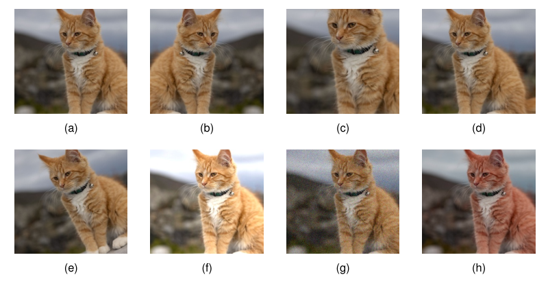
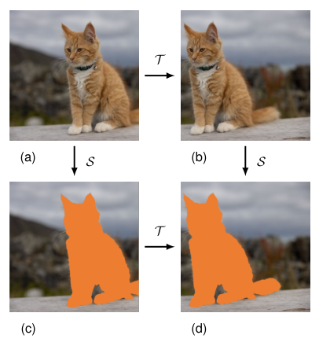

## 9.1. Inductive Bias

#### P3 

When we compared the predictive error of polynomials of various orders for the sinusoidal synthetic data problem, we saw that the smallest generalization error was achieved using a polynomial of intermediate complexity, being neither too simple nor too flexible. 

A similar result was found when we used a regularization term of the form (9.1) to control model complexity, as an intermediate value of the regularization coefficient $\lambda$ gave the best predictions for new input values. 

Insight into this result came from the bias--variance decomposition, where we saw that an appropriate level of bias in the model was important to allow generalization from finite data sets. 

Simple models with high bias are unable to capture the variation in the underlying data generation process, whereas highly flexible models with low bias are prone to over-fitting leading to poor generalization. 

As the size of the data set grows, we can afford to use more flexible models having less bias without incurring excessive variance, thereby leading to improved generalization. 

Note that in a practical setting, our choice of model might also be influenced by factors such as memory usage or speed of execution. 

Here we ignore such ancillary considerations and focus on the core goal of achieving good predictive performance, in other words good generalization.

### 9.1.1 Inverse problems

#### P4 

This issue of model choice lies at the heart of machine learning and can be traced to the fact that most machine learning tasks are examples of **inverse problems**. 

Given a conditional distribution $p(t \mid \mathbf{x})$ along with a finite set of input points $\{\mathbf{x}_1,\dots,\mathbf{x}_N\}$, it is straightforward, at least in principle, to sample corresponding values $\{t_1,\dots,t_N\}$ from that distribution. 

In machine learning, however, we have to solve the inverse of this problem, namely to infer an entire distribution given only a finite number of samples. 

This is intrinsically **ill-posed**, as there are infinitely many distributions which could potentially have been responsible for generating the observed training data. 

In fact any distribution that has a non-zero probability density at the observed target values is a candidate.

#### P5 

For machine learning to be useful, however, we need to make predictions for new values of $\mathbf{x}$, and therefore we need a way to choose a specific distribution from amongst the infinitely many possibilities. 

The preference for one choice over others is called **inductive bias**, or **prior knowledge**, and plays a central role in machine learning. 

Prior knowledge may come from background information that helps constrain the space of solutions. 

For many applications, small changes in the input values should lead to small changes in the output values, and so we should bias our solutions towards those with smoothly varying functions. 

Regularization terms of the form (9.1) encourage the model weights to have a smaller magnitude and hence introduce a bias towards functions that vary more slowly with changes in the inputs. 

Likewise, when detecting objects in images, we can introduce prior knowledge that the identity of an object is generally independent of its location within the image. 

This is known as translation invariance, and incorporating this into our solution can greatly simplify the task of building a system with good generalization. 

However, care must be taken not to incorporate biases or constraints that are inconsistent with the underlying process that generates the data. 

For example, assuming that the relationship between outputs and inputs is linear when in fact there are significant nonlinearities can lead to a system that produces inaccurate answers.

#### P6 

Techniques such as transfer learning and multi-task learning can also be viewed from the perspective of regularization. 

When training data for a particular task is limited, additional data from a different, but related, task can be used to help determine the learnable parameters in a neural network. 

The assumption of similarity between the tasks represents a more sophisticated form of inductive bias compared to simple regularization, and this explains the improved performance resulting from the use of the additional data.

### 9.1.2 No free lunch theorem

#### P7 

The core focus of this book is on the important class of machine learning models called deep neural networks. 

These are highly flexible models and have revolutionized many fields including computer vision, speech recognition, and natural language processing. 

In fact, they have become the framework of choice for the great majority of machine learning applications. 

It might appear, therefore, that they represent a `universal' learning algorithm able to solve all tasks. 

However, even very flexible neural networks contain important inductive biases. 

For example, convolutional neural networks encode specific forms of inductive bias, including translation equivariance, that are especially useful in applications involving images.

#### P8 

The **no free lunch theorem** (Wolpert, 1996), named from the expression ``There's no such thing as a free lunch,'' states that every learning algorithm is as good as any other when averaged over all possible problems. 

If a particular model or algorithm is better than average on some problems, it must be worse than average on others. 

However, this is a rather theoretical notion as the space of possible problems here includes relationships between input and output that would be very uncharacteristic of any plausible practical application. 

For example, we have already noted that most examples of practical interest exhibit some degree of smoothness, in which small changes in the input values are associated, for the most part, with small changes in the target values. 

Models such as neural networks, and indeed most widely used machine learning techniques, exhibit this form of inductive bias, and therefore to some degree, they have broad applicability.

#### P9

Although the no free lunch theorem is somewhat theoretical, it does highlight the central importance of bias in determining the performance of a machine learning algorithm. 

In practice, bias may be implicit. 

For example, every neural network has a finite number of parameters, which therefore limits the functions that it can represent. 

However, bias may also be encoded explicitly as a reflection of prior knowledge relating to the specific type of problem being solved.

#### P10

In trying to find general-purpose learning algorithms, we are really seeking inductive biases that are appropriate to the broad classes of applications that will be encountered in practice. 

For any given application, however, better results can be obtained if it is possible to incorporate stronger inductive biases that are specific to that application. 

The perspective of **model-based machine learning** (Winn et al., 2023) advocates making all the assumptions in machine learning models explicit so that the appropriate choices can be made for inductive biases.

#### P11 

We have seen that inductive bias can be incorporated through the form of distribution, for example by specifying that the output is a linear function of a fixed set of specific basis functions. 

It can also be incorporated through the addition of a regularization term to the error function used during training. 

Yet another way to control the complexity of a neural network is through the training process itself. 

We will see that deep neural networks can give good generalization even when the number of adjustable parameters exceeds the number of training data points, provided the training process is set up correctly. 

Part of the skill in applying deep learning to real-world problems is in the careful design of inductive bias and the incorporation of prior knowledge.

### 9.1.3 Symmetry and invariance

#### P12 

In many applications of machine learning, the predictions should be unchanged, or **invariant**, under one or more transformations of the input variables. 

For example, when classifying an object in two-dimensional images, such as a cat or dog, a particular object should be assigned the same classification irrespective of its position within the image. 

This is known as **translation invariance**. 

Likewise changes to the size of the object within the image should also leave its classification unchanged. 

This is called **scale invariance**. 

Exploiting such symmetries to create inductive biases can greatly improve the performance of machine learning models and forms the subject of **geometric deep learning** (Bronstein et al., 2021).

#### P13 

Transformations, such as a translation or scaling, that leave particular properties unchanged, represent **symmetries**. 

The set of all transformations corresponding to a particular symmetry form a mathematical structure called a **group**. 

A group consists of a set of elements $\mathcal{A}, \mathcal{B}, \mathcal{C}, \dots$ together with a binary operation for composing pairs of elements together, which we denote using the notation $\mathcal{A} \circ \mathcal{B}$. 

The following four axioms hold for a group:

1. **Closed:** For any two elements $\mathcal{A}, \mathcal{B}$ in the set, $\mathcal{A} \circ \mathcal{B}$ must also be in the set.
    
2. **Associative:** For any three elements $\mathcal{A}, \mathcal{B}, \mathcal{C}$ in the set, $(\mathcal{A} \circ \mathcal{B}) \circ \mathcal{C} = \mathcal{A} \circ (\mathcal{B} \circ \mathcal{C})$.
    
3. **Identity:** There exists an element $\mathcal{I}$ of the set, called the identity, with the property: $\mathcal{A} \circ \mathcal{I} = \mathcal{I} \circ \mathcal{A} = \mathcal{A}$ for every element $\mathcal{A}$ in the set.
    
4. **Inverse:** For each element $\mathcal{A}$ in the set, there exists another element in the set, which we denote by $\mathcal{A}^{-1}$, called the inverse, with the property: $\mathcal{A} \circ \mathcal{A}^{-1} = \mathcal{A}^{-1} \circ \mathcal{A} = \mathcal{I}$.

Simple examples of groups include the set of rotations of a square through multiples of $90^\circ$ or the set of continuous translations of an object in a two-dimensional plane.

#### P14

In principle, invariance of the predictions made by a neural network to transformations of the input space could be learned from data, without any special modifications to the network or the training procedure. 

In practice, however, this can prove to be extremely challenging because such transformations can produce substantial changes in the raw data. 

For example, relatively small translations of an object within an image, even by a few pixels, can cause pixel values to change significantly. 

Furthermore, multiple invariances must often hold at the same time, for example invariance to translations in two dimensions as well as scaling, rotation, changes of intensity, changes of colour balance, and many others. 

There are exponentially many possible **combinations** of such transformations, making the size of the required training set needed to learn all of these invariances prohibitive.

#### P15 

We therefore seek more efficient approaches for encouraging an adaptive model to exhibit the required invariances. 

These can broadly be divided into four categories:

1. **Pre-processing.** Invariances are built into a pre-processing stage by computing features of the data that are invariant under the required transformations. Any subsequent regression or classification system that uses such features as inputs will necessarily also respect these invariances.
    
2. **Regularized error function.** A regularization term is added to the error function to penalize changes in the model output when the input is subject to one of the invariant transformations.
    
3. **Data augmentation.** The training set is expanded using replicas of the training data points, transformed according to the desired invariances and carrying the same output target values as the untransformed examples.
    
4. **Network architecture.** The invariance properties are built into the structure of a neural network through an appropriate choice of network architecture.

#### P16 

One challenge with approach 1 is to design features that exhibit the required invariances without also discarding information that can be useful for determining the network outputs. 

We have already seen that fixed, hand-crafted features have limited capabilities and have been superseded by learned representations obtained using deep neural networks.

#### P17 

An example of approach 2 is the technique of **tangent propagation** (Simard et al., 1992) in which a regularization term is added to the error function during training. 

This term directly penalizes changes in the output resulting from changes in the input variables that correspond to one of the invariant transformations. 

A limitation of this technique, in addition to the extra complexity of training, is its cope with small transformations (e.g., translations by less than a pixel).

#### P18 

Approach 3 is known as **data set augmentation**. 

It is often relatively easy to implement and can prove to be very effective in practice. 

It is often applied in the context of image analysis as it is straightforward to create the transformed training data. 

Figure~9.1 shows examples of such transformations applied to an image of a cat. 

For medical images of soft tissue, data augmentation could also include continuous `rubber sheet' deformations (Ronneberger, Fischer, and Brox, 2015).

Figure 9.1 Caption: Illustration of data set augmentation, showing (a) the original image, (b) horizontal inversion, (c) scaling, (d) translation, (e) rotation, (f) brightness and contrast change, (g) additive noise, and (h) colour shift.

#### P19 

For sequential training algorithms, such as stochastic gradient descent, the data set can be augmented by transforming each input data point before it is presented to the model so that, if the data points are being recycled, a different transformation (drawn from an appropriate distribution) is applied each time. 

For batch methods, a similar effect can be achieved by replicating each data point a number of times and transforming each copy independently.

#### P20

We can analyse the effect of using augmented data by considering transformations that represent small changes to the original examples and then making a Taylor expansion of the error function in powers of the magnitude of the transformation (Bishop, 1995c; Leen, 1995; Bishop, 2006). 

This leads to a regularized error function in which the regularizer penalizes the gradient of the network output with respect to the input variables projected onto the direction of transformation. 

This is related to the technique of tangent propagation discussed above. 

A special case arises when the transformation of the input variables consists simply of the addition of random noise, in which case the regularizer penalizes the derivatives of the network outputs with respect to the inputs. 

Again, this is intuitively reasonable, since we are encouraging the network outputs to remain unchanged despite the addition of noise to the input variables.

#### P21 

Finally, approach 4, in which we build invariances into the structure of the network, has proven to be very powerful and effective and leads to other key benefits. 

We will discuss this approach at length in the context of convolutional neural networks for computer vision.

### 9.1.4 Equivariance

#### P22 

An important generalization of invariance is called **equivariance** in which the output of the network, instead of remaining constant when the input is transformed, is itself transformed in a specific way. 

For example, consider a network that takes an image as input and returns a segmentation of that image in which each pixel is classified as belonging either to a foreground object or to the background. 

In this case, if the location of the object within the image is translated, we want the corresponding segmentation of the object to be similarly translated. 

Suppose we denote the image by $\mathbf{I}$, and the operation of the segmentation network by $\mathcal{S}$, then for a translation operation $\mathcal{T}$ we have
$$
\mathcal{S}\bigl(\mathcal{T}(\mathbf{I})\bigr) = \mathcal{T}\bigl(\mathcal{S}(\mathbf{I})\bigr),
\tag{9.2}
$$
which says that the segmentation of the translated image is given by the translation of the segmentation of the original image. 

This is illustrated in Figure~9.2.

Figure 9.2 Caption: Illustration of equivariance, corresponding to (9.2). If an image (a) is first translated to give (b) and then segmented to give (d), the result is the same as if the image is first segmented to give (c) and then translated to give (d).

#### P23 

More generally, equivariance can hold if the transformation applied to the output is different to that applied to the input:
$$
\mathcal{S}\bigl(\mathcal{T}(\mathbf{I})\bigr) = \widetilde{\mathcal{T}}\bigl(\mathcal{S}(\mathbf{I})\bigr).
\tag{9.3}
$$
For example, if the segmented image has a lower resolution than the original image, then if $\mathcal{T}$ is a translation in the original image space, $\widetilde{\mathcal{T}}$ represents the corresponding translation in the lower-dimensional segmentation space. 

Similarly, if $\mathcal{S}$ is an operator that measures the orientation of an object within an image, and $\mathcal{T}$ represents a rotation (which is a complex nonlinear transformation of all of the pixel values in the image) then $\widetilde{\mathcal{T}}$ will increment or decrement the scalar orientation value generated by $\mathcal{S}$.

#### P24

We also see that invariance is a special case of equivariance in which the output transformation is simply the identity. 

For example, if $\mathcal{C}$ is a neural network that classifies an object within an image and $\mathcal{T}$ is a translation operator then
$$
\mathcal{C}\bigl(\mathcal{T}(\mathbf{I})\bigr) = \mathcal{C}(\mathbf{I}),
\tag{9.4}
$$
which says that the class of the object does not depend on its position within the image.

