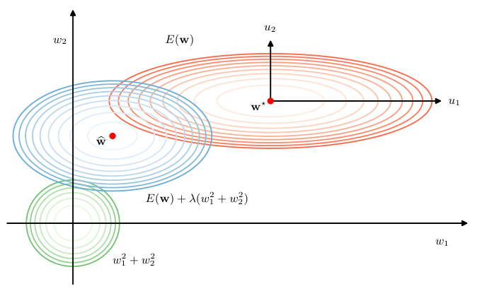
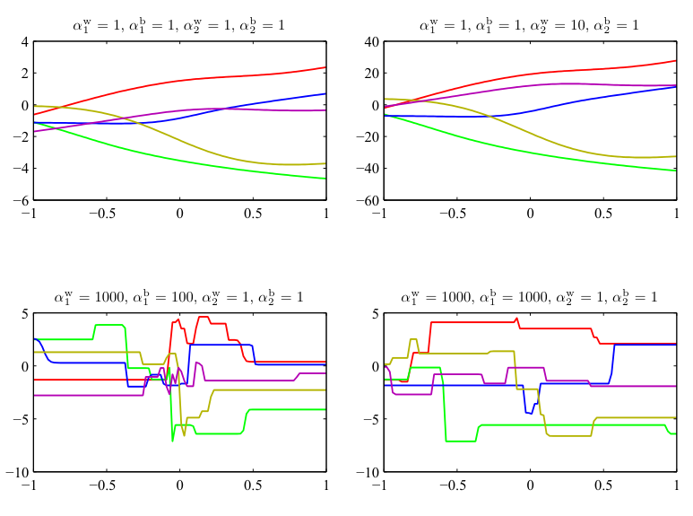
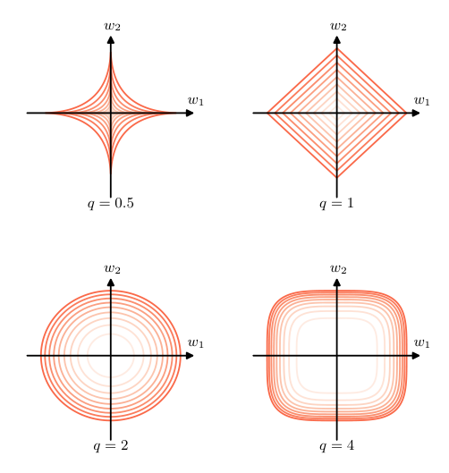
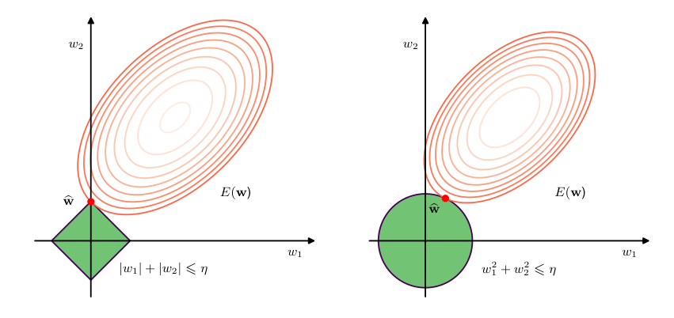

# Ch9. REGULARIZATION

## 9.2. Weight Decay 

### P1

We introduced regularization in the context of linear regression to control model complexity, as an alternative to limiting the number of parameters in the model. 

The simplest regularizer comprises the sum of the squares of the model parameters to give a regularized error function of the form (9.1), which penalizes parameter values with large magnitude. 

The effective model complexity is then determined by the choice of the regularization coefficient $\lambda$.

### P2

We have also seen that this additive regularization term can be interpreted as the negative logarithm of a zero-mean Gaussian prior distribution over the weight vector $\mathbf{w}$. 

This provides a probabilistic perspective on the inclusion of prior knowledge into the model training process. 

Unfortunately, this prior is expressed over the model parameters, whereas any domain knowledge we might possess regarding the problem to be solved is more likely to be expressed in terms of the network function from inputs to outputs. 

The relationship between the parameters and the network function is, however, extremely complex, and therefore only very limited kinds of prior knowledge can easily be expressed directly as priors over model parameters.

### P3

The sum-of-squares regularizer in (9.1) is known in the machine learning literature as **weight decay** because in sequential learning algorithms, it encourages weight values to decay towards zero, unless supported by the data. 

One advantage of this kind of regularizer is that it is trivial to evaluate its derivatives for use in gradient descent training. 

Specifically for (9.1) the gradient is given by
$$
\nabla \widetilde{E}(\mathbf{w}) = \nabla E(\mathbf{w}) + \lambda \mathbf{w}.
\tag{9.5}
$$

We see that the factor of $1/2$ in (9.1), which is often included by convention, disappears when we take the derivative.

### P4

The general effect of a quadratic regularizer can be seen by considering a two-dimensional parameter space along with an unregularized error function $E(\mathbf{w})$ that is a quadratic function of $\mathbf{w}$ (corresponding to a simple linear regression model with a sum-of-squares error function), as illustrated in Figure~9.3. 

The axes in parameter space have been rotated to align with the eigenvectors of the Hessian matrix, corresponding to the axes of the elliptical error function contours. 

We see that the effect of the regularization term is to shrink the magnitudes of the weight parameters. 

However, the effect is much larger for parameter $w_1$ compared to that of $w_2$. 

Intuitively only the parameter $w_2$ is `active' because the output is relatively insensitive to $w_1$, and hence the regularizer pushes $w_1$ close to zero. 

The **effective number of parameters** is the number that remain active after regularization, and this concept can be formalized either from a Bayesian or from a frequentist perspective (Bishop, 2006; Hastie, Tibshirani, and Friedman, 2009). 

For $\lambda \to \infty$, all the parameters are driven to zero and the effective number of parameters is then zero. 

As $\lambda$ is reduced, the number of parameters increases until for $\lambda = 0$ it equals the total number of actual parameters in the model. 

We see that controlling model complexity by regularization has similarities to controlling model complexity by limiting the number of parameters.

Figure 9.3 Caption: Contours of the error function (red), the regularization term (green), and a linear combination of the two (blue) for a quadratic error function and a sum-of-squares regularizer $\lambda(w_1^2 + w_2^2)$. 

Here the axes in parameter space have been rotated to align with the axes of the elliptical contour of the unregularized error function. 

For $\lambda = 0$, the minimum error is indicated by $w^*$. 

When $\lambda > 0$, the minimum of the regularized error function $E(w) + \lambda(w_1^2 + w_2^2)$ is shifted towards the origin. 

This shift is greater in the direction of $w_1$ because the unregularized error is relatively insensitive to the parameter value, and less in direction w2 where the error is more strongly dependent on the parameter value. 

The regularization term is effectively suppressing parameters that have only a small effect on the accuracy of the network predictions.

## 9.2.1 Consistent regularizers

### P5 

One of the limitations of simple weight decay in the form (9.1) is that it breaks certain desirable transformation properties of network mappings. 

To illustrate this, consider a multilayer perceptron network having two layers of weights and linear output units that performs a mapping from a set of input variables $\{x_i\}$ to a set of output variables $\{y_k\}$. 

The activations of the hidden units in the first hidden layer take the form
$$
z_j = h\left( \sum_i w_{ji} x_i + w_{j0} \right)
\tag{9.6}
$$
whereas the activations of the output units are given by
$$
y_k = \sum_j w_{kj} z_j + w_{k0}.
\tag{9.7}
$$

Suppose we perform a linear transformation of the input data:
$$
x_i \to \widetilde{x}_i = a x_i + b.
\tag{9.8}
$$
Then we can arrange for the mapping performed by the network to be unchanged by making a corresponding linear transformation of the weights and biases from the inputs to the units in the hidden layer:
$$
w_{ji} \to \widetilde{w}_{ji} = \frac{1}{a} w_{ji} \tag{9.9} 
$$
$$
w_{j0} \to \widetilde{w}_{j0} = w_{j0} - \frac{b}{a} \sum_i w_{ji}. 

\tag{9.10}
$$

Similarly, a linear transformation of the output variables of the network of the form
$$
y_k \to \widetilde{y}_k = c y_k + d
\tag{9.11}
$$
can be achieved transforming the second-layer weights and biases using
$$
w_{kj} \to \widetilde{w}_{kj} = c w_{kj} \tag{9.12} 
$$
$$
w_{k0} \to \widetilde{w}_{k0} = c w_{k0} + d. 

\tag{9.13}
$$

If we train one network using the original data and one network using data for which the input and/or target variables have been transformed by one of the above linear transformations, then consistency requires that we should obtain equivalent networks that differ only by the linear transformation of the weights as given. 

Any regularizer should be consistent with this property, otherwise it would arbitrarily favour one solution over another, equivalent one. 

Clearly, simple weight decay (9.1), which treats all weights and biases on an equal footing, does not satisfy this property.

### P6

We therefore look for a regularizer that is invariant under the linear transformations (9.9), (9.10), (9.12), and (9.13). 

These require that the regularizer should be invariant to re-scaling of the weights and to shifts of the biases. 

Such a regularizer is given by
$$
\frac{\lambda_1}{2} \sum_{w \in \mathcal{W}_1} w^2 + \frac{\lambda_2}{2} \sum_{w \in \mathcal{W}_2} w^2
\tag{9.14}
$$
where $\mathcal{W}_1$ denotes the set of weights in the first layer, $\mathcal{W}_2$ denotes the set of weights in the second layer, and biases are excluded from the summations. 

This regularizer will remain unchanged under the weight transformations provided the regularization parameters are re-scaled using $\lambda_1 \to a^{1/2} \lambda_1$ and $\lambda_2 \to c^{-1/2} \lambda_2$.

### P7

The regularizer (9.14) corresponds to a prior distribution over the parameters of the form:
$$
p(\mathbf{w} \mid \alpha_1, \alpha_2) \propto \exp\left( -\frac{\alpha_1}{2} \sum_{w \in \mathcal{W}_1} w^2 - \frac{\alpha_2}{2} \sum_{w \in \mathcal{W}_2} w^2 \right).
\tag{9.15}
$$

Note that priors of this form are **improper** (they cannot be normalized) because the bias parameters are unconstrained. 

Using improper priors can lead to difficulties in selecting regularization coefficients and in model comparison within the Bayesian framework. 

It is therefore common to include separate priors for the biases (which then break the shift invariance) that have their own hyperparameters.

### P8

We can illustrate the effect of the resulting four hyperparameters by drawing samples from the prior and plotting the corresponding network functions, as shown in Figure~9.4. 

The priors are governed by four hyperparameters, $\alpha_1^\mathrm{b}, \alpha_1^\mathrm{w}, \alpha_2^\mathrm{b},$ and $\alpha_2^\mathrm{w}$, which represent the precisions of the Gaussian distributions of the first-layer biases, first-layer weights, second-layer biases, and second-layer weights, respectively. 

We see that the parameter $\alpha_2^\mathrm{w}$ governs the vertical scale of the functions (note the different vertical axis ranges on the top two diagrams), $\alpha_1^\mathrm{w}$ governs the horizontal scale of variations in the function values, and $\alpha_1^\mathrm{b}$ governs the horizontal range over which variations occur. 

The parameter $\alpha_2^\mathrm{b}$, whose effect is not illustrated here, governs the range of the vertical offsets of the functions.

Figure 9.4 Caption: Illustration of the effect of the hyperparameters governing the prior distribution over weights and biases in a two-layer network having a single input, a single linear output, and 12 hidden units with tanh activation functions.

### P9

More generally, we can consider regularizers in which the weights are divided into any number of groups $\mathcal{W}_k$ so that
$$
\Omega(\mathbf{w}) = \frac{1}{2} \sum_k \alpha_k \|\mathbf{w}\|_k^2
\tag{9.16}
$$
where
$$
\|\mathbf{w}\|_k^2 = \sum_{j \in \mathcal{W}_k} w_j^2.
\tag{9.17}
$$
For example, we could use a different regularizer for each layer in a multilayer network.

## 9.2.2 Generalized weight decay

### P10

A generalization of the simple quadratic regularizer is sometimes used:
$$
\Omega(\mathbf{w}) = \frac{\lambda}{2} \sum_{j=1}^M |w_j|^q
\tag{9.18}
$$
where $q = 2$ corresponds to the quadratic regularizer in (9.1). 

Figure~9.5 shows contours of the regularization function for different values of $q$.

Figure 9.5 Caption: Contours of the regularization term in (9.18) for various values of the parameter $q$.

### P11

A regularizer of the form (9.18) with $q = 1$ is known as a **lasso** in the statistics literature (Tibshirani, 1996). 

For quadratic error functions, it has the property that if $\lambda$ is sufficiently large, some of the coefficients $w_j$ are driven to zero, leading to a **sparse** model in which the corresponding basis functions play no role. 

To see this, we first note that minimizing the regularized error function given by
$$
E(\mathbf{w}) + \frac{\lambda}{2} \sum_{j=1}^M |w_j|^q
\tag{9.19}
$$
is equivalent to minimizing the unregularized error function $E(\mathbf{w})$ subject to the constraint
$$
\sum_{j=1}^M |w_j|^q \leqslant \eta
\tag{9.20}
$$
for an appropriate value of the parameter $\eta$, where the two approaches can be related using Lagrange multipliers. 

The origin of the sparsity can be seen in Figure~9.6, which shows the minimum of the error function, subject to the constraint (9.20). 

As $\lambda$ is increased, more parameters will be driven to zero. 

By comparison, a quadratic regularizer leaves both weight parameters with non-zero values.

### P12

Regularization allows complex models to be trained on data sets of limited size without severe over-fitting, essentially by limiting the effective model complexity. 

However, the problem of determining the optimal model complexity is then shifted from one of finding the appropriate number of learnable parameters to one of determining a suitable value of the regularization coefficient $\lambda$. 

We will discuss the issue of model complexity in the next section.

