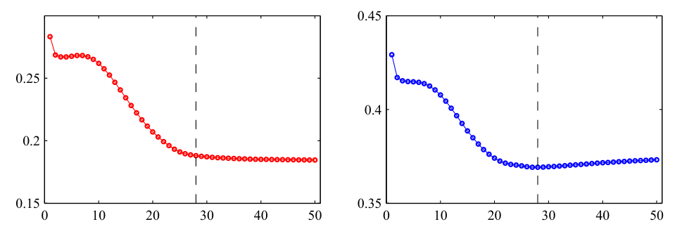
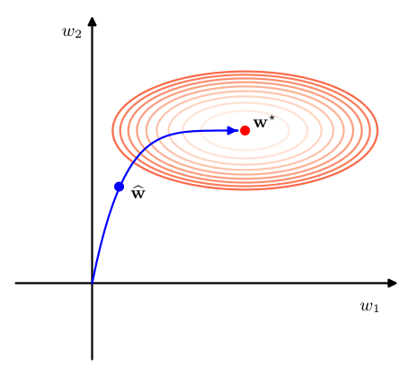
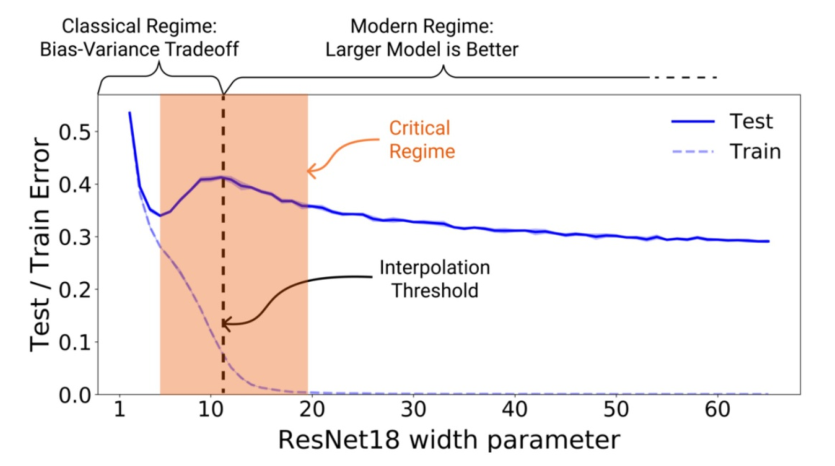
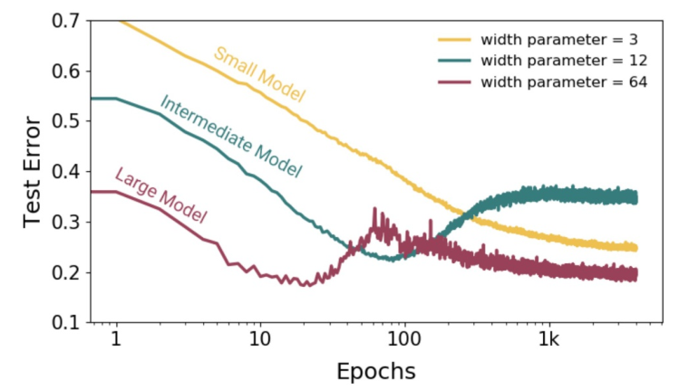
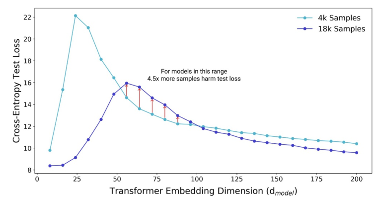

# 9. 正则化

## 9.3 学习曲线

### P1：学习曲线的定义与作用

我们已经探讨了模型的泛化性能如何随模型参数数量、数据集大小以及权重衰减正则化系数的变化而变化。

这些因素中的每一个都允许我们在偏差与方差之间进行权衡，以最小化泛化误差。

影响这种权衡的另一个因素是学习过程本身。

在通过梯度下降优化误差函数的过程中，随着模型参数的更新，训练误差通常会下降，而留出数据（hold-out data）的误差则可能是非单调变化的。

这种行为可以通过**学习曲线（learning curves）** 来可视化，学习曲线绘制了在随机梯度下降等迭代学习过程中，训练集和验证集误差等性能指标随迭代次数的变化关系。

这些曲线不仅提供了对训练进度的洞察，还为控制有效模型复杂度提供了一种实用的方法论。

> **💡 重点难点解析**

> - **重点**：掌握学习曲线的核心定义及其双重作用——既是监控训练状态的诊断工具，也是调节模型复杂度的控制手段；理解训练误差与验证误差在迭代过程中的典型分化行为。

> - **难点**：认识到学习过程本身就是一种隐式的正则化机制。

> 初学者往往将“优化算法”与“正则化策略”视为两个独立模块，但本段指出迭代步数本身就是影响偏差-方差权衡的关键变量，这为后续早停法的理论奠基做了铺垫。

---

## 9.3.1 早停法

### P2：早停法的基本原理与操作准则

作为控制网络有效复杂度的一种替代正则化的方法，我们可以采用**早停法（early stopping）**。

深度学习模型的训练涉及针对训练数据集定义的误差函数的迭代最小化。

虽然基于训练集计算的误差函数通常随迭代次数呈现大致单调的下降趋势，但基于留出数据（通常称为验证集）测量的误差往往先下降，随后在网络开始过拟合时转为上升。

为了获得具有良好泛化性能的网络，应当在验证集误差达到最小值时停止训练，如图 9.7 所示。

图 9.7 说明：展示了正弦数据集在典型训练过程中，训练集误差（左）和验证集误差（右）随迭代步数的变化行为。

为实现最佳泛化性能，应在垂直虚线所示的位置停止训练，该位置对应于验证集误差的最小值点。

> **💡 重点难点解析**

> - **重点**：掌握早停法的操作准则——以验证集误差最小值为停止信号；理解训练误差与验证误差的"U型分化"是过拟合开始的标志。

> - **难点**：实践中验证集误差曲线往往不是光滑的U型，而是带有显著噪声和局部波动。

> 简单地取全局最小值可能导致过早停止或错过真正的最优点。

> 因此实际应用中常采用"耐心（patience）"策略，即允许验证误差在若干轮内不改善后再停止，而非严格卡在第一个极小值点。

> 此外，验证集本身参与了模型选择，严格来说已不再是纯粹的"验证"，必要时还需独立的测试集来评估最终性能。

---

### P3：早停法的有效参数数量解释

学习曲线的这种行为有时可以从网络有效参数数量的角度进行定性解释。

有效参数数量在训练初始时较小，随后在训练过程中逐渐增长，对应于模型有效复杂度的稳步提升。

在训练误差达到最小值之前停止训练，是一种限制有效模型复杂度的方式。

> **💡 重点难点解析**

> - **重点**：建立"迭代步数 ↔ 有效参数数量 ↔ 模型复杂度"三者之间的等价直觉；理解早停法本质上是通过截断优化轨迹来实现隐式正则化。

> - **难点**：这一解释是定性的，容易给人造成"参数数量随时间线性增长"的错误印象。

> 实际上，有效参数数量的增长速率取决于误差曲面的几何结构（Hessian 特征值分布），在不同训练阶段差异巨大。

> 在损失快速下降的阶段，有效复杂度增长迅速；而在鞍点附近平坦区域，即使迭代很多步，有效参数数量也可能几乎不变。

---

### P4：早停法与权重衰减的等价性分析

我们可以针对二次误差函数验证上述见解，并证明早停法应表现出与简单权重衰减正则化项类似的行为（Bishop, 1995a）。

这一点可以从图 9.8 中理解，其中权重空间的坐标轴已被旋转至与 Hessian 矩阵的特征向量平行。

如果在没有权重衰减的情况下，权重向量从原点出发，沿局部负梯度方向的路径进行训练，那么由于误差曲面的形状以及 Hessian 矩阵特征值的巨大差异，权重向量最初将沿平行于 $w_2$ 轴的方向移动，经过大致对应于 $\bar{\mathbf{w}}$ 的点，然后才向误差函数的最小值点 $\mathbf{w}_{\text{ML}}$ 移动。

因此，在 $\bar{\mathbf{w}}$ 附近停止训练类似于权重衰减的效果，这表明量 $\tau/\eta$（其中 $\tau$ 为迭代索引，$\eta$ 为学习率参数）起到了正则化参数 $\lambda$ 倒数的作用。

因此，网络的有效参数数量在训练过程中是逐渐增长的。

图 9.8 说明：示意图展示了为何对于二次误差函数，早停法能产生与权重衰减相似的结果。

椭圆表示等误差等高线，$\mathbf{w}^*$ 表示对应于未正则化误差函数最小值的最大似然解。

如果权重向量从原点出发并按局部负梯度方向移动，则将遵循图中曲线所示的路径。

通过提前停止训练，可以得到一个权重向量 $\bar{\mathbf{w}}$，其性质与使用简单权重衰减正则化项并训练至正则化误差最小值时得到的结果类似，可通过与图 9.3 对比看出。

> **💡 重点难点解析**

> - **重点**：掌握早停法与 $L_2$ 正则化在二次误差情形下的定量等价关系：$\tau/\eta \sim 1/\lambda$；理解梯度下降路径的各向异性——沿大特征值方向（陡峭方向）先收敛，沿小特征值方向（平坦方向）后收敛，早停恰好抑制了尚未充分更新的平坦方向分量。

> - **难点**：这一等价性严格依赖于二次误差假设和零初始化条件。

> 在深度非线性网络中，误差曲面远非二次型，且初始化通常不为零，因此 $\tau/\eta \sim 1/\lambda$ 仅是粗略的类比而非精确等式。

> 此外，需注意该等价性暗示早停法和权重衰减在功能上存在冗余，实践中二者同时使用时需谨慎调整，避免过度正则化。

> 更深层的理解是：早停法利用了优化算法的动力学特性作为隐式先验，这与显式修改目标函数的权重衰减在哲学层面上代表了两种不同的正则化范式。

### 9.3.2 双重下降现象

#### P5：经典偏差-方差权衡的局限性

偏差-方差权衡为理解可学习模型的泛化性能如何随参数数量变化提供了洞见。

参数过少的模型由于表征能力有限（高偏差），在测试集上的误差会较高；随着参数数量增加，测试误差预期会下降。

然而，当参数数量进一步增加时，由于过拟合（高方差），测试误差会再次上升。

这导致了经典统计学中普遍的传统观念：模型参数数量需要根据数据集大小加以限制，对于给定的训练数据集，非常大的模型预期表现会很差。

> **💡 重点难点解析**

> - **重点**：回顾经典 U 型测试误差曲线的理论基础——偏差与方差的此消彼长；明确"插值阈值"左侧的经典区域行为。

> - **难点**：意识到这一经典图景隐含了一个关键假设：模型在达到零训练误差后继续增大只会增加方差而不再降低偏差。

> 这一假设在现代深度学习中被打破，理解双重下降的前提是先牢固掌握经典理论为何在此失效。

---

#### P6：现代深度学习对传统观念的挑战

然而，与上述预期相反，即使参数数量远超完美拟合训练数据所需的数量，现代深度神经网络仍能表现出优异的性能（Zhang et al., 2016）。

深度学习社区的普遍共识是"更大的模型更好"。

虽然有时也会使用早停法，但模型也可以被训练至零误差，同时在测试数据上仍保持良好的性能。

> **💡 重点难点解析**

> - **重点**：认识经验事实与经典理论的矛盾——过参数化模型在零训练误差下仍可泛化良好；理解这是推动双重下降理论研究的实证动机。

> - **难点**：区分"能够过拟合"与"必然过拟合"。

> 过参数化模型拥有记忆全部训练样本的能力，但这并不意味着优化算法一定会找到这样的解。

> SGD 的隐式偏置使得它在众多零误差解中倾向于选择泛化较好的那个，这是理解后续内容的关键前提。

---

#### P7：双重下降现象的定义与可视化

这种看似矛盾的视角可以通过检视学习曲线及其他泛化性能随模型复杂度变化的图表来调和，这些图表揭示了一种更为微妙的现象，称为**双重下降（double descent）**（Belkin et al., 2019）。

如图 9.9 所示，该图展示了名为 ResNet18（He et al., 2015a）的大型神经网络在图像分类任务上，训练集和测试集误差随模型复杂度（由可学习参数数量决定）的变化关系。

该网络具有 18 层参数，通过改变控制每层隐藏单元数量的"宽度参数"来调整网络中权重和偏置的数量。

我们可以看到，训练误差如预期般随模型复杂度增加而单调下降。

然而，测试集误差先下降、再上升，最后又再次下降。

即使在训练集误差已达到零之后，这种超大模型测试误差的下降趋势仍在持续。

图 9.9 说明：大型神经网络模型 ResNet18 在图像分类问题上的训练集和测试集误差随模型复杂度的变化图。

横轴表示控制隐藏单元数量进而决定网络整体权重和偏置数量的超参数。

标记为"插值阈值（interpolation threshold）"的垂直虚线指示了模型原则上能够在训练集上实现零误差的模型复杂度水平。

[经 Nakkiran et al. (2019) 许可转载]

> **💡 重点难点解析**

> - **重点**：准确识别双重下降曲线的三个阶段：经典下降区、峰值区（插值阈值附近）、第二下降区；理解"插值阈值"是划分两个体制的分水岭。

> - **难点**：注意第二下降区发生在训练误差已经为零的条件下，这意味着测试误差的改善并非来自偏差的进一步降低（偏差已为零），而是来自某种形式的方差减小或隐式正则化效应。

> 这与经典理论中"零训练误差 = 完全过拟合"的直觉根本冲突。

---

#### P8：两种拟合体制与有效模型复杂度

这种令人惊讶的行为比经典统计学中通常的偏差-方差讨论更为复杂，它展现出两种不同的模型拟合体态，如图 9.9 示意所示：对应于中小复杂度下的经典偏差-方差权衡，以及进入超大模型区域后测试误差的进一步下降。

两个体制之间的过渡大致发生在模型参数数量足够大以至于能够精确拟合训练数据的时候（Belkin et al., 2019）。

Nakkiran et al. (2019) 将**有效模型复杂度（effective model complexity）** 定义为模型能够实现零训练误差的最大训练数据集规模。

因此，当有效模型复杂度超过训练集中的数据点数量时，就会出现双重下降现象。

> **💡 重点难点解析**

> - **重点**：掌握"有效模型复杂度"的精确定义——不是参数数量本身，而是模型能完美拟合的数据集上限；理解双重下降的本质是有效复杂度跨越数据规模的临界相变。

> - **难点**：有效模型复杂度是一个与数据和模型都相关的动态量，而非静态属性。

> 同一架构在不同数据分布下的有效复杂度可能截然不同。

> 此外，"最大数据集规模"这一定义在实践中难以精确测量，更多是一个理论概念框架，用于统一理解不同复杂度度量下的双重下降行为。

---

#### P9：早停法作为复杂度控制时的双重下降

如果我们使用早停法来控制模型复杂度，也会观察到类似的行为，如图 9.10 所示。

增加训练轮数（epochs）会提高有效模型复杂度，对于足够大的模型，双重下降现象再次出现。

对于这类模型，存在许多可能的解，包括那些过拟合数据的解。

因此，这似乎是随机梯度下降的一个特性：它所引入的隐式偏置导致了良好的泛化性能。

图 9.10 说明：不同大小的 ResNet18 模型的测试集误差随梯度下降训练轮数的变化图。

有效模型复杂度随训练轮数增加而增长，对于足够大的模型可以观察到双重下降现象。

[经 Nakkiran et al. (2019) 许可转载]

> **💡 重点难点解析**

> - **重点**：认识到双重下降不仅关于模型尺寸，也关于训练时长——时间维度上同样存在插值阈值和第二下降区；理解 SGD 的隐式偏置是第二下降区泛化改善的核心机制。

> - **难点**：将"训练轮数"理解为连续的有效复杂度调节器需要思维转换。

> 在经典观点中，更多训练只意味着更接近最优解；而在双重下降框架中，训练过程本身穿越了不同的复杂度体制。

> 此外，SGD 隐式偏置的具体数学形式仍是开放研究问题，目前仅有部分理论解释（如最小范数解偏好），不应将其视为已完全解决的理论。

---

#### P10：正则化强度作为复杂度控制时的双重下降

当使用误差函数中的正则化项来控制复杂度时，也得到了类似的结果。

在这种情况下，训练至收敛的大模型的测试集误差相对于 $1/\lambda$（正则化参数的倒数）呈现出双重下降行为，因为高 $\lambda$ 对应低复杂度（Yilmaz and Heckel, 2022）。

> **💡 重点难点解析**

> - **重点**：确认双重下降的普适性——无论用参数量、训练时间还是正则化强度来参数化复杂度，都会出现相同的定性行为；理解 $1/\lambda$ 作为复杂度度量的合理性。

> - **难点**：注意此处双重下降是关于 $1/\lambda$ 而非 $\lambda$ 的。

> 这意味着强正则化（大 $\lambda$）对应曲线左侧的经典区域，弱正则化（小 $\lambda$）对应右侧的第二下降区。

> 实践中若仅在中等 $\lambda$ 范围内搜索，可能会恰好落在峰值区域而误判正则化的效果，因此需要在足够宽的范围内进行扫描。

---

#### P11：双重下降的反直觉推论——更多数据可能有害

双重下降的一个讽刺性后果是，在某些情况下，增加训练数据集的大小反而可能降低性能，这与"更多数据总是好事"的传统观点相悖。

对于处于图 9.9 所示临界区域的模型，训练集规模的增加会将插值阈值向右推移，导致更高的测试集误差。

图 9.11 证实了这一点，该图展示了 Transformer 模型的测试集误差随输入空间维度（即嵌入维度，embedding dimension）的变化关系。

增加嵌入维度会增加模型中权重和偏置的数量，从而提高模型复杂度。

我们看到，将训练集大小从 4,000 增加到 18,000 个数据点总体上使曲线大幅降低。

然而，对于对应于临界复杂度区域的一系列嵌入维度值，增加数据集大小实际上会降低泛化性能。

图 9.11 说明：大型 Transformer 模型的测试集误差随嵌入维度（控制模型参数数量）的变化图。

将训练集大小从 4,000 增加到 18,000 个样本通常会降低测试误差，但对于某些中间模型复杂度值，误差反而会增加，如垂直红色箭头所示。

[经 Nakkiran et al. (2019) 许可转载]

> **💡 重点难点解析**

> - **重点**：理解"更多数据可能有害"这一反直觉结论的精确条件——仅发生在临界复杂度区域；掌握其机制：数据增加使原本处于第下降区的模型被推入峰值区。

> - **难点**：这一结论极易被误读为"不要收集更多数据"。

> 实际上，它强调的是数据量与模型复杂度的匹配问题：要么同时扩大模型以保持在第二下降区，要么缩小模型以回到经典安全区。

> 最危险的是在固定模型下盲目增加数据却恰好穿越插值阈值。

> 在实际工程中，这意味着扩展数据时应同步监控模型是否仍处于合适的复杂度体制，而非简单地认为数据越多越好。
