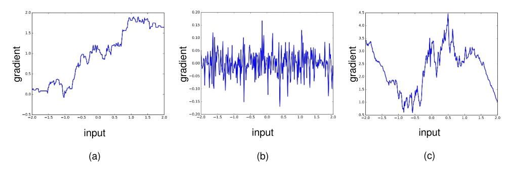
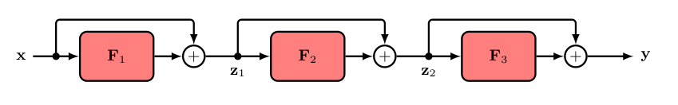
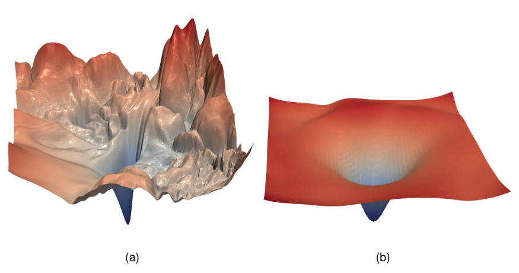
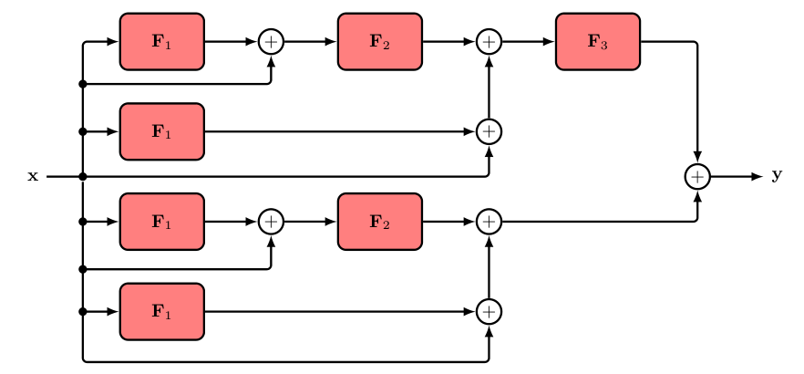
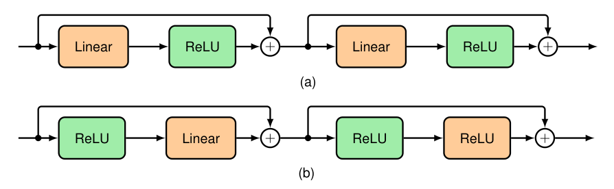

# Ch9. REGULARIZATION

## Section 9.5. Residual Connections

### P1

The representational power of deep neural networks stems in large part from the use of multiple layers of processing, and it has been observed that increasing the number of layers in a network can increase generalization performance significantly. 

We have also seen how batch normalization, along with careful initialization of the weights and biases, can help address the problem of vanishing or exploding gradients in deep networks. 

However, even with batch normalization, it becomes increasingly difficult to train networks with a large number of layers.

### P2

One explanation for this phenomenon is called \emph{shattered gradients} {balduzzi2017shattered}. 

We have seen that the representational capabilities of neural networks increase exponentially with depth. 

With ReLU activation functions, there is an exponential increase in the number of linear regions that the network can represent. 

However, a consequence of this is a proliferation of discontinuities in the gradient of the error function. 

This is illustrated for networks with a single input variable and a single output variable in Figure~9.12. 

Here the derivative of the output variable with respect to the input variable (the Jacobian of the network) is plotted as a function of the input variable. 

From the chain rule of calculus, these derivatives determine the gradients of the error function surface. 

We see that for deep networks, extremely small changes in the weight parameters in the early layers of the network can produce significant changes in the gradient. 

Iterative gradient-based optimization algorithms assume that the gradient varies smoothly across parameter space, and hence this `shattered gradient' effect can render training ineffective in very deep networks.

### P3

An important modification to the architecture of neural networks that greatly assists in training very deep networks is that of \emph{residual connections} {he2015deep}, which are a particular form of \emph{skip-layer connections}. 

Consider a neural network that consists of a sequence of three layers of the form
$$
\mathbf{z}_1 = \mathbf{F}_1(\mathbf{x}) \tag{9.32}
$$
$$
\mathbf{z}_2 = \mathbf{F}_2(\mathbf{z}_1) \tag{9.33}
$$
$$
\mathbf{y} = \mathbf{F}_3(\mathbf{z}_2). 
\tag{9.34}
$$

Here the functions $\mathbf{F}_i(\cdot)$ might simply consist of a linear transformation followed by a ReLU activation function or they might be more complex with multiple linear, activation function, and normalization layers. 

A residual connection consists simply of adding the input to each function back onto the output to give
$$
\mathbf{z}_1 = \mathbf{F}_1(\mathbf{x}) + \mathbf{x} \tag{9.35}
$$
$$
\mathbf{z}_2 = \mathbf{F}_2(\mathbf{z}_1) + \mathbf{z}_1 \tag{9.36}
$$
$$
\mathbf{y}   = \mathbf{F}_3(\mathbf{z}_2) + \mathbf{z}_2. 
\tag{9.37}
$$

Each combination of a function and a residual connection, such as $\mathbf{F}_1(\mathbf{x}) + \mathbf{x}$, is called a \emph{residual block}. 

A \emph{residual network}, also known as a \emph{ResNet}, consists of multiple layers of such blocks in sequence. 

A modified network with residual connections is illustrated in Figure~9.13. 

A residual block can easily generate the identity transformation, if the parameters in the nonlinear function are small enough for the function outputs to become close to zero.

### P4

The term `residual' refers to the fact that in each block the function learns the residual between the identity map and the desired output, which we can see by rearranging the residual transformation:
$$
\mathbf{F}_i(\mathbf{z}_{i-1}) = \mathbf{z}_i - \mathbf{z}_{i-1}.
\tag{9.38}
$$

The gradients in a network with residual connections are much less sensitive to input values compared to a standard deep network, as seen in Figure~9.12(c).

### P5

{li2017visualizing} developed a way to visualize error surfaces directly, which showed that the effect of the residual connections is to create smoother error function surfaces, as shown in Figure~9.14. 

It is usual to include batch normalization layers in a residual network, as together they significantly reduce the issue of vanishing and exploding gradients. 

{he2015deep} showed that including residual connections allows very deep networks, potentially having hundreds of layers, to be trained effectively.

### P6

Further insight into the way residual connections encourage smooth error surfaces can be obtained if we combine (9.35), (9.36), and (9.37) to give a single overall equation for the whole network:
$$
\mathbf{y} = \mathbf{F}_3\bigl( \mathbf{F}_2( \mathbf{F}_1(\mathbf{x}) + \mathbf{x} ) + \mathbf{z}_1 \bigr) + \mathbf{z}_2.
\tag{9.39}
$$

We can now substitute for the intermediate variables $\mathbf{z}_1$ and $\mathbf{z}_2$ to give an expression for the network output as a function of the input $\mathbf{x}$:
$$
\mathbf{y} = \mathbf{F}_3\bigl( \mathbf{F}_2( \mathbf{F}_1(\mathbf{x}) + \mathbf{x} ) + \mathbf{F}_1(\mathbf{x}) + \mathbf{x} \bigr) + \mathbf{F}_2\bigl( \mathbf{F}_1(\mathbf{x}) + \mathbf{x} \bigr) + \mathbf{F}_1(\mathbf{x}) + \mathbf{x}.
\tag{9.40}
$$

This expanded form of the residual network is depicted in Figure~9.15. 

We see that the overall function consists of multiple networks acting in parallel and that these include networks with fewer layers. 

The network has the representational capability of a deep network, since it contains such a network as a special case. 

However, the error surface is moderated by a combination of shallow and deep sub-networks.

### P7

Note that the skip-layer connections defined by (9.40) require the input and all the intermediate variables to have the same dimensionality so that they can be added. 

We can change the dimensionality at some point in the network by including a non-square matrix $\mathbf{W}$ of learnable parameters in the form
$$
\mathbf{z}_i = \mathbf{F}_i(\mathbf{z}_{i-1}) + \mathbf{W}\mathbf{z}_{i-1}.
\tag{9.41}
$$

### P8

So far we have not been specific about the form of the learnable nonlinear functions $\mathbf{F}_i(\cdot)$. 

The simplest choice would be a standard neural network that alternates between layers consisting of a learnable linear transformation and a fixed nonlinear activation function such as ReLU. 

This opens two possibilities for placing the residual connections, as shown in Figure~9.16. 

In version (a) the quantities being added are always non-negative since they are given by the outputs of ReLU layers, and so to allow for both positive and negative values, version (b) is more commonly used.

