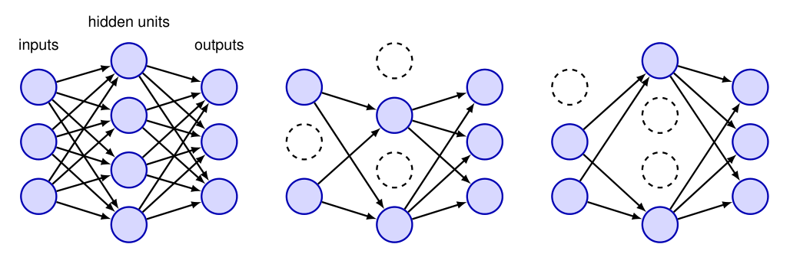

# 第9章 正则化

## 第9.6节 模型平均

### 段落1：委员会与集成的概念

如果我们针对同一个问题训练了多个不同的模型，那么与其试图从中挑选出最佳的一个，通常可以通过对各个模型的预测进行平均来提升泛化能力。

这种模型组合有时被称为**委员会**或**集成**。

对于输出概率的模型，预测分布是各模型预测分布的平均值：
$$
p(\mathbf{y}|\mathbf{x}) = \frac{1}{L} \sum_{l=1}^{L} p_l(\mathbf{y}|\mathbf{x})
\tag{9.42}
$$
其中 $p_l(\mathbf{y}|\mathbf{x})$ 是第 $l$ 个模型的输出，$L$ 是模型的总数。

> **重点难点**：本段引入模型集成的核心思想——组合多个模型而非单选。

> 关键公式(9.42)说明概率输出的平均方式。

> 难点在于理解为何平均能改善泛化，以及“委员会”与“集成”术语的等价性。

---

### 段落2：集成与偏差-方差权衡

这种平均过程可以从偏差与方差之间的权衡来理解。

回顾图4.7，当我们用正弦数据训练多条多项式曲线，然后对所得函数进行平均时，来自方差项的贡献往往会相互抵消，从而带来预测性能的提升。

> **重点难点**：本段从偏差-方差角度解释集成的动机。

> 核心是“方差抵消”这一直观思想。

> 难点在于联系前面章节（图4.7）的具体例子，并理解平均如何在不增加偏差的情况下降低方差。

---

### 段落3：引入多样性的方法——Bagging

在实际中，我们通常只有一个数据集，因此必须想办法在委员会的不同模型之间引入变异性。

一种方法是使用**自助法**数据集，其生成方式如下：假设原始数据集包含 $N$ 个数据点 $\mathbf{X} = \{\mathbf{x}_1, \ldots, \mathbf{x}_N\}$。

我们可以通过从 $\mathbf{X}$ 中有放回地随机抽取 $N$ 个点来创建一个新数据集 $\mathbf{X}_B$，这样 $\mathbf{X}$ 中的某些点可能在 $\mathbf{X}_B$ 中重复出现，而另一些点则可能缺失。

重复该过程 $L$ 次，生成 $L$ 个大小均为 $N$ 的数据集，每个数据集都从原始数据集 $\mathbf{X}$ 中采样得到。

然后可用每个数据集训练一个模型，并对结果模型的预测进行平均。

这个过程被称为**自助聚集**或**Bagging**（Breiman, 1996）。

另一种集成方法是使用原始数据集训练多个不同架构的模型。

> **重点难点**：本段介绍实际中如何创造模型多样性，核心方法是Bagging。

> 重点是有放回抽样（bootstrap）的机制及其导致的样本重复与缺失。

> 难点在于理解为什么这种重采样能带来模型间的差异，以及Bagging与后面Boosting的区别。

---

### 段落4上：集成误差的理论分析（上）

我们可以通过考虑一个回归问题来分析集成预测的收益。

设输入向量为 $\mathbf{x}$，输出变量为 $y$。

假设我们有一组训练好的模型 $y_1(\mathbf{x}), \ldots, y_M(\mathbf{x})$，并形成委员会预测：
$$
y_{\text{COM}}(\mathbf{x}) = \frac{1}{M} \sum_{m=1}^{M} y_m(\mathbf{x}).
\tag{9.43}
$$

若真实函数为 $h(\mathbf{x})$，则每个模型的输出可写成真实值加误差：
$$
y_m(\mathbf{x}) = h(\mathbf{x}) + \epsilon_m(\mathbf{x}).
\tag{9.44}
$$

平均平方和误差的形式为：
$$
\mathbb{E}_{\mathbf{x}} \left[ \left\{ y_m(\mathbf{x}) - h(\mathbf{x}) \right\}^2 \right] = \mathbb{E}_{\mathbf{x}} \left[ \epsilon_m(\mathbf{x})^2 \right]
\tag{9.45}
$$
其中 $\mathbb{E}_{\mathbf{x}}[\cdot]$ 表示关于输入向量 $\mathbf{x}$ 分布的频率学派期望。

各模型单独行动时的平均误差为：
$$
E_{\text{AV}} = \frac{1}{M} \sum_{m=1}^{M} \mathbb{E}_{\mathbf{x}} \left[ \epsilon_m(\mathbf{x})^2 \right].
\tag{9.46}
$$

> **重点难点**：本段开始数学推导集成误差。

> 重点是定义单个模型误差和平均误差 $E_{\text{AV}}$。

> 难点在于理解频率学派期望的含义，以及将模型输出分解为真实值加误差的表示方法。

---

### 段落4下：集成误差的理论分析（下）

同样，委员会（9.43）的期望误差为：
$$
E_{\text{COM}} = \mathbb{E}_{\mathbf{x}} \left[ \left\{ \frac{1}{M} \sum_{m=1}^{M} y_m(\mathbf{x}) - h(\mathbf{x}) \right\}^2 \right] 
= \mathbb{E}_{\mathbf{x}} \left[ \left\{ \frac{1}{M} \sum_{m=1}^{M} \epsilon_m(\mathbf{x}) \right\}^2 \right].
\tag{9.47}
$$

如果我们假设误差均值为零且互不相关，即
$$
\mathbb{E}_{\mathbf{x}} \left[ \epsilon_m(\mathbf{x}) \right] = 0 
\tag{9.48}
$$
$$
\mathbb{E}_{\mathbf{x}} \left[ \epsilon_m(\mathbf{x}) \epsilon_l(\mathbf{x}) \right] = 0, \quad m \neq l
\tag{9.49}
$$
则可得到
$$
E_{\text{COM}} = \frac{1}{M} E_{\text{AV}}.
\tag{9.50}
$$

这一看似惊人的结果表明，仅通过对 $M$ 个模型版本进行平均，模型的平均误差就能降低 $M$ 倍。

遗憾的是，这依赖于一个关键假设——各模型的误差互不相关。

在实际中，误差通常高度相关，因此整体误差的降低通常要小得多。

不过可以证明，委员会期望误差不会超过各组成模型的期望误差，即 $E_{\text{COM}} \leqslant E_{\text{AV}}$。

> **重点难点**：本段是理论分析的核心，导出集成误差公式。

> 重点在于(9.50)式的理想结果，以及误差不相关这一**关键假设**。

> 难点在于理解为何在实际中误差高度相关导致收益大打折扣，以及不等式 $E_{\text{COM}} \leqslant E_{\text{AV}}$ 的保守结论。

---

### 段落5：Boosting 方法简介

另一种不同的模型组合方法称为**Boosting**（Freund and Schapire, 1996），它将多个“基”分类器组合成一个委员会形式，其性能可以显著优于任何一个基分类器。

即使基分类器的表现仅略好于随机猜测，Boosting也能给出良好结果。

Boosting与上述Bagging等委员会方法的主要区别在于，基分类器是**按顺序**训练的，并且每个基分类器在训练时使用数据集的**加权**形式，其中每个数据点的权重系数取决于先前分类器的表现。

特别地，被某个基分类器误分类的点在训练下一个分类器时会被赋予更大的权重。

当所有分类器训练完毕后，它们的预测通过**加权多数投票**方案进行组合。

> **重点难点**：本段介绍Boosting的核心机制。

> 重点是顺序训练、加权数据和加权投票。

> 难点在于区分Boosting与Bagging的关键差异（顺序 vs 并行，加权 vs 等权），以及理解“误分类点被赋予更大权重”这一自适应思想的直观含义。

---

### 段落6：模型组合的实际局限性

在实际中，所有模型组合方法的主要缺点是需要训练多个模型，并且预测时也需要对所有模型进行评估，这显著增加了训练和推理的计算成本。

具体影响多大，取决于实际的应用场景。

> **重点难点**：本段指出集成的现实代价——计算开销。

> 重点是“训练+推理”双环节的成本增加。

> 难点在于如何在实际应用中权衡性能提升与计算资源，这属于工程决策问题。

### 段落7：Dropout 概述——高效的隐式集成

一种被广泛使用且非常有效的正则化方法称为 **Dropout**（Srivastava 等，2014），它可以看作是一种隐式地对指数级数量模型进行近似平均的方法，而无需单独训练多个模型。

它具有广泛的适用性且计算成本低廉。

Dropout 是最有效的正则化形式之一，并广泛应用于实际任务中。

> **重点难点**：本段引入 Dropout 的核心定位——一种高效、隐式的模型平均近似方法。

> 重点是理解“隐式”和“指数级模型”的含义。

> 难点在于将 Dropout 与上一节的显式集成（如 Bagging）联系起来，把握其作为正则化手段的本质。

---

### 段落8：Dropout 的核心机制——随机删除节点

Dropout 的核心思想是在训练过程中随机地从网络中删除节点及其连接。

每当一个数据点被送入网络时，都会重新随机选择要省略的节点。

图 9.17 展示了一个简单网络以及删除了部分节点的剪枝网络示例。

图 9.17 标题：左侧为一个神经网络，右侧为两个剪枝网络示例，其中随机子集的节点已被省略。

> **重点难点**：本段描述 Dropout 的基本操作——随机删除节点。

> 重点是“每个数据点重新随机选择”这一动态机制。

> 难点在于理解这种随机剪枝如何与训练过程结合，以及为什么删除节点能带来正则化效果。

---

### 段落9：Dropout 的实施细节——掩码向量与保留概率

Dropout 应用于隐藏节点和输入节点，但不应用于输出节点，其等价于将被丢弃节点的输出置为零。

它可以通过定义一个掩码向量 $R_i \in \{0, 1\}$ 来实现，该向量乘以非输出节点 $i$ 对数据点 $n$ 的激活值，其值以概率 $\rho$ 设为 1。

对于隐藏节点，$\rho = 0.5$ 似乎效果很好；而对于输入节点，通常使用 $\rho = 0.8$。

> **重点难点**：本段给出 Dropout 的具体数学实现。

> 重点是掩码向量的定义和保留概率 $\rho$ 的取值经验。

> 难点在于理解掩码如何与激活值相乘实现“丢弃”，以及输入节点和隐藏节点保留概率不同的原因。

---

### 段落10：训练过程与特点——前向/反向传播与参数共享

在训练过程中，每个数据点输入网络时都会生成一个新的掩码，然后在该剪枝网络上进行前向和反向传播以计算误差函数的梯度，随后用于更新权重（例如通过随机梯度下降）。

如果数据点按小批量分组，则在应用权重更新之前，会对每个小批量中数据点的梯度进行平均。

对于一个有 $M$ 个非输出节点的网络，存在 $2^M$ 个剪枝网络，因此在训练期间只会考虑到其中极小一部分。

这与传统集成方法不同，后者集成中的每个网络都是独立训练至收敛的。

另一个区别是，Dropout 隐式训练的指数级网络并不是独立的，它们与完整网络共享参数值，因此彼此之间也共享参数。

请注意，使用 Dropout 时训练可能需要更长时间，因为各个参数更新非常嘈杂。

此外，由于误差函数本身具有内在噪声，因此很难仅通过观察训练过程中误差函数的下降来确认优化算法是否正常工作。

> **重点难点**：本段是 Dropout 训练过程的核心。

> 重点是三个关键点：(1) 每个数据点使用不同掩码；(2) 隐式训练 $2^M$ 个网络但参数共享；(3) 与传统集成的区别。

> 难点在于理解参数共享如何使得指数级网络的训练变得可行，以及为什么训练会更慢、误差函数更不可靠。

---

### 段落11：预测阶段——蒙特卡洛 Dropout

训练完成后，原则上可以通过应用集成规则（9.42）来进行预测，在这种情况下该规则的形式为
$$
p(\mathbf{y}|\mathbf{x}) = \sum_{\mathbf{R}} p(\mathbf{R}) p(\mathbf{y}|\mathbf{x}, \mathbf{R})
\tag{9.51}
$$
其中求和遍历指数级大小的掩码空间，$p(\mathbf{y}|\mathbf{x}, \mathbf{R})$ 是掩码为 $\mathbf{R}$ 的网络的预测分布。

由于该求和难以计算，可以通过采样少量掩码来近似，实际中仅需 10 或 20 个掩码就足以获得良好结果。

这个过程称为**蒙特卡洛 Dropout**。

> **重点难点**：本段介绍 Dropout 的预测方式。

> 重点是公式 (9.51) 的集成形式以及蒙特卡洛采样的近似策略。

> 难点在于理解为什么直接求和不可行，以及少量采样为何能取得不错的效果——这体现了近似模型平均的思想。

---

### 段落12：简化预测方法——权重缩放

一种更简单的方法是使用训练好的、不掩蔽任何节点的网络进行预测，并重新缩放网络中的权重，使得测试时每个节点的期望输入与训练时大致相同，以补偿训练时一部分节点缺失的事实。

因此，如果训练时一个节点以概率 $\rho$ 出现，那么在测试时，该节点的输出权重要乘以 $\rho$，然后再使用网络进行预测。

> **重点难点**：本段介绍 Dropout 预测的实用简化技巧——权重缩放。

> 重点是“训练-测试一致性”的补偿思想。

> 难点在于理解为什么要乘以 $\rho$（保持期望激活值不变），以及这种近似与蒙特卡洛 Dropout 的关系。

---

### 段落13：Dropout 的贝叶斯视角

对 Dropout 的另一种动机来自贝叶斯视角。

在完全的贝叶斯处理中，我们会通过对所有可能的 $2^M$ 个网络模型进行平均来进行预测，每个网络按其后验概率加权。

在计算上，无论是在训练时评估后验概率，还是在测试时计算加权预测，这都是极其昂贵的。

Dropout 通过对每个可能模型赋予相等的权重来近似这种模型平均。

> **重点难点**：本段从贝叶斯角度理解 Dropout。

> 重点是“等权重近似后验加权平均”这一观点。

> 难点在于理解完全贝叶斯模型平均的计算瓶颈，以及 Dropout 如何用均匀权重来近似，这为 Dropout 提供了一种理论解释。

---

### 段落14：Dropout 的直觉解释——减少共适应与过拟合

对 Dropout 的进一步直观理解来自其在减少过拟合方面的作用。

在标准网络中，参数可能会调整以适应单个数据点上的噪声，导致隐藏节点变得过度专门化。

每个节点根据其他节点的输出调整其权重以最小化误差，导致节点之间的**共适应**，这种共适应可能无法泛化到新数据。

使用 Dropout 后，每个节点不能依赖其他特定节点的存在，而必须在广泛的情境中做出有用的贡献，从而减少共适应和专门化。

对于使用最小二乘法训练的简单线性回归模型，Dropout 正则化等价于一种改进形式的二次正则化。

> **重点难点**：本段解释 Dropout 为何有效的直观原因。

> 核心概念是“共适应”（co-adaptation）和“过度专门化”。

> 难点在于理解节点间依赖如何损害泛化，以及 Dropout 如何迫使节点独立有用。

> 最后一句关于线性回归的等价性是对 Dropout 更深层次的理论联系，需注意其适用范围。
