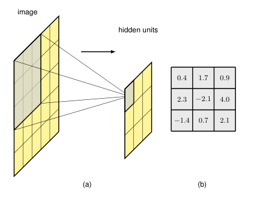

## 10.2.1 Feature detectors

### P3

For simplicity we will initially restrict our attention to grey-scale images (i.e., ones having a single channel). 

Consider a single unit in the first layer of a neural network that takes as input just the pixel values from a small rectangular region, or patch, from the image, as illustrated in Figure 10.1(a). 

This patch is referred to as the *receptive field* of that unit, and it captures the notion of locality. 

We would like weight values associated with this unit to learn to detect some useful low-level feature. 

The output of this unit is given by the usual functional form comprising a weighted linear combination of the input values, which is subsequently transformed using a nonlinear activation function:
$$
z = \text{ReLU}(\mathbf{w}^T\mathbf{x} + w_0) \tag{10.1}
$$
where $\mathbf{x}$ is a vector of pixel values for the receptive field, and we have assumed a ReLU activation function. 

Because there is one weight associated with each input pixel, the weights themselves form a small two-dimensional grid known as a *filter*, sometimes also called a *kernel*, which itself can be visualized as an image. 

This is illustrated in Figure 10.1(b).

**Figure 10.1** (a) Illustration of a receptive field, showing a unit in a hidden layer of a network that receives input from pixels in a $3 \times 3$ patch of the image. Pixels in this patch form the receptive field for this unit. (b) The weight values associated with this hidden unit can be visualized as a small $3 \times 3$ matrix, known as a kernel. There is also an additional bias parameter that is not shown here.

---

### P4

Suppose that $\mathbf{w}$ and $w_0$ in (10.1) are fixed and we ask for which value of the input image patch $\mathbf{x}$ will this hidden unit give the largest output response. 

To answer this we need to constrain $\mathbf{x}$ in some way, so let us suppose that its norm $\|\mathbf{x}\|^2$ is fixed. 

Then the solution for $\mathbf{x}$ that maximizes $\mathbf{w}^T\mathbf{x}$, and hence maximizes the response of the hidden unit, is of the form $\mathbf{x} = \alpha\mathbf{w}$ for some coefficient $\alpha$. 

This says that the maximum output response from this hidden unit occurs when it detects a patch of image that, up to an overall scaling, looks like the kernel image. 

Note that the ReLU generates a non-zero output only when $\mathbf{w}^T\mathbf{x}$ exceeds a threshold of $-w_0$, and therefore the unit acts as a feature detector that signals when it finds a sufficiently good match to its kernel.

---

## 10.2.1 特征检测器

### 第3段：局部感受野与滤波器的定义

为简单起见，我们首先将注意力限制在灰度图像（即单通道图像）上。

考虑神经网络第一层中的某个单元，它只接受来自图像中一个小矩形区域（或称为图像块）的像素值作为输入，如图10.1(a)所示。

该图像块被称为该单元的**感受野**，它体现了局部性的概念。

我们希望与此单元相关联的权重值能够学习检测某些有用的低层特征。

该单元的输出由通常的函数形式给出，即对输入值进行加权线性组合，随后使用非线性激活函数进行变换：
$$
z = \text{ReLU}(\mathbf{w}^T\mathbf{x} + w_0) \tag{10.1}
$$
其中 $\mathbf{x}$ 是感受野的像素值向量，并且我们假设采用了ReLU激活函数。

由于每个输入像素对应一个权重，这些权重本身形成了一个小的二维网格，称为**滤波器**（有时也叫**核**），它本身可以可视化为一幅图像。

如图10.1(b)所示。

**图 10.1** (a) 感受野示意图，展示网络中某一隐藏层单元接收来自图像中 $3 \times 3$ 图像块像素的输入。该图像块内的像素构成该单元的感受野。(b) 与该隐藏单元相关联的权重值可以可视化为一个小的 $3 \times 3$ 矩阵，称为核。此外还有一个额外的偏置参数，图中未显示。

**重点难点**  

- 正式定义了“感受野”和“滤波器”两个核心概念，并给出了卷积单元的前向计算公式。
  
- 难点在于将权重矩阵可视化为“图像模式”，这是理解滤波器作为“模板匹配器”的关键视觉化思维。

---

### 第4段：滤波器作为模板匹配器的解释

假设 (10.1) 中的 $\mathbf{w}$ 和 $w_0$ 是固定的，我们问：对于什么样的输入图像块 $\mathbf{x}$，该隐藏单元会给出最大的输出响应？为了回答这个问题，我们需要以某种方式约束 $\mathbf{x}$，因此让我们假设其范数 $\|\mathbf{x}\|^2$ 是固定的。

那么，使 $\mathbf{w}^T\mathbf{x}$ 最大化，从而也使得隐藏单元响应最大化的 $\mathbf{x}$ 的解具有 $\mathbf{x} = \alpha\mathbf{w}$ 的形式，其中 $\alpha$ 是某个系数。

这意味着，该隐藏单元的最大输出响应出现在它检测到的图像块（在整体缩放范围内）看起来像滤波器图像的时候。

请注意，只有当 $\mathbf{w}^T\mathbf{x}$ 超过阈值 $-w_0$ 时，ReLU 才会产生非零输出，因此该单元充当一个特征检测器，当它发现与其核足够好地匹配时，便会发出信号。

**重点难点**  

- 通过数学推导（范数约束下的内积最大化）说明滤波器的“模板匹配”本质：最大响应输入与滤波器形状一致。
  
- 难点在于理解ReLU的阈值作用（$-w_0$）将滤波器从“线性匹配”转变为“有条件的激活检测器”，以及“整体缩放不变性”的含义（滤波器检测的是模式形状，而非绝对亮度）。

---

