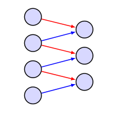
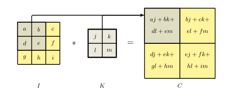
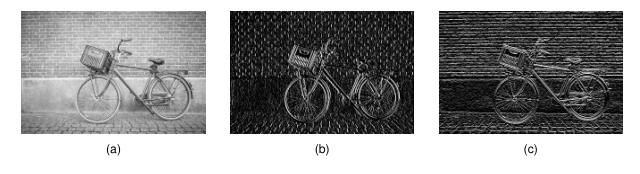

## 10.2.2 Translation equivariance 平移等变性

### P5 第5段：权重复制实现位置泛化

Next note that if a small patch in a face image represents, for example, an eye at that location, then the same set of pixel values in a different part of the image must represent an eye at the new location. 

Our neural network needs to be able to generalize what it has learned in one location to all possible locations in the image, without needing to see examples in the training set of the corresponding feature at every possible location. 

To achieve this, we can simply replicate the *same* hidden-unit weight values at multiple locations across the image, as illustrated for a one-dimensional input space in Figure 10.2.

**Figure 10.2** Illustration of convolution for a one-dimensional array of input values and a kernel of width 2. The connections are sparse and are shared by the hidden units, as shown by the red and blue arrows in which links with the same colour have the same weight values. This network therefore has six connections but only two independent learnable parameters.

接下来注意，如果人脸图像中的一个小块表示的是该位置上的，例如，一只眼睛，那么图像中另一位置上的相同像素值集合必然表示新位置上的眼睛。

我们的神经网络需要能够将其在一个位置学到的东西泛化到图像中的所有可能位置，而无需在训练集中看到对应特征在每个可能位置上的样本。

为了实现这一点，我们只需在图像中的多个位置上复制**相同**的隐藏单元权重值，如图10.2所示的一维输入空间示意。

**图 10.2** 一维输入数组与宽度为 2 的核进行卷积的示意图。连接是稀疏的，并且由隐藏单元共享，如红色和蓝色箭头所示，其中相同颜色的连接具有相同的权重值。因此，该网络有 6 个连接，但只有 2 个独立的可学习参数。

> **重点难点**  
> 
> - 核心思想是“权重复制”作为实现位置泛化的机制，避免为每个位置单独学习参数。
>   
> - 难点在于理解为何权重复制能够实现泛化——它假设特征检测器是位置无关的，这是对图像平移对称性的直接利用。

---

### P6 第6段：特征图、稀疏连接与参数共享

The units of the hidden layer form a *feature map* in which all the units share the same weights. 

Consequently if a local patch of an image produces a particular response in the unit connected to that patch, then the same set of pixel values at a different location will produce the same response in the corresponding translated location in the feature map. 

This is an example of *equivariance*. 

We see that the connections in this network are *sparse* in that most connections are absent. 

Also, the values of the weights are *shared* by all the hidden units, as indicated by the colours of the connections. 

This transformation is an example of a *convolution*.

隐藏层的单元构成一个**特征图**，其中所有单元共享相同的权重。

因此，如果图像的某个局部块在其连接的单元中产生特定响应，那么不同位置上的相同像素值集合会在特征图中相应的平移位置产生相同的响应。

这就是**等变性**的一个例子。

我们看到，该网络中的连接是**稀疏**的，因为大多数连接都不存在。

同时，所有权重值由所有隐藏单元**共享**，如连接的颜色所示。

这种变换是**卷积**的一个实例。

> **重点难点**  
> 
> - 正式定义了“特征图”概念，并明确“稀疏连接”和“参数共享”是卷积的两大核心特性。
>   
> - 难点在于区分“等变性”与“不变性”——等变性指响应随输入位置平移而平移，而不是忽略位置变化。

---

### P7 第7段：二维卷积的数学定义与批归一化的位置独立要求

We can extend the idea of convolution to two-dimensional images as follows (Dumoulin and Visin, 2016). 

For an image $\mathbf{I}$ with pixel intensities $I(j, k)$, and a filter $\mathbf{K}$ with pixel values $K(l, m)$, the feature map $\mathbf{C}$ has activation values given by
$$
C(j, k) = \sum_l \sum_m I(j + l, k + m)K(l, m) \tag{10.2}
$$
where we have omitted the nonlinear activation function for clarity. 

This again is an example of a *convolution* and is sometimes expressed as $\mathbf{C} = \mathbf{I} * \mathbf{K}$. 

Note that strictly speaking (10.2) is called a *cross-correlation*, which differs slightly from the conventional mathematical definition of convolution, but here we will follow common practice in the machine learning literature and refer to (10.2) as a convolution. 

The relationship (10.2) is illustrated in Figure 10.3 for a $3 \times 3$ image and a $2 \times 2$ filter. 

Importantly, when using batch normalization in a convolutional network, the same value of mean and variance must be used at every spatial location within a feature map when normalizing the states of the units to ensure that the statistics of the feature map are independent of location.

**Figure 10.3** Example of a $3 \times 3$ image convolved with a $2 \times 2$ filter to give a resulting $2 \times 2$ feature map.

我们可以将卷积思想推广到二维图像，如下所示（Dumoulin和Visin, 2016）。

对于像素强度为 $I(j, k)$ 的图像 $\mathbf{I}$，以及像素值为 $K(l, m)$ 的滤波器 $\mathbf{K}$，特征图 $\mathbf{C}$ 的激活值由下式给出：
$$
C(j, k) = \sum_l \sum_m I(j + l, k + m)K(l, m) \tag{10.2}
$$
为清晰起见，我们省略了非线性激活函数。

这同样是**卷积**的一个实例，有时可表示为 $\mathbf{C} = \mathbf{I} * \mathbf{K}$。

注意，严格来说 (10.2) 被称为**互相关**，它与传统数学定义的卷积略有不同，但此处我们遵循机器学习文献中的惯例，将 (10.2) 称为卷积。

图10.3以 $3 \times 3$ 图像和 $2 \times 2$ 滤波器为例展示了 (10.2) 的关系。

重要的是，当在卷积网络中使用批归一化时，在归一化单元状态时，必须在特征图内的每个空间位置上使用相同的均值和方差值，以确保特征图的统计特性与位置无关。

**图 10.3** 一个 $3 \times 3$ 图像与一个 $2 \times 2$ 滤波器卷积生成一个 $2 \times 2$ 特征图的示例。

> **重点难点**  
> 
> - 给出二维卷积的数学表达式，并指出实际使用的是互相关（但惯例上称为卷积）。
>   
> - 难点在于理解批归一化在卷积网络中的特殊要求——必须对同一特征图的所有位置使用统一的统计量，以保持等变性。

---

### P8 第8段：手工设计的边缘检测滤波器

As an example of the application of convolution, we consider the problem of detecting edges in images using a fixed, hand-crafted convolutional filter. 

Intuitively, we can think of a vertical edge as occurring when there is a significant local change in the intensity between pixels as we move horizontally across the image. 

We can measure this by convolving the image with a $3 \times 3$ filter of the form
$$
\begin{bmatrix} -1 & 0 & 1 \\ -1 & 0 & 1 \\ -1 & 0 & 1 \end{bmatrix} \tag{10.3}
$$
Similarly we can detect horizontal edges by convolving with the transpose of this filter:
$$
\begin{bmatrix} -1 & -1 & -1 \\ 0 & 0 & 0 \\ 1 & 1 & 1 \end{bmatrix} \tag{10.4}
$$

作为卷积应用的一个示例，我们考虑使用固定的人工设计卷积滤波器在图像中检测边缘的问题。

直观上，当我们水平扫过图像时，如果像素之间强度发生显著局部变化，就可以认为存在垂直边缘。

我们可以通过将图像与如下 $3 \times 3$ 滤波器进行卷积来度量这种变化：
$$
\begin{bmatrix} -1 & 0 & 1 \\ -1 & 0 & 1 \\ -1 & 0 & 1 \end{bmatrix} \tag{10.3}
$$
类似地，我们可以通过与该滤波器的转置进行卷积来检测水平边缘：
$$
\begin{bmatrix} -1 & -1 & -1 \\ 0 & 0 & 0 \\ 1 & 1 & 1 \end{bmatrix} \tag{10.4}
$$

> **重点难点**  
> 
> - 以Sobel类滤波器为例，直观展示卷积如何计算局部梯度（水平方向差异检测垂直边缘，垂直方向差异检测水平边缘）。
>   
> - 难点在于理解滤波器数值的符号含义——正负权重分别对应左右或上下像素的差异，体现的是方向性导数。

---

### P9 第9段：边缘检测结果的正负响应解读

Figure 10.4 shows the results of applying these two convolutional filters to a sample image. 

Note that in Figure 10.4(b) if a vertical edge corresponds to an increase in pixel intensity, the corresponding point on the feature map is positive (indicated by a light colour), whereas if the vertical edge corresponds to a decrease in pixel intensity, the corresponding point on the feature map is negative (indicated by a dark colour), with analogous properties for Figure 10.4(c) for horizontal edges.

**Figure 10.4** Illustration of edge detection using convolutional filters showing (a) the original image, (b) the result of convolving with the filter (10.3) that detects vertical edges, and (c) the result of convolving with the filter (10.4) that detects horizontal edges.

图10.4展示了将这两个卷积滤波器应用于样本图像的结果。

注意，在图10.4(b)中，如果垂直边缘对应像素强度的增加，则特征图上的相应点为正（用亮色表示），而如果垂直边缘对应像素强度的减小，则特征图上的相应点为负（用暗色表示），图10.4(c)对于水平边缘具有类似的性质。

**图 10.4** 使用卷积滤波器进行边缘检测的示意图，展示 (a) 原始图像，(b) 与检测垂直边缘的滤波器 (10.3) 卷积的结果，以及 (c) 与检测水平边缘的滤波器 (10.4) 卷积的结果。

> **重点难点**  
> 
> - 解释卷积输出的正负值如何反映边缘的方向（亮度由暗到亮为正，反之为负）。
>   
> - 难点在于将符号与图像中的实际亮度变化方向对应起来，这是理解卷积作为“特征检测器”的直观基础。

---

### P10 第10段：卷积结构相对于全连接网络的三大优势

Comparing this convolutional structure with a standard fully connected network, we see several advantages: (i) the connections are sparse, leading to far fewer weights even with large images, (ii) the weight values are shared, greatly reducing the number of independent parameters and consequently reducing the required size of the training set needed to learn those parameters, and (iii) the same network can be applied to images of different sizes without the need for retraining. 

We will return to this final point later, but for the moment, simply note that changing the size of the input image simply changes the size of the feature map but does not change the number of weights, or the number of independent learnable parameters, in the model. 

One final observation regarding convolutional networks is that, by exploiting the massive parallelism of graphics processing units (GPUs) to achieve high computational throughput, convolutions can be implemented very efficiently.

将这种卷积结构与标准全连接网络进行比较，我们可以看到几个优势：(i) 连接是稀疏的，即使在大图像上也能大大减少权重数量；(ii) 权重值是共享的，大幅减少了独立参数的数量，从而降低了学习这些参数所需的训练集大小；(iii) 相同的网络可以应用于不同尺寸的图像，而无需重新训练。

我们稍后会回到最后一点，但目前只需注意，改变输入图像的尺寸只会改变特征图的大小，而不会改变模型中的权重数量或独立可学习参数的数量。

关于卷积网络的最后一点观察是，通过利用图形处理单元（GPU）的大规模并行性来实现高计算吞吐量，卷积可以非常高效地实现。

> **重点难点**  
> 
> - 系统总结了卷积结构的三大优势：稀疏连接、参数共享、输入尺寸灵活性。
>   
> - 难点在于理解“输入尺寸改变不影响参数数量”这一反直觉结论，以及GPU并行性为何特别适合卷积运算（相同操作在大量位置上重复执行）。
