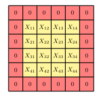

## 10.2.3 Padding 填充

### P11 第11段：填充的目的、尺寸计算与常见类型

We see from Figure 10.3 that the convolution map is smaller than the original image. 

If the image has dimensionality $J \times K$ pixels and we convolve with a kernel of dimensionality $M \times M$ (filters are typically chosen to be square) the resulting feature map has dimensionality $(J - M + 1) \times (K - M + 1)$. 

In some cases we want the feature map to have the same dimensions as the original image. 

This can be achieved by padding the original image with additional pixels around the outside, as illustrated in Figure 10.5. 

If we pad with $P$ pixels then the output map has dimensionality $(J + 2P - M + 1) \times (K + 2P - M + 1)$. 

If there is no padding, so that $P = 0$, this is called a *valid* convolution. 

When the value of $P$ is chosen such that the output array has the same size as the input, corresponding to $P = (M - 1)/2$, this is called a *same* convolution, because the image and the feature map have the same dimensions. 

In computer vision, filters generally use odd values of $M$, so that the padding can be symmetric on all sides of the image and that there is a well-defined central pixel associated with the location of the filter. 

Finally, we have to choose a suitable value for the intensities associated with the padding pixels. 

A typical choice is to set the padding values to zero, after first subtracting the mean from each image so that zero represents the average value of the pixel intensity. 

Padding can also be applied to feature maps for processing by subsequent convolutional layers.

**Figure 10.5** Illustration of a $4 \times 4$ image that has been padded with additional pixels to create a $6 \times 6$ image.

从图10.3可以看出，卷积映射图比原始图像要小。

如果图像维度为 $J \times K$ 像素，并且我们使用维度为 $M \times M$ 的核进行卷积（滤波器通常选择为正方形），则所得特征图的维度为 $(J - M + 1) \times (K - M + 1)$。

在某些情况下，我们希望特征图与原始图像具有相同的维度。

这可以通过在原始图像外围填充额外的像素来实现，如图10.5所示。

如果我们填充 $P$ 个像素，则输出映射图的维度为 $(J + 2P - M + 1) \times (K + 2P - M + 1)$。

如果没有填充，即 $P = 0$，这被称为**有效**卷积。

当 $P$ 的值选择为使输出数组与输入具有相同大小时，对应于 $P = (M - 1)/2$，这被称为**相同**卷积，因为图像和特征图具有相同的维度。

在计算机视觉中，滤波器通常使用奇数 $M$，这样填充可以在图像的所有边上对称，并且存在一个与滤波器位置相关联的明确定义的中心像素。

最后，我们必须为填充像素选择合适的强度值。

一种典型的选择是将填充值设为零，不过首先需要从每幅图像中减去均值，使得零代表像素强度的平均值。

填充也可以应用于特征图，以供后续卷积层处理。

**图 10.5** 一个 $4 \times 4$ 图像通过填充额外像素形成 $6 \times 6$ 图像的示意图。

> **重点难点**  
> 
> - 核心是掌握“有效卷积”（不填充，输出缩小）和“相同卷积”（填充使输出尺寸不变）两种模式及其尺寸计算公式。
>  
> - 难点在于理解为何滤波器尺寸通常取奇数（保证对称填充和唯一中心像素），以及填充值为何常设为零（需配合图像零均值化）。
