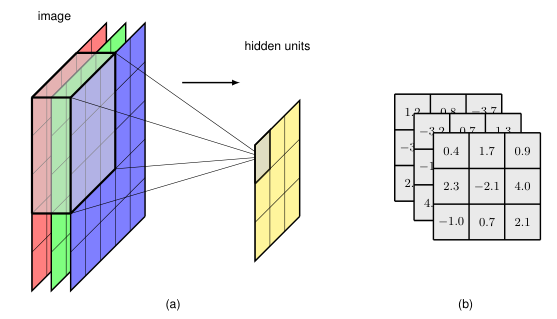
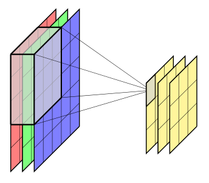

## 10.2.5 Multi-dimensional convolutions 多维卷积

### P13 第13段：多通道输入的卷积扩展

So far we have considered convolutions over a single grey-scale image. 

For a colour image there will be three channels corresponding to the red, green, and blue colours. 

We can easily extend convolutions to cover multiple channels by extending the dimensionality of the filter. 

An image with $J \times K$ pixels and $C$ channels will be described by a *tensor* of dimensionality $J \times K \times C$. 

We can introduce a filter described by a tensor of dimensionality $M \times M \times C$ comprising a separate $M \times M$ filter for each of the $C$ channels. 

Assuming no padding and a stride of 1, this again gives a feature map of size $(J - M + 1) \times (K - M + 1)$, as illustrated in Figure 10.6.

**Figure 10.6** (a) Illustration of a multi-dimensional filter that takes input from across the R, G, and B channels. (b) The kernel here has 27 weights (plus a bias parameter not shown) and can be visualized as a $3 \times 3 \times 3$ tensor.

到目前为止，我们只考虑了单通道灰度图像上的卷积。

对于彩色图像，将有红、绿、蓝三个通道。

我们可以通过扩展滤波器的维度来轻松地将卷积推广到多通道。

一个 $J \times K$ 像素、$C$ 个通道的图像将由维度为 $J \times K \times C$ 的**张量**来描述。

我们可以引入一个维度为 $M \times M \times C$ 的滤波器张量，其中包含针对 $C$ 个通道中每个通道的单独 $M \times M$ 滤波器。

假设无填充且步长为1，这同样会得到一个大小为 $(J - M + 1) \times (K - M + 1)$ 的特征图，如图10.6所示。

**图 10.6** (a) 多维滤波器示意图，该滤波器从 R、G、B 通道中接收输入。(b) 这里的核有 27 个权重（外加一个未显示的偏置参数），可以可视化为一个 $3 \times 3 \times 3$ 张量。

> **重点难点**  
> 
> - 关键扩展：滤波器从二维变为三维，深度与输入通道数相同，实现跨通道的联合特征提取。
>   
> - 难点在于理解每个输出位置的值是所有通道上对应空间位置的加权和，即滤波器张量与图像张量在空间和通道两个维度上的内积。

---

### P14 第14段：多输出通道——从单一特征到多个特征检测器

We now make a further important extension to convolutions. 

Up to now we have created a single feature map in which all the points in the feature map share the same set of learnable parameters. 

For a filter of dimensionality $M \times M \times C$, this will have $M^2C$ weight parameters, irrespective of the size of the image. 

In addition there will be a bias parameter associated with this unit. 

Such a filter is analogous to a single hidden node in a fully connected network, and it can learn to detect only one kind of feature and is therefore very limited. 

To build more flexible models, we simply include multiple such filters, in which each filter has its own independent set of parameters giving rise to its own independent feature map, as illustrated in Figure 10.7. 

We will again refer to these separate feature maps as *channels*. 

The filter tensor now has dimensionality $M \times M \times C \times C_{\text{OUT}}$ where $C$ is the number of input channels and $C_{\text{OUT}}$ is the number of output channels. 

Each output channel will have its own associated bias parameter, so the total number of parameters will be $(M^2C + 1)C_{\text{OUT}}$.

**Figure 10.7** The multi-dimensional convolutional filter layer shown in Figure 10.6 can be extended to include multiple independent filter channels.

现在我们对卷积进行另一个重要的扩展。

到目前为止，我们只创建了单个特征图，其中特征图中的所有点共享同一组可学习参数。

对于一个维度为 $M \times M \times C$ 的滤波器，将会有 $M^2C$ 个权重参数，与图像大小无关。

此外，与该单元相关联的还有一个偏置参数。

这样的滤波器类似于全连接网络中的单个隐藏节点，它只能学习检测一种特征，因此非常受限。

为了构建更灵活的模型，我们只需包含多个这样的滤波器，每个滤波器拥有自己独立的一组参数，从而产生自己独立的特征图，如图10.7所示。

我们将这些独立的特征图也称为**通道**。

此时滤波器张量的维度为 $M \times M \times C \times C_{\text{OUT}}$，其中 $C$ 是输入通道数，$C_{\text{OUT}}$ 是输出通道数。

每个输出通道都有自己的关联偏置参数，因此总参数数量为 $(M^2C + 1)C_{\text{OUT}}$。

**图 10.7** 图 10.6 所示的多维卷积滤波器层可以扩展为包含多个独立滤波器通道。

> **重点难点**  
> 
> - 引入多输出通道是实现表达能力扩展的关键——每个输出通道学习不同的特征检测器。
>   
> - 难点在于掌握参数量的计算方法：参数量由滤波器尺寸、输入通道数和输出通道数共同决定，与输入图像的空间尺寸无关。

---

### P15 第15段：$1 \times 1$ 卷积的作用与应用

A useful concept in designing convolutional networks is the $1 \times 1$ convolution (Lin, Chen, and Yan, 2013), which is simply a convolutional layer in which the filter size is a single pixel. 

The filters have $C$ weights, one for each input channel, plus a bias. 

One application for $1 \times 1$ convolutions is simply to change the number of channels (typically to reduce the number of channels) without changing the size of the feature maps, by setting the number of output channels to be different to the number of input channels. 

It is therefore complementary to strided convolutions or pooling in that it reduces the number of channels rather than the dimensionality of the channels.

---

在设计卷积网络时，$1 \times 1$ 卷积是一个有用的概念（Lin, Chen, 和 Yan, 2013），它本质上是一个滤波器尺寸为单个像素的卷积层。

该滤波器有 $C$ 个权重（每个输入通道一个），外加一个偏置。

$1 \times 1$ 卷积的一个应用是，通过将输出通道数设置为与输入通道数不同的值，在不改变特征图空间尺寸的情况下改变通道数量（通常用于减少通道数）。

因此，它与步长卷积或池化相辅相成，因为它减少的是通道数而非通道的空间维度。

> **重点难点**  
> 
> - $1 \times 1$ 卷积的作用是通道维度的变换（升维或降维），同时保持空间分辨率不变，是一种轻量级的特征组合方式。
>   
> - 难点在于理解 $1 \times 1$ 卷积本质上是跨通道的全连接层（对每个位置独立应用），它在增加非线性（配合激活函数）和降低计算量方面有重要作用。
