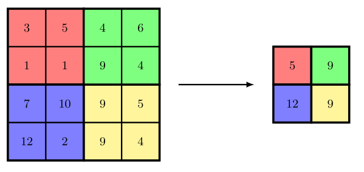

## 10.2.6 Pooling 池化

### P16 第16段：平移不变性与池化的动机

A convolutional layer encodes translation **equivariance**, whereby if a small patch of pixels, representing the receptive field of a hidden unit, is moved to a different location in the image, the associated outputs of the feature map will move to the corresponding location in the feature map. 

This is valuable for applications such as finding the location of an object within an image. 

For other applications, such as classifying an image, we want the output to be **invariant** to translations of the input. 

In all cases, however, we want the network to be able to learn hierarchical structure in which complex features at a particular level are built up from simpler features at the previous level. 

In many cases the spatial relationship between those simpler features will be important. 

For example, it is the relative positions of the eyes, nose, and mouth that help determine the presence of a face and not just the presence of these features in arbitrary locations within the image. 

However, small changes in the relative locations do not affect the classification, and we want to be invariant to such small translations of individual features. 

This can be achieved using **pooling** applied to the output of the convolutional layer.

卷积层编码了**平移等变性**（translation equivariance）：如果代表隐单元感受野的一小块像素被移动到图像中的不同位置，则特征图上的对应输出也会随之移动到特征图上的相应位置。

这种性质在寻找图像中物体位置等任务中非常有用。

但在另一些任务中，例如图像分类，我们期望输出对输入的平移具有**不变性**（invariance）。

然而，无论哪种情况，我们都希望网络能够学习层次化结构，即某一层的复杂特征由前一层的简单特征组合而成。

在很多情况下，这些简单特征之间的空间关系至关重要。

例如，眼睛、鼻子和嘴巴的相对位置决定了人脸的存在，而不仅仅是这些特征在图像中任意位置的出现。

不过，相对位置的微小变化通常不影响分类结果，因此我们希望对这些单个特征的微小平移具有不变性。

这可以通过对卷积层的输出应用**池化**（pooling）来实现。

> **重点难点**：
> - 理解“等变性”与“不变性”的区别——等变性是指输出随输入平移而同步平移，不变性则要求输出对平移不敏感。
> - 池化的核心目标正是有选择地丢弃精确位置信息，换取对局部位移的鲁棒性。

---

### P17 第17段：池化的基本操作与最大池化

Pooling has similarities to using a convolutional layer in that an array of units is arranged in a grid, with each unit taking input from a receptive field in the previous feature map layer. 

Again, there is a choice of filter size and of stride length. 

The difference, however, is that the output of a pooling unit is a simple, fixed function of its inputs, and so there are no learnable parameters in pooling. 

A common example of a pooling function is *max-pooling* (Zhou and Chellappa, 1988) in which each unit simply outputs the max function applied to the input values. 

This is illustrated with a simple example in Figure 10.8. 

Here the stride length is equal to the filter width, and so there is no overlap of the receptive fields.

**Figure 10.8** Illustration of max-pooling in which blocks of $2 \times 2$ pixels in a feature map are combined using the 'max' operator to generate a new feature map of smaller dimensionality.

池化在结构上与卷积层类似：一组单元按网格排列，每个单元接收来自前一层特征图某个感受野的输入，同样需要选择滤波器尺寸和步长。

但不同之处在于，池化单元的输出是其输入的简单固定函数，因此池化层**没有可学习参数**。

最常见的池化函数之一是**最大池化**（max-pooling）（Zhou and Chellappa, 1988），即每个单元直接输出输入值的最大值。

图10.8给出了一个简单示例，其中步长等于滤波器宽度，因此感受野之间没有重叠。

**图10.8图注** 最大池化示意图：将特征图中 $2 \times 2$ 的像素块通过“最大值”运算符合并，生成维度更小的新特征图。

> **重点难点**：
> - 池化与卷积的结构相似性，以及关键区别——池化无参数、操作固定。
> - 最大池化仅保留最强响应，丢弃其他信息，这是其实现平移不变性的核心机制。

---

### P18 第18段：池化的降维作用

As well as building in some local translation invariance, pooling can also be used to reduce the dimensionality of the representation by down-sampling the feature map. 

Note that using strides greater than 1 in a convolutional layer also has the effect of down-sampling the feature maps.

除了引入局部平移不变性外，池化还可以通过对特征图进行**下采样**（down-sampling）来降低表示的维度。

需要注意的是，在卷积层中使用大于1的步长同样具有下采样特征图的效果。

> **重点难点**：
> - 明确池化的双重功能——不变性与降维。
> - 同时要区分“池化下采样”和“卷积步长下采样”的不同：前者是无参数的固定操作，后者是可学习的。

---

### P19 第19段：池化对特征响应的解释与其他池化方式

We can interpret the activation of a unit in a feature map as a measure of the strength of detection of a corresponding feature, so that the max-pooling preserves information on whether the feature is present and with what strength but discards some positional information. 

There are many other choices of pooling function, for example *average pooling* in which the pooling function computes the average of the values from the corresponding receptive field in the feature map. 

These all introduce some degree of local translation invariance.

我们可以将特征图中一个单元的激活值解释为对应特征检测的强度，因此最大池化保留了“特征是否存在”及其强度信息，但丢弃了部分位置信息。

池化函数还有其他多种选择，例如**平均池化（average pooling）**，它计算感受野内数值的平均值。

所有这些池化方式都会引入一定程度的局部平移不变性。

> **重点难点**：
> - 最大池化保留强度但丢失位置信息的“信息取舍”逻辑。
> - 平均池化与最大池化的行为差异——平均池化对整体响应更敏感，而最大池化更关注最显著特征，这在后续层中会影响梯度传播。

---

### P20 第20段：通道独立池化

Pooling is usually applied to each channel of a feature map independently. 

For example, if we have a feature map with 8 channels, each of dimensionality $64 \times 64$, and we apply max-pooling with a receptive field of size $2 \times 2$ and a stride of 2, the output of the pooling operation will be a tensor of dimensionality $32 \times 32 \times 8$.

池化通常独立应用于特征图的每个通道。

例如，若有一个8通道的特征图，每个通道维度为 $64 \times 64$，使用 $2 \times 2$ 的感受野和步长2进行最大池化，则输出张量的维度为 $32 \times 32 \times 8$。

> **重点难点**：
> - 池化不改变通道数，只改变空间维度。
> - 这种“逐通道独立处理”是标准做法，需与后续跨通道池化区分。

---

### P21 第21段：跨通道池化与学习更广泛的不变性

We can also apply pooling across multiple channels of a feature map, which gives the network the potential to *learn* other invariances beyond simple translation invariance. 

For example, if several channels in a convolutional layer learn to detect the same feature but at different orientations, then max-pooling across those feature maps will be approximately invariant to rotations.

我们也可以对特征图的**多个通道**进行池化，这使网络有可能**学习**除简单平移之外的其他不变性。

例如，如果卷积层的多个通道分别检测同一特征的不同朝向，那么对这些特征图进行最大池化将近似实现**旋转不变性**。

> **重点难点**：
> - 跨通道池化不再独立处理通道，而是跨维度合并，这引入了可学习的不变性（通过让不同通道学习同一特征的不同变体）。
> - 这是一种更高级的池化策略，需要与通道独立池化明确区分。

---

### P22 第22段：池化适应变尺寸图像

Pooling also allows a convolutional network to process images of varying sizes. 

Ultimately, the output, and generally some of the intermediate layers, of a convolutional network must have a fixed size. 

Variable-sized inputs can be accommodated by varying the stride length of the pooling according to the size of the image such that the number of pooled outputs remains constant.

池化还使得卷积网络能够处理不同尺寸的图像。

因为卷积网络的最终输出（以及部分中间层）必须具有固定尺寸，所以可以通过根据图像尺寸**调整池化的步长**，使得池化输出的数量保持不变，从而适配可变尺寸的输入。

> **重点难点**：
> - 如何通过动态调整池化步长来“消化”不同输入尺寸，使网络输出固定维度。
> - 这是处理变尺寸输入的一种实用技巧，但需注意步长变化会改变感受野的覆盖密度，可能影响特征提取的尺度一致性。

---
