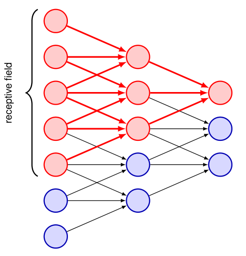

## 10.2.7 Multilayer convolutions 多层卷积

### P23 第23段：从单层到多层卷积结构

The convolutional network structure described so far is analogous to a single layer in a standard fully connected neural network. 

To allow the network to discover and represent hierarchical structure in the data, we now extend the architecture by considering multiple layers of the kind described above. 

Each convolutional layer is described by a filter tensor of dimensionality $M \times M \times C_{\text{IN}} \times C_{\text{OUT}}$ in which the number of independent weight and bias parameters is $(M^2 C_{\text{IN}} + 1)C_{\text{OUT}}$. 

Each such convolutional layer can optionally be followed by a pooling layer. 

We can now apply multiple such layers of convolution and pooling in succession, in which the $C_{\text{OUT}}$ output channels of a particular layer, analogous to the RGB channels of the input image, form the input channels of the next layer. 

Note that the number of channels in a feature map is sometimes called the ‘depth’ of the feature map, but we prefer to reserve the term *depth* to mean the number of layers in a multilayer network.

到目前为止描述的卷积网络结构，类似于标准全连接神经网络中的单层。

为了让网络能够发现并表达数据中的层次化结构，我们现在通过堆叠多个上述类型的层来扩展架构。

每个卷积层由一个维度为 $M \times M \times C_{\text{IN}} \times C_{\text{OUT}}$ 的滤波器张量描述，其中独立的权重和偏置参数数量为 $(M^2 C_{\text{IN}} + 1)C_{\text{OUT}}$。

每个这样的卷积层之后可以选择性地跟一个池化层。

我们可以连续应用多个这样的卷积层和池化层，其中某一层的 $C_{\text{OUT}}$ 个输出通道——类似于输入图像的RGB通道——将作为下一层的输入通道。

需要注意的是，特征图的通道数有时被称为特征图的“深度”，但我们更倾向于将术语*深度*保留用于表示多层网络中的层数。

> **重点难点**：
> - 掌握卷积层参数数量的计算公式，理解各维度含义（滤波器大小、输入通道数、输出通道数）。
> - 同时要明确“通道数”与“网络深度”在术语上的区分，避免混淆。

---

### P24 第24段：感受野随深度增长

A key property that we built into the convolutional framework is that of *locality*, in which a given unit in a feature map takes information only from a small patch, the *receptive field*, in the previous layer. 

When we construct a deep neural network in which each layer is convolutional then the effective receptive field of a unit in later layers in the network becomes much larger than those in earlier layers, as seen in Figure 10.9.

**Figure 10.9** Illustration of how the effective receptive field grows with depth in a multilayer convolutional network. 

Here we see that the red unit at the top of the output layer takes inputs from a receptive field in the middle layer of units, each of which has a receptive field in the first layer of units. 

Thus, the activation of the red unit in the output layer depends on the outputs of 3 units in the middle layer and 5 units in the input layer.

我们构建到卷积框架中的一个关键属性是**局部性（locality）**，即特征图中的某个给定单元仅从上一层的一个小斑块（即*感受野*）获取信息。

当我们构建一个每层都是卷积的深度神经网络时，网络中较后层单元的有效感受野会比较早层大得多，如图10.9所示。

**图10.9** 多层卷积网络中有效感受野随深度增长的示意图。

图中可以看到，输出层顶部的红色单元接受来自中间层单元的某个感受野的输入，而中间层每个单元又在第一层拥有各自的感受野。

因此，输出层红色单元的激活取决于中间层3个单元的输出，以及输入层5个单元的输出。

> **重点难点**：
> - 理解“有效感受野”随层数增加而扩展的机制——不是参数增多，而是通过层级组合自然扩大视野。
> - 这是深度卷积网络能够捕捉全局上下文信息的基础，也是设计网络深度时需要考虑的核心因素。

---

### P25 第25段：全连接层作为网络输出阶段

In many applications, the output units of the network need to make predictions about the image as a whole, for example in a classification task, and so they need to combine information from across the whole of the input image. 

This is typically achieved by introducing one or two standard fully connected layers as the final stages of the network, in which each unit is connected to every unit in the previous layer. 

The number of parameters in such an architecture can be manageable because the final convolutional layer generally has much lower dimensionality than the input layer due to the intermediate pooling layers. 

Nevertheless, the final fully connected layers may contain the majority of the independent degrees of freedom in the network even if the number of (shared) connections in the network is larger in the convolutional layers.

在许多应用中，网络输出单元需要对整张图像做出预测（例如分类任务），因此它们需要整合来自整个输入图像的信息。

这通常通过在网络的最后阶段引入一个或两个标准全连接层来实现，其中每个单元都与前一层的每个单元相连。

这种架构中的参数数量是可管理的，因为由于中间的池化层，最终卷积层的维度通常远低于输入层。

然而，即使网络中（共享）连接的数量在卷积层中更多，最终的几个全连接层仍然可能包含网络中大部分的自由度（独立参数）。

> **重点难点**：
> - 理解为什么全连接层参数数量可能巨大，但整体仍然可控——关键在于池化已大幅缩减了空间维度。
> - 同时要注意“连接数”与“独立参数数量”的区别：卷积层共享权重，连接多但参数少；全连接层无共享，参数集中于此。

---

### P26 第26段：完整CNN的架构设计

A complete CNN therefore comprises multiple layers of convolutions interspersed with pooling operations, and often with conventional fully connected layers in the final stages of the network. 

There are many choices to be made in designing such an architecture including the number of layers, the number of channels in each layer, the filter sizes, the stride widths, and multiple other such hyperparameters. 

A wide variety of different architectures have been explored, although in practice it is difficult to make a systematic comparison of hyperparameter values using hold-out data due to the high computational cost of training each candidate configuration.

因此，一个完整的CNN包含多个卷积层，其间穿插池化操作，并且在网络最后阶段通常带有传统的全连接层。

设计这样的架构时有许多选择，包括层数、每层通道数、滤波器尺寸、步长宽度以及其他多个此类超参数。

尽管训练每个候选配置的计算成本很高，导致在实践中很难使用留出数据对超参数值进行系统比较，但研究人员已经探索了各种各样不同的架构。

> **重点难点**：
> - 认识到CNN架构设计是超参数密集型的工程任务，涉及层数、通道数、滤波器大小等多维度的权衡。
> - 难点在于这些超参数相互耦合，且由于训练成本高昂，系统性搜索非常困难，通常依赖于经验法则、启发式方法或迁移已有成功架构。
