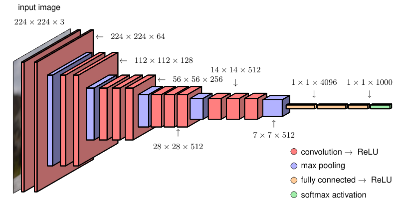

## 10.2.8 Example network architectures 经典网络架构示例

### P27 第27段：卷积网络的早期成功与ImageNet的推动

Convolutional networks were the first deep neural networks (i.e., ones with more than two learnable layers of parameters) to be successfully deployed in applications. 

An early example was *LeNet*, which was used to classify low-resolution monochrome images of handwritten digits (LeCun et al., 1989; LeCun et al., 1998). 

The development of more powerful convolutional networks was accelerated through the introduction of a large-scale benchmark data set called *ImageNet* (Deng et al., 2009) comprising some 14 million natural images each of which has been hand labelled into one of nearly 22,000 categories. 

This was a much larger data set than had been used previously, and the advances in the field driven by ImageNet served to emphasize the importance of large-scale data, alongside well-designed models having appropriate inductive biases, in building successful deep learning solutions.

卷积网络是首批在实际应用中获得成功的深度神经网络（即拥有两层以上可学习参数层的网络）。

早期的一个典型例子是 **LeNet**，用于对低分辨率的手写数字灰度图像进行分类（LeCun 等，1989；LeCun 等，1998）。

更强大的卷积网络的发展得益于一个大规模基准数据集 **ImageNet** 的引入（Deng 等，2009），该数据集包含约 1400 万张自然图像，每张图像都被手工标注到近 22,000 个类别之一。

这个数据集远比之前使用的数据集规模宏大，而由 ImageNet 推动的该领域进展，强调了大规模数据以及具有适当归纳偏好的精心设计模型，在构建成功的深度学习解决方案中的重要性。

> **重点难点**：
> - 理解 ImageNet 数据集的规模（1400 万张图，2.2 万类）对深度学习发展的里程碑意义。
> - 它不仅是数据量的提升，更迫使模型必须依赖更强大的归纳偏置（如卷积的局部性和平移等变性）才能有效学习，而无法依赖简单的浅层特征工程。

---

### P28 第28段：ImageNet挑战赛与AlexNet的突破

A subset of images comprising 1,000 non-overlapping categories formed the basis for the annual *ImageNet Large Scale Visual Recognition Challenge*. 

Again, this was a much larger number of categories than the typically few dozen classes previously considered. 

Having so many categories made the problem much more challenging because, if the classes were distributed uniformly, random guessing would have an error rate of 99.9%. 

The data set has just over 1.28 million training images, 50,000 validation images, and 100,000 test images. 

The classifiers are designed to produce a ranked list of predicted output classes on test images, and results are reported in terms of top-1 and top-5 error rates, meaning an image is deemed to be correctly classified if the true class appears at the top of the list or if it is in one of the five highest-ranked class predictions. 

Early results with this data set achieved a top-5 error rate of around 25.5%. 

An important advance was made by the *AlexNet* convolutional network architecture (Krizhevsky, Sutskever, and Hinton, 2012), which won the 2012 competition and reduced the top-5 error rate to a new record of 15.3%. 

Key aspects of this model were the use of the ReLU activation function, the application of GPUs to train the network, and the use of dropout regularization. 

Subsequent years saw further advances, leading to error rates of around 3%, which is somewhat better than human-level performance for the same data, which is around 5% (Dodge and Karam, 2017). 

This can be attributed to the difficulty humans have in distinguishing subtly different classes (for example multiple varieties of mushrooms).

ImageNet 的一个包含 1000 个不重叠类别的图像子集，构成了年度 **ImageNet 大规模视觉识别挑战赛** 的基础。

这个类别数量远超此前通常考虑的几十个类别。

如此多的类别使问题极具挑战性，因为如果类别均匀分布，随机猜测的错误率将高达 99.9%。

该数据集拥有约 128 万张训练图像、5 万张验证图像和 10 万张测试图像。

分类器需要为测试图像生成一个预测类别的排序列表，结果以 top-1 和 top-5 错误率报告，即如果真实类别排在预测列表首位或排在前五名内，则认为图像被正确分类。

该数据集的早期结果达到了约 25.5% 的 top-5 错误率。

**AlexNet** 卷积网络架构（Krizhevsky, Sutskever, 和 Hinton, 2012）取得了重要突破，它赢得了 2012 年的比赛，并将 top-5 错误率降至创纪录的 15.3%。

该模型的关键要素包括：使用 ReLU 激活函数、利用 GPU 训练网络，以及使用丢弃法（dropout）正则化。

随后的几年中，错误率进一步降低至约 3%，这略优于人类在该数据集上约 5% 的水平（Dodge 和 Karam, 2017）。

这可以归因于人类在区分细微差异的类别（例如多种蘑菇）时存在的困难。

> **重点难点**：
> - 理解 top-5 错误率在超多类别分类中的意义（放宽了评价标准）。
> - AlexNet 的三个核心技术贡献（ReLU 解决梯度饱和、GPU 并行加速、dropout 缓解过拟合）是深度学习复兴的关键驱动力，需要掌握它们各自解决的具体问题。

---

### P29 第29段：VGG-16 架构详解

As an example of a typical convolutional network architecture, we look in detail at the VGG-16 model (Simonyan and Zisserman, 2014), where VGG stands for the Visual Geometry Group, who developed the model, and 16 refers to the number of learnable layers in the model. 

VGG-16 has some simple design principles leading to a relatively uniform architecture, shown in Figure 10.10, that minimizes the number of hyperparameter choices that need to be made. 

It takes an input image having $224 \times 224$ pixels and three colour channels, followed by sets of convolutional layers interspersed with down-sampling. 

All convolutional layers have filters of size $3 \times 3$ with a stride of 1, same padding, and a ReLU activation function, whereas the max-pooling operations all use stride 2 and filter size $2 \times 2$ thereby down-sampling the number of units by a factor of 4. 

The first learnable layer is a convolutional layer in which each unit takes input from a $3 \times 3 \times 3$ ‘cube’ from the stack of input channels and so has 28 parameters including the bias. 

These parameters are shared across all units in the feature map for that channel. 

There are 64 such feature channels in the first layer, giving an output tensor of size $224 \times 224 \times 64$. 

The second layer is also convolutional and again has 64 channels. 

This is followed by max-pooling giving feature maps of size $112 \times 112$. 

Layers 3 and 4 are again convolutional, of dimensionality $112 \times 112$, and each was chosen to have 128 channels. 

This increase in the number of channels offsets to some extent the down-sampling in the max-pooling layer to ensure that the number of variables in the representation at each layer does not decrease too rapidly through the network. 

Again, this is followed by a max-pooling operation to give a feature map size of $56 \times 56$. 

Next come three more convolutional layers each with 256 channels, thereby again doubling the number of channels in association with the down-sampling. 

This is followed by another max-pooling to give feature maps of size $28 \times 28$ followed by three more convolutional layers each having 512 channels, followed by another max-pooling, which down-samples to feature maps of size $14 \times 14$. 

This is followed by three more convolutional layers, although the number of feature maps in these layers is kept at 512, followed by another max-pooling, which brings the size of the feature maps down to $7 \times 7$. 

Finally there are three more layers that are *fully connected* meaning that they are standard neural network layers with full connectivity and no sharing of parameters. 

The final max-pooling layer has 512 channels each of size $7 \times 7$ giving 25,088 units in total. 

The first fully connected layer has 4,096 units, each of which is connected to each of the max-pooling units. 

This is followed by a second fully connected layer again with 4,096 units, and finally there is a third fully connected layer with 1,000 units so that the network can be applied to a classification problem involving 1,000 classes. 

All the learnable layers in the network have nonlinear ReLU activation functions, except for the output layer, which has a softmax activation function. 

In total there are roughly 138 million independently learnable parameters in VGG-16, the majority of which (nearly 103 million) are in the first fully connected layer, whereas most of the connections are in the first convolutional layer.

**Figure 10.10** The architecture of a typical convolutional network, in this case a model called VGG-16.

作为典型卷积网络架构的示例，我们详细分析 **VGG-16** 模型（Simonyan 和 Zisserman, 2014），其中 VGG 代表开发该模型的可视化几何组（Visual Geometry Group），16 指模型中可学习层的数量。

VGG-16 遵循一些简单的设计原则，形成了如图 10.10 所示的相对统一的架构，最大限度地减少了需要选择的超参数数量。

它接收 $224 \times 224$ 像素、3 个颜色通道的输入图像，随后是一系列卷积层与下采样层交错排列。

所有卷积层均使用 $3 \times 3$ 滤波器、步长 1、相同填充（same padding）和 ReLU 激活函数，而所有最大池化操作均使用步长 2 和 $2 \times 2$ 滤波器，从而将单元数量下采样 4 倍。

第一个可学习层是卷积层，其中每个单元从输入通道堆叠中取一个 $3 \times 3 \times 3$ 的“立方体”作为输入，因此包含 28 个参数（含偏置）。

这些参数在该通道的特征图上的所有单元之间共享。

第一层有 64 个这样的特征通道，输出张量尺寸为 $224 \times 224 \times 64$。

第二层同样是卷积层，也有 64 个通道。

随后是最大池化，得到 $112 \times 112$ 的特征图。

第 3 和第 4 层同样是卷积层，维度为 $112 \times 112$，每层选择 128 个通道。

这种通道数的增加在一定程度上抵消了最大池化层的下采样影响，以确保网络各层表示的变量数量不会下降过快。

之后再次进行最大池化，得到 $56 \times 56$ 的特征图。

接下来是三层卷积，每层 256 个通道，从而在下采样的同时再次将通道数加倍。

之后是另一个最大池化，得到 $28 \times 28$ 的特征图，随后又是三层卷积，每层 512 个通道，接着再进行一次最大池化，下采样至 $14 \times 14$ 的特征图。

接下来是三层卷积，不过这些层的特征图数量保持在 512，之后再次进行最大池化，将特征图尺寸降至 $7 \times 7$。

最后三个层是**全连接层**，即标准的、完全连接且无参数共享的神经网络层。

最后一个最大池化层有 512 个通道，每个通道尺寸为 $7 \times 7$，总共产生 25,088 个单元。

第一个全连接层有 4,096 个单元，每个单元都与每个最大池化单元相连。

之后是第二个全连接层，同样是 4,096 个单元，最后是第三个全连接层，包含 1,000 个单元，使网络能够应用于 1000 类别的分类问题。

网络中所有可学习层均使用非线性 ReLU 激活函数，但输出层使用 softmax 激活函数。

VGG-16 总共有约 1.38 亿个独立可学习参数，其中绝大多数（近 1.03 亿）位于第一个全连接层，而大部分连接则位于第一个卷积层。

**图 10.10** 典型卷积网络架构示意图，此处为 VGG-16 模型。

> **重点难点**：
> 
> - 理解 VGG 的“均匀设计哲学”——全部使用 3×3 小卷积核和 2×2 池化，通过堆叠层数来增大感受野。
>
> - 需要掌握通道数随下采样倍增的规律（64→128→256→512），以及为什么这样做可以平衡各层的表示容量。
>
> - 同时注意参数分布的极端不均衡：全连接层占绝对主导，这是 VGG 内存和计算开销大的根源。

---

### P30 第30段：小卷积核堆叠的优势与自动微分简化训练

Earlier CNNs typically had fewer convolutional layers, as they had larger receptive fields. 

For example, Alexnet (Krizhevsky, Sutskever, and Hinton, 2012) has $11 \times 11$ receptive fields with a stride of 4. 

We saw in Figure 10.9 that larger receptive fields can also be achieved implicitly by using multiple layers each having smaller receptive fields. 

The advantage of the latter approach is that it requires significantly fewer parameters, effectively imposing an inductive bias on the larger filters as they must be composed of convolutional sub-filters. 

Although this is a highly complex architecture, only the network function itself needs to be coded explicitly since the derivatives of the cost function can be evaluated using automatic differentiation and the cost function optimized using stochastic gradient descent.

早期的 CNN 通常卷积层较少，因为它们使用较大的感受野。

例如，AlexNet（Krizhevsky, Sutskever, 和 Hinton, 2012）使用了 $11 \times 11$ 的感受野，步长为 4。

我们在图 10.9 中看到，较大的感受野也可以通过多层堆叠、每层使用较小感受野来隐式地实现。

后一种方法的优势在于它需要的参数显著更少，实质上是对较大滤波器施加了一种归纳偏置，因为它们必须由卷积子滤波器组合而成。

尽管这是一个高度复杂的架构，但由于代价函数的导数可以通过自动微分（automatic differentiation）来计算，且代价函数可以使用随机梯度下降来优化，因此只有网络函数本身需要显式编码。

> **重点难点**：
> - 理解为什么多层小卷积核（如 VGG 的 3×3）优于单层大卷积核（如 AlexNet 的 11×11）——在相同有效感受野下，前者参数量更少且非线性更强。
> - 同时要理解，虽然架构设计复杂，但训练并不需要手动推导梯度，自动微分和 SGD 使得复杂网络的优化变得工程上可行，这是现代深度学习框架的核心便利。

---
