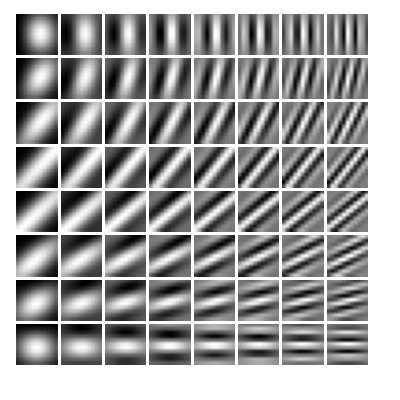

# 10.3 Visualizing Trained CNNs

We turn now to an exploration of the features learned by modern deep CNNs, and we will see some remarkable similarities to the properties of the mammalian visual cortex.

## 10.3.1 Visual cortex

Historically, much of the motivation for CNNs came from pioneering research in neuroscience, which gave insights into the nature of visual processing in mammals including humans. 

Electrical signals from the retina are transformed through a series of processing layers in the visual cortex, which is at the back of the brain, where the neurons are organized into two-dimensional sheets each of which forms a map of the two-dimensional visual field. 

In their pioneering work, Hubel and Wiesel (1959) measured the electrical responses of individual neurons in the visual cortex of cats while presenting visual stimuli to the cats’ eyes. 

They discovered that some neurons, called ‘simple cells’, have a strong response to visual inputs with a simple edge oriented at a particular angle and located at a particular position within the visual field, whereas other stimuli generated relatively little response in those neurons. 

More detailed studies showed that the response of these simple cells can be modelled using *Gabor filters*, which are two-dimensional functions defined by
$$
G(x, y) = A \exp\left(-\alpha \overline{x}^2 - \beta \overline{y}^2\right) \sin\left(\omega \overline{x} + \phi\right) \tag{10.6}
$$
where
$$
\overline{x} = (x - x_0) \cos(\theta) + (y - y_0) \sin(\theta) \tag{10.7}
$$
$$
\overline{y} = -(x - x_0) \sin(\theta) + (y - y_0) \cos(\theta). 

\tag{10.8}
$$

Equations (10.7) and (10.8) represent a rotation of the coordinate system through an angle $\theta$ and therefore the $\sin(\cdot)$ term in (10.6) represents a sinusoidal spatial oscillation oriented in a direction defined by the polar angle $\theta$, with frequency $\omega$ and phase angle $\phi$. 

The exponential factor in (10.6) creates a decay envelope that localizes the filter in the neighbourhood of position $(x_0, y_0)$, with decay rates governed by $\alpha$ and $\beta$. 

Example Gabor filters are shown in Figure 10.11.

**Figure 10.11** Examples of Gabor filters defined by (10.6). 

The orientation angle $\theta$ varies from $0$ in the top row to $\pi/2$ in the bottom row, whereas the frequency varies from $\omega = 1$ in the left column to $\omega = 10$ in the right column.

Hubel and Wiesel also discovered the presence of ‘complex cells’, which respond to more complex stimuli and which seem to be derived by combining and processing the output of simple cells. 

These responses exhibit some degree of invariance to small changes in the input such as shifts in location, analogous to the pooling units in a convolutional deep network. 

Deeper levels of the mammalian visual processing system have even more specific responses and even greater invariance to transformations of the visual input. 

Such cells have been termed ‘grandmother cells’ because such a cell could notionally respond if, and only if, the visual input corresponds to a person’s grandmother, irrespective of location, scale, lighting, or other transformations of the scene. 

This work directly inspired an early form of deep neural network called the *neocognitron* (Fukushima, 1980), which was the forerunner of convolutional neural networks. 

The neocognitron had multiple layers of processing comprising local receptive fields with shared weights followed by local averaging or max-pooling to confer positional invariance. 

However, it lacked an end-to-end training procedure since it predated the development of backpropagation, relying instead on greedy layer-wise learning through an unsupervised clustering algorithm.

# 10.3 可视化训练好的卷积神经网络

我们现在转向探索现代深度卷积神经网络（CNN）所学到的特征，并且我们将看到它们与哺乳动物视觉皮层特性之间存在一些显著相似之处。

## 10.3.1 视觉皮层

从历史上看，CNN 的许多动机来自神经科学的开创性研究，这些研究为包括人类在内的哺乳动物的视觉加工本质提供了洞见。

来自视网膜的电信号通过视觉皮层中的一系列处理层进行变换。

视觉皮层位于大脑后部，其中的神经元组织成二维薄片，每一层都形成对二维视野的映射。

在 Hubel 和 Wiesel（1959）的开创性工作中，他们在向猫的眼睛呈现视觉刺激时，测量了猫视觉皮层中单个神经元的电响应。

他们发现，有些被称为“简单细胞”的神经元，对具有特定角度方向且位于视野中特定位置的简单边缘视觉输入有强烈响应，而其他刺激在这些神经元中引起的响应相对很小。

更详细的研究表明，这些简单细胞的响应可以用 *Gabor 滤波器* 来建模，它是由下式定义的二维函数
$$
G(x, y) = A \exp\left(-\alpha \overline{x}^2 - \beta \overline{y}^2\right) \sin\left(\omega \overline{x} + \phi\right) \tag{10.6}
$$
其中
$$
\overline{x} = (x - x_0) \cos(\theta) + (y - y_0) \sin(\theta) \tag{10.7}
$$
$$
\overline{y} = -(x - x_0) \sin(\theta) + (y - y_0) \cos(\theta). \tag{10.8}
$$

式（10.7）和（10.8）表示将坐标系旋转一个角度 $\theta$，因此（10.6）中的 $\sin(\cdot)$ 项表示一个正弦空间振荡，其方向由极角 $\theta$ 定义，频率为 $\omega$，相位角为 $\phi$。

（10.6）中的指数因子产生一个衰减包络，使滤波器局限在位置 $(x_0, y_0)$ 附近，衰减速率由 $\alpha$ 和 $\beta$ 控制。

示例 Gabor 滤波器如图 10.11 所示。

**图 10.11** 由（10.6）定义的 Gabor 滤波器示例。方向角 $\theta$ 从顶行的 $0$ 变化到底行的 $\pi/2$，而频率从左列的 $\omega = 1$ 变化到右列的 $\omega = 10$。

Hubel 和 Wiesel 还发现了“复杂细胞”的存在，它们对更复杂的刺激作出响应，并且似乎是通过组合和处理简单细胞的输出而得到的。

这些响应表现出对输入的小变化有一定程度的不变性，例如位置偏移，这类似于卷积深度网络中的池化单元。

哺乳动物视觉处理系统的更深层具有更加特定的响应，并且对视觉输入的变换具有更大的不变性。

这类细胞被称为“祖母细胞”，因为从概念上说，这种细胞可以当且仅当视觉输入对应于某人的祖母时作出响应，而不论位置、尺度、光照或场景的其他变换如何。

这项工作直接启发了一种早期形式的深度神经网络，称为 *neocognitron*（Fukushima，1980），它是卷积神经网络的前身。

Neocognitron 具有多层处理结构，包括具有共享权重的局部感受野，随后是局部平均或最大池化，以赋予位置不变性。

然而，它缺乏端到端的训练过程，因为它早于反向传播的发展，转而依赖于通过无监督聚类算法进行的贪婪逐层学习。

---

> 重点总结
> 
> 1. **CNN 与视觉皮层的联系**  
>   现代深度 CNN 学习到的特征与哺乳动物视觉皮层之间存在显著相似性。
> 
> 2. **简单细胞与 Gabor 滤波器**  
>    Hubel 和 Wiesel 发现视觉皮层中的简单细胞对特定位置和方向的边缘有强烈响应，并可用 Gabor 滤波器建模。
> 
> 3. **Gabor 滤波器的数学形式**  
>   式（10.6）—（10.8）描述了一个带正弦振荡和局部衰减包络的二维滤波器，其中：
>    - $\theta$ 控制方向；
>    - $\omega$ 控制频率；
>    - $\phi$ 控制相位；
>    - $(x_0, y_0)$ 控制位置；
>    - $\alpha, \beta$ 控制衰减范围。
> 
> 4. **复杂细胞与池化**  
>    复杂细胞通过组合简单细胞输出，获得对位置等小变化的不变性，类似于 CNN 中的池化单元。
> 
> 5. **祖母细胞与深层不变性**  
>    更深层视觉处理对特定复杂对象具有高度选择性，并对位置、尺度、光照等变换具有更大不变性。
> 
> 6. **Neocognitron 与 CNN 前身**  
>    Fukushima 的 neocognitron 受视觉皮层启发，包含局部感受野、共享权重和池化，但缺少端到端反向传播训练。

> 难点总结
> 
> 1. **Gabor 滤波器的理解**  
>   需要理解坐标旋转、正弦空间振荡、局部衰减包络以及各参数含义。
> 
> 2. **简单细胞、复杂细胞与 CNN 组件的对应关系**  
>    需要把神经科学概念映射到 CNN 中的卷积、池化和层级特征学习。
> 
> 3. **不变性的层次化来源**  
>    复杂细胞和深层视觉处理中的不变性，与 CNN 中池化和深层表示之间的类比需要仔细理解。
> 
> 4. **Neocognitron 的局限性**  
>    它虽具备 CNN 的某些结构思想，但依赖无监督逐层学习，而不是现代端到端反向传播训练。
