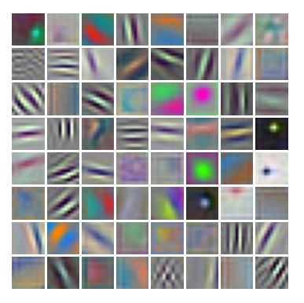
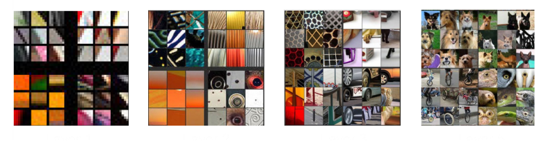
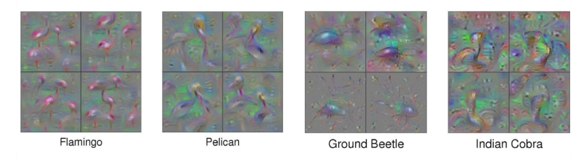

## 10.3.2 Visualizing trained filters

Suppose we have a trained deep CNN and we wish to explore what the hidden units have learned to detect. For the filters in the first convolutional layer this is relatively straightforward, as they correspond to small patches in the original input image space, and so we can visualize the network weights associated with these filters directly as small images. The first convolutional layer computes inner products between the filters and the corresponding image patches, and so the unit will have a large activation when the inner product has a large magnitude.

Figure 10.12 shows some example filters from the first layer of a CNN trained on the ImageNet data set. We see a remarkable similarity between these filters and the Gabor filters of Figure 10.11. However, this does not imply that a convolutional neural network is a good model of how the brain works, because very similar results can be obtained from a wide variety of statistical methods (Hyvärinen, Hurri, and Hoyer, 2009). This is because these characteristic filters are a general property of the statistics of natural images and therefore prove useful for image understanding in both natural and artificial systems.

**Figure 10.12** Examples of learned filters from the first layer of AlexNet. Note the remarkable similarity of many of the learned filters to the Gabor filters in Figure 10.11, which correspond to features detected by living neurons in the visual cortex of mammals.

Although we can visualize the filters in the first layer directly, the subsequent layers in the network are harder to interpret because their inputs are not patches of images but groups of filter responses. One approach, analogous to that used by Hubel and Wiesel, is to present a large number of image patches to the network and see which produce the highest activation value in any particular hidden unit. Figure 10.13 shows examples obtained using a network with five convolutional layers, followed by two fully connected layers, trained on 1.3 million ImageNet data points spanning 1,000 classes. We see a natural hierarchical structure, with the first layer responding to edges, the second layer responding to textures and simple shapes, layer 3 showing components of objects (such as wheels), and layer 5 showing entire objects.

**Figure 10.13** Examples of image patches (taken from a validation set) that produce the strongest activation in the hidden units in a network having five convolutional layers trained on ImageNet data. The top nine activations in each feature map are arranged as a $3 \times 3$ grid for four randomly chosen channels in each of the corresponding layers. We see a steady progression in complexity with depth, from simple edges in layer 1 to complete objects in layer 5. [From Zeiler and Fergus (2013) with permission.]

We can extend this technique to go beyond simply selecting image patches from the validation set and instead perform a numerical optimization over the input variables to maximize the activation of a particular unit (Zeiler and Fergus, 2013; Simonyan, Vedaldi, and Zisserman, 2013; Yosinski et al., 2015). If we chose the unit to be one of the outputs then we can look for an image that is most representative of the corresponding class label. Because the output units generally have a softmax activation function, it is better to maximise the pre-activation value that feeds into the softmax rather than the class probability directly, as this ensures the optimization depends on only one class. For example, if we seek the image that produces the strongest response to the class ‘dog’, then if we optimize the softmax output it could drive the image to be, say, less like a cat because of the denominator in the softmax. This approach is related to adversarial training. Unconstrained optimization of the output-unit activation, however, leads to individual pixel values being driven to infinity and also creates high-frequency structure that is difficult to interpret, and so some form of regularization is required to find solutions that are closer to natural images. Yosinski et al. (2015) used a regularization function comprising the sum of squares of the pixel values along with a procedure that alternates gradient-based updates to the image pixel values with a blurring operation to remove high-frequency structure and a clipping operation that sets to zero those pixel values that make only small contributions to the class label. Example results are shown in Figure 10.14.

**Figure 10.14** Examples of synthetic images generated by maximizing the class probability with respect to the image pixel channel values for a trained convolutional classifier. Four different solutions, obtained with different settings of the regularization parameters, are shown for each of four object classes. [From Yosinski *et al.* (2015) with permission.]

