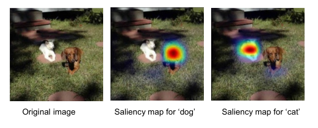

## 10.3.3 Saliency maps

Another way to gain insight into the features used by a convolutional network is through **saliency maps**, which aim to identify those regions of an image that are most significant in determining the class label. This is best done by investigating the final convolutional layer because this still retains spatial localization, which becomes lost in the subsequent fully connected layers, and yet it has the highest level of semantic representation. The Grad-CAM (gradient class activation mapping) method (Selvaraju *et al.*, 2016) first computes, for a given input image, the derivatives of the output-unit pre-activation $a^{(c)}$ for a given class $c$, before the softmax, with respect to the pre-activations $a_{ij}^{(k)}$ of all the units in the final convolutional layer for channel $k$. For each channel in that layer, the average of those derivatives is evaluated to give
$$
\alpha_k = \frac{1}{M_k} \sum_i \sum_j \frac{\partial a^{(c)}}{\partial a_{ij}^{(k)}} \tag{10.9}
$$

where $i$ and $j$ index the rows and columns of channel $k$, and $M_k$ is the total number of units in that channel. These averages are then used to form a weighted sum of the form:
$$
\mathbf{L} = \sum_k \alpha_k \mathbf{A}^{(k)} \tag{10.10}
$$
in which $\mathbf{A}^{(k)}$ is a matrix with elements $a_{ij}^{(k)}$. The resulting array has the same dimensionality as the final convolutional layer, for example $14 \times 14$ for the VGG network shown in Figure 10.10, and can be superimposed on the original image in the form of a ‘heat map’ as seen in Figure 10.15.

**Figure 10.15** Saliency maps for the VGG-16 network with respect to the ‘dog’ and ‘cat’ categories. [From Selvaraju *et al.* (2016) with permission.]

## 10.3.3 显著图

另一种深入了解卷积网络所使用特征的方法是通过**显著图**（saliency maps），其目标是识别图像中对确定类别标签最重要的那些区域。最好通过研究最后一个卷积层来完成这一点，因为该层仍然保留空间定位信息，而这些信息在随后的全连接层中会丢失，同时它又具有最高层次的语义表示。Grad-CAM（梯度类别激活映射）方法（Selvaraju *et al.*, 2016）首先对给定输入图像，计算给定类别 $c$ 的输出单元预激活值 $a^{(c)}$（softmax 之前）相对于最后一个卷积层中通道 $k$ 所有单元预激活值 $a_{ij}^{(k)}$ 的导数。对于该层中的每个通道，对这些导数取平均，得到
$$
\alpha_k = \frac{1}{M_k} \sum_i \sum_j \frac{\partial a^{(c)}}{\partial a_{ij}^{(k)}} \tag{10.9}
$$

其中 $i$ 和 $j$ 索引通道 $k$ 的行和列，$M_k$ 是该通道中单元的总数。然后使用这些平均值构成如下形式的加权和：
$$
\mathbf{L} = \sum_k \alpha_k \mathbf{A}^{(k)} \tag{10.10}
$$
其中 $\mathbf{A}^{(k)}$ 是一个元素为 $a_{ij}^{(k)}$ 的矩阵。所得数组具有与最后一个卷积层相同的维度，例如对于图 10.10 所示的 VGG 网络为 $14 \times 14$，并且可以以“热力图”的形式叠加在原始图像上，如图 10.15 所示。

**图 10.15** VGG-16 网络针对“狗”和“猫”类别的显著图。[经 Selvaraju *et al.* (2016) 许可转载。]

---

## 重点总结

1. **显著图的目标**  
   显著图旨在识别图像中对确定类别标签最重要的区域，从而帮助理解卷积网络使用了哪些特征。

2. **选择最后一个卷积层的原因**  
   - 仍然保留空间定位信息；
   - 具有最高层次的语义表示；
   - 后续全连接层会丢失空间信息。

3. **Grad-CAM 方法的核心步骤**  
   - 计算给定类别 $c$ 的输出单元预激活值 $a^{(c)}$（softmax 之前）对最后一个卷积层各通道所有单元预激活值 $a_{ij}^{(k)}$ 的导数；
   - 对每个通道，将这些导数取平均，得到权重 $\alpha_k$，如式（10.9）；
   - 用这些权重对最后一个卷积层的各通道特征图 $\mathbf{A}^{(k)}$ 进行加权求和，得到显著图 $\mathbf{L}$，如式（10.10）。

4. **显著图的维度与叠加**  
   显著图与最后一个卷积层具有相同维度（如 VGG 网络为 $14 \times 14$），可以以热力图形式叠加在原始图像上。

5. **示例**  
   图 10.15 展示了 VGG-16 网络针对“狗”和“猫”类别的显著图，热力图高亮区域对应图像中对分类最重要的部分。

## 难点总结

1. **理解预激活值与 softmax 的区别**  
   Grad-CAM 使用的是 softmax 之前的预激活值 $a^{(c)}$，而不是最终的类别概率，这一点需要明确。

2. **导数含义的理解**  
   $\frac{\partial a^{(c)}}{\partial a_{ij}^{(k)}}$ 表示类别 $c$ 的预激活值对最后一个卷积层中某个单元预激活值的敏感程度，即该单元对类别 $c$ 的重要性。

3. **通道级平均的作用**  
   对每个通道内所有单元的导数取平均，得到该通道的整体重要性权重 $\alpha_k$，这一步是 Grad-CAM 的关键。

4. **加权求和与热力图生成**  
   式（10.10）将各通道特征图按权重 $\alpha_k$ 加权求和，得到显著图 $\mathbf{L}$，再将其归一化并叠加到原图上形成热力图。

5. **为什么选择最后一个卷积层**  
   需要理解“空间定位”与“语义表示”之间的权衡：最后一个卷积层同时具备较好的空间定位和最高层语义信息，因此最适合用于显著图分析。