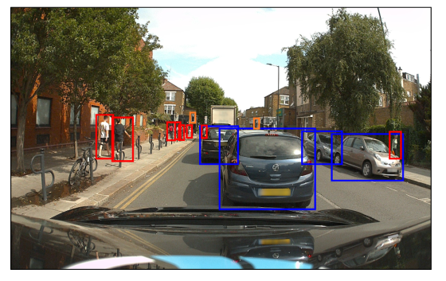

# 10.4. Object Detection

### P1

We have motivated the design of CNNs primarily by the image classification problem, in which an entire image is assigned to a single class, for example ‘cat’ or ‘bicycle’. This is reasonable for data sets such as ImageNet where, by design, each image is dominated by a single object. However, there are many other applications for CNNs that are able to exploit the inbuilt inductive biases. More generally, the convolutional layers of a CNN trained on a large image data base for a particular task can learn internal representations that have broad applicability, and therefore a CNN can be fine-tuned for a wide range of specific tasks. We have already seen an example of a convolutional network trained on ImageNet data, which through transfer learning was able to achieve human-level performance on skin lesion classification.

## 10.4.1 Bounding boxes

### P2

Many images have multiple objects belonging to one or more classes, and we may wish to detect the presence and class of each object. Moreover, in many applications of computer vision we also need to determine the locations within the image of any objects that are detected. For example, an autonomous vehicle that uses RGB cameras may need to detect the presence and location of pedestrians and also identify road signs, other vehicles, etc.

### P3

Consider the problem of specifying the location of an object in an image. A widely used approach is to define a *bounding box*, which consists of a rectangle that fits closely to the boundary of the object, as illustrated in Figure 10.19. The bounding box can be defined by the coordinates of its centre along with its width and height in the form of a vector $\mathbf{b} = (b_x, b_y, b_W, b_H)$. Here the elements of $\mathbf{b}$ can be specified in terms of pixels or as continuous numbers where, by convention, the top left of the image is given coordinates $(0, 0)$ and the bottom right is given coordinates $(1, 1)$.

**Figure 10.19 Caption**: An image containing several objects from different classes in which the location of each object is labelled by a close-fitting rectangle known as a bounding box. Here blue boxes
correspond to the class ‘car’, red boxes to the class ‘pedestrian’, and orange boxes to the class traffic light’. [Original image courtesy of Wayve Technologies Ltd.]

### P4

When images are assumed to contain one, and only one, object drawn from a predefined set of $C$ classes, a CNN will generally have $C$ output units whose activation functions are defined by the softmax function. An object can be localized by using an additional four outputs, with linear activation functions trained to predict the bounding box coordinates $(b_x, b_y, b_W, b_H)$. Since these quantities are continuous, a sum-of-squares error function over the corresponding outputs may be appropriate. This is used for example by Redmon *et al.* (2015), who first divide the image into a $7 \times 7$ grid. For each grid cell, they use a convolutional network to output the class and bounding box coordinates of any object associated with that grid cell, based on features taken from the whole image.

# 10.4 目标检测

### P1

我们主要是通过图像分类问题来启发 CNN 的设计。在图像分类中，整张图像被分配到一个单一类别，例如“猫”或“自行车”。对于 ImageNet 这类数据集来说，这是合理的，因为按照设计，每张图像都由一个单一物体主导。然而，CNN 还有许多其他应用，能够利用其内在的归纳偏置。更一般地说，在大型图像数据库上针对某一任务训练得到的 CNN 卷积层，可以学到具有广泛适用性的内部表示，因此 CNN 可以针对各种具体任务进行微调。我们已经看到一个例子：在 ImageNet 数据上训练的卷积网络，通过迁移学习，能够在皮肤病变分类上达到人类水平的表现。

## 10.4.1 边界框

### P2

许多图像包含属于一个或多个类别的多个物体，我们可能希望检测每个物体的存在和类别。此外，在计算机视觉的许多应用中，我们还需要确定检测到的任何物体在图像中的位置。例如，使用 RGB 摄像头的自动驾驶车辆可能需要检测行人的存在和位置，还需要识别道路标志、其他车辆等。

### P3

考虑指定图像中物体位置的问题。一种广泛使用的方法是定义*边界框*，它由一个紧贴物体边界的矩形组成，如图 10.19 所示。边界框可以通过其中心坐标以及宽度和高度来定义，形式为向量 $\mathbf{b} = (b_x, b_y, b_W, b_H)$。这里 $\mathbf{b}$ 的元素可以用像素表示，也可以表示为连续数值；按照惯例，图像左上角坐标为 $(0, 0)$，右下角坐标为 $(1, 1)$。

**图 10.19 说明**：一张包含来自不同类别的若干物体的图像，其中每个物体的位置都用紧贴的矩形标注，称为边界框。这里蓝色框对应类别“汽车”，红色框对应类别“行人”，橙色框对应类别“交通灯”。[原图由 Wayve Technologies Ltd. 提供。]

### P4

当假设图像包含一个且仅一个来自预定义 $C$ 个类别的物体时，CNN 通常会有 $C$ 个输出单元，其激活函数由 softmax 函数定义。可以通过额外的四个输出对物体进行定位，这些输出使用线性激活函数，训练用于预测边界框坐标 $(b_x, b_y, b_W, b_H)$。由于这些量是连续的，因此对相应输出使用平方和误差函数可能是合适的。例如，Redmon *et al.* (2015) 就使用了这种方法，他们首先将图像划分为 $7 \times 7$ 网格。对于每个网格单元，他们使用卷积网络，基于来自整张图像的特征，输出与该网格单元相关联的任何物体的类别和边界框坐标。

---

## 重点总结

1. **从图像分类到目标检测**  
   图像分类将整张图像分配到一个单一类别，适用于 ImageNet 这类每张图由一个物体主导的数据集；但许多应用需要检测多个物体及其位置。

2. **CNN 的迁移学习能力**  
   在大规模图像数据库上训练的卷积层可以学到广泛适用的内部表示，因此 CNN 可以微调用于各种具体任务，例如皮肤病变分类。

3. **边界框的定义**  
   边界框是一个紧贴物体边界的矩形，用向量 $\mathbf{b} = (b_x, b_y, b_W, b_H)$ 表示，包含中心坐标、宽度和高度。

4. **坐标表示方式**  
   边界框坐标可以用像素表示，也可以归一化为连续数值，约定左上角为 $(0, 0)$，右下角为 $(1, 1)$。

5. **单物体分类与定位**  
   当图像中只有一个来自 $C$ 个类别的物体时，CNN 通常有 $C$ 个 softmax 输出单元，并额外增加四个线性输出用于预测边界框坐标。

6. **边界框回归的损失函数**  
   由于边界框坐标是连续量，通常使用平方和误差函数进行训练。

7. **YOLO 的早期思想**  
   Redmon *et al.* (2015) 将图像划分为 $7 \times 7$ 网格，对每个网格单元使用卷积网络输出类别和边界框坐标，基于整张图像的特征进行预测。

## 难点总结

1. **理解归纳偏置与迁移学习**  
   需要理解 CNN 的卷积层为何能学到广泛适用的表示，以及为什么可以微调用于不同任务。

2. **边界框参数的表示**  
   需要区分像素坐标与归一化连续坐标两种表示方式，并理解 $(b_x, b_y, b_W, b_H)$ 各分量的含义。

3. **分类输出与定位输出的结合**  
   需要理解如何在同一个网络中同时输出类别概率（softmax）和边界框坐标（线性输出），并分别使用不同的损失函数。

4. **平方和误差的适用性**  
   边界框坐标是连续量，因此适合用平方和误差；但需要理解它与分类交叉熵损失的区别与组合方式。

5. **网格划分与多物体检测**  
   Redmon *et al.* (2015) 的 $7 \times 7$ 网格方法需要理解每个网格单元如何负责预测与之关联的物体，以及这如何扩展到多物体检测场景。
   