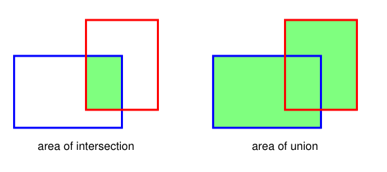

## 10.4.2 Intersection-over-union

### P5

We need a meaningful way to measure the performance of a trained network that can predict bounding boxes. In image classification the output of the network is a probability distribution over class labels, and we can measure performance by looking at the log likelihood for the true class labels on a test set. For object localization, however, we need some way to measure the accuracy of a bounding box relative to some ground truth, where the latter could, for example, be obtained by human labelling. The extent to which the predicted and target boxes overlap can be used as the basis for such a measure, but the area of the overlap will depend on the size of the object within the image. Also a predicted bounding box should be penalized for the region of the prediction that lies outside the ground truth bounding box. A better metric that addresses both of these issues is called *intersection-over-union*, or IoU, and is simply the ratio of the area of the intersection of the two bounding boxes to that of their union, as illustrated in Figure 10.20. Note that the IoU measure lies in the range 0 to 1. Predictions can be labelled as correct if the IoU measure exceeds a threshold, which is typically set at 0.5. Note that IoU is not generally used directly as a loss function for training as it is hard to optimize by gradient descent, and so training is typically performed using centred objects, and the IoU score is mainly used an evaluation metric.

**Figure 10.20 Caption**: Illustration of the intersection-over-union metric for quantifying the accuracy of a bounding box prediction. If the predicted bounding box is shown by the blue rectangle and the ground truth by the red rectangle, then the intersection-over-union is defined as the ratio of the area of the intersection of the boxes, shown in green on the left, divided by the area of their union, shown in green on the right.

## 10.4.2 交并比

### P5

我们需要一种有意义的方法来衡量训练好的、能够预测边界框的网络性能。在图像分类中，网络输出是类别标签上的概率分布，我们可以通过查看测试集上真实类别标签的对数似然来衡量性能。然而，对于目标定位，我们需要某种方法来衡量边界框相对于某种真实标注的准确度，后者例如可以通过人工标注获得。预测框与目标框重叠的程度可以作为这种度量的基础，但重叠面积会取决于图像中物体的大小。此外，预测边界框如果有一部分落在真实边界框之外，也应该受到惩罚。一种能同时解决这两个问题的更好度量称为*交并比*，简称 IoU，它简单地等于两个边界框交集面积与并集面积之比，如图 10.20 所示。注意，IoU 度量的取值范围是 0 到 1。如果 IoU 度量超过某个阈值，通常设为 0.5，则预测可以被标记为正确。注意，IoU 通常不直接用作训练的损失函数，因为它难以通过梯度下降进行优化，因此训练通常使用居中物体进行，而 IoU 分数主要用作评估指标。

**图 10.20 说明**：用于量化边界框预测准确度的交并比度量示意图。如果预测边界框用蓝色矩形表示，真实标注用红色矩形表示，那么交并比定义为两个框交集面积（左图绿色部分）除以并集面积（右图绿色部分）之比。

---

## 重点总结

1. **目标定位需要新的性能度量**  
   图像分类可以用对数似然衡量性能，但目标定位需要衡量边界框相对于真实标注的准确度。

2. **简单重叠面积的不足**  
   仅使用重叠面积会受物体大小影响，并且无法惩罚预测框落在真实框之外的部分。

3. **交并比（IoU）的定义**  
   IoU 等于两个边界框交集面积与并集面积之比，如图 10.20 所示。

4. **IoU 的取值范围与判定**  
   IoU 取值在 0 到 1 之间；通常当 IoU 超过阈值 0.5 时，认为预测正确。

5. **IoU 主要用作评估指标**  
   IoU 一般不用作训练损失函数，因为它难以通过梯度下降优化；训练通常使用居中物体进行，IoU 主要用于评估。

## 难点总结

1. **理解 IoU 的几何含义**  
   需要清楚交集面积与并集面积分别对应图 10.20 中的哪部分，以及为什么用比值而不是直接用重叠面积。

2. **为什么 IoU 能同时处理大小和越界问题**  
   比值形式对物体大小具有归一化作用，同时并集包含预测框在真实框之外的部分，因此能惩罚越界预测。

3. **IoU 与损失函数的区别**  
   需要理解 IoU 虽然能衡量预测质量，但由于其不可微或难以优化，通常不直接作为训练损失，而是作为评估指标。

4. **阈值 0.5 的含义**  
   阈值 0.5 是一个常用约定，需要理解它只是判定“正确”的经验标准，并非唯一或绝对的标准。
   