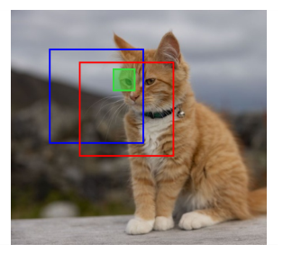
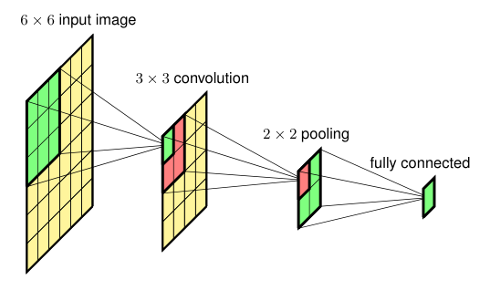
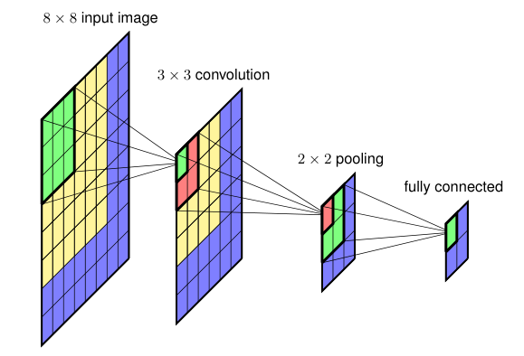

### 10.4.3 Sliding windows

### P6

One approach to object detection and object localization starts by creating a training set consisting of tightly cropped examples of the object to be detected, as well as examples of similarly cropped sections of images that do not contain any object (the 'background' class). This data set is used to train a classifier, such as a deep CNN, whose outputs represent the probability of there being an object of each particular class in the input window. The trained model is then used to detect objects in a new image by 'scanning' an input window across the image and, for each location, taking the resulting subset of the image as input to the classifier. This is called a *sliding window*. When an object is detected with high probability, the associated window location then defines the corresponding bounding box.

### P7

One obvious drawback of this approach is that it can be computationally very costly due to the large number of potential window positions in the image. Furthermore, the process may have to be repeated using windows of various scales to allow for different sizes of object within the image. A cost saving can be made by moving the input window in strides across the image, both horizontally and vertically, which are larger than one pixel. However, there is a trade-off between precision of location using a small stride and reducing the computational cost by using a larger stride. The computational cost of a sliding window approach may be reasonable for simple classifiers, but for deep neural networks potentially containing millions of parameters, the cost of a naive implementation can be prohibitive.

### P8

Fortunately, the convolutional structure of the neural network allows for a dramatic improvement in efficiency (Sermanet *et al*., 2013). We note that a convolutional layer within such a network itself involves sliding a feature detector, with shared weights, across the input image in strides. Consequently, when a sliding window is used to generate multiple forward passes through a convolutional network there is substantial redundancy in the computation, as illustrated in Figure 10.21.

**Figure 10.21 Caption**: Illustration of replicated calculations when a CNN is used to process data from a sliding input window, in which the red and blue boxes show two overlapping locations for the input window. The green box represents one of the locations for the receptive field of a hidden unit in the first convolutional layer, and the evaluation of the corresponding hidden-unit activation is shared across the two window positions.

### P9

Because the computational structure of sliding windows mirrors that of convolutions, it turns out to be remarkably simple to implement sliding windows efficiently in a convolutional network. Consider the simplified convolutional network in Figure 10.22, which consists of a convolutional layer followed by a max-pooling layer followed by a fully connected layer. For simplicity we have shown only a single channel in each layer, but the extension to multiple channels is straightforward. The input image to the network has size $6 \times 6$, the filters in the convolutional layer have size $3 \times 3$ with stride 1, and the max-pooling layer has non-overlapping receptive fields of size $2 \times 2$ with stride 1. This is followed by a fully connected layer with a single output unit. Note that we can also view this final layer as another convolutional layer with a filter size that is $2 \times 2$, so that there is only a single position for the filter and hence a single output.

**Figure 10.22**: Example of a simple convolutional network having a single channel at each layer used to illustrate the concept of a sliding window for detecting objects in images.

### P10

Now suppose this network is trained on centred images of objects and then applied to a larger image of size $8 \times 8$, as shown in Figure 10.23 in which we simply enlarge the network by increasing the size of the convolutional and max-pooling layers. The convolution layer now has size $6 \times 6$ and the pooling layer has size $3 \times 3$. There are now four output units each of which has its own softmax function. The weights into this unit are shared across the four units. We see that the calculations needed to process the input corresponding to a window position in the top left corner of the input image are the same as those used to process the original $6 \times 6$ inputs used in training. For the remaining window positions, only a small amount of additional computation is needed, as indicated by the blue squares, leading to a significant increase in efficiency compared to a naive repeated application of the full convolutional network. Note that the fully connected layers themselves now have a convolutional structure.

**Figure 10.23 Caption**: Application of the network shown in Figure 10.22 to a larger image in which the additional computation required corresponds to the blue regions.

### 10.4.3 滑动窗口

### P6

目标检测和目标定位的一种方法是，首先创建一个训练集，其中包含待检测物体的紧密裁剪示例，以及不包含任何物体的类似裁剪图像区域（即“背景”类）的示例。该数据集用于训练一个分类器，例如深度 CNN，其输出表示输入窗口中存在每个特定类别物体的概率。然后，训练好的模型通过将输入窗口在图像上“扫描”来检测新图像中的物体；对于每个位置，将图像的相应子集作为分类器的输入。这称为*滑动窗口*。当以高概率检测到物体时，相关的窗口位置就定义了相应的边界框。

### P7

这种方法的一个明显缺点是，由于图像中潜在窗口位置数量巨大，计算成本可能非常高。此外，为了适应图像中不同大小的物体，可能还必须使用各种尺度的窗口重复该过程。一种节省成本的方法是让输入窗口在图像上以大于一个像素的步幅水平和垂直移动。然而，使用小步幅的定位精度与使用较大步幅降低计算成本之间存在权衡。对于简单分类器，滑动窗口方法的计算成本可能是合理的，但对于可能包含数百万参数的深度神经网络，朴素实现的成本可能高得令人望而却步。

### P8

幸运的是，神经网络的卷积结构允许效率的显著提升（Sermanet *et al*., 2013）。我们注意到，这种网络中的卷积层本身就涉及以步幅在输入图像上滑动一个具有共享权重的特征检测器。因此，当使用滑动窗口通过卷积网络生成多次前向传播时，计算中存在大量冗余，如图 10.21 所示。

**图 10.21 说明**：当使用 CNN 处理来自滑动输入窗口的数据时，重复计算的示意图。其中红色和蓝色框显示了输入窗口的两个重叠位置。绿色框表示第一层卷积层中某个隐藏单元感受野的一个位置，而相应隐藏单元激活值的计算在两个窗口位置之间是共享的。

### P9

由于滑动窗口的计算结构与卷积的计算结构相似，事实证明，在卷积网络中高效实现滑动窗口非常简单。考虑图 10.22 中的简化卷积网络，它由一个卷积层、一个最大池化层和一个全连接层组成。为简单起见，我们每层只显示一个通道，但扩展到多通道是直接的。网络的输入图像大小为 $6 \times 6$，卷积层中的滤波器大小为 $3 \times 3$，步幅为 1，最大池化层具有大小为 $2 \times 2$、步幅为 1 的不重叠感受野。其后是一个具有单个输出单元的全连接层。注意，我们也可以将这个最终层视为另一个卷积层，其滤波器大小为 $2 \times 2$，因此滤波器只有一个位置，从而只有一个输出。

**图 10.22**：一个简单卷积网络的示例，每层只有一个通道，用于说明在图像中检测物体的滑动窗口概念。

### P10

现在假设该网络在居中的物体图像上训练，然后应用于大小为 $8 \times 8$ 的更大图像，如图 10.23 所示，其中我们通过增大卷积层和最大池化层的大小来简单地扩大网络。卷积层现在大小为 $6 \times 6$，池化层大小为 $3 \times 3$。现在有四个输出单元，每个都有自己的 softmax 函数。进入这些单元的权重在四个单元之间共享。我们看到，处理对应于输入图像左上角窗口位置的输入所需的计算，与处理训练中使用的原始 $6 \times 6$ 输入所需的计算相同。对于其余窗口位置，只需要少量额外计算，如蓝色方块所示，与朴素地重复应用完整卷积网络相比，效率显著提高。注意，全连接层本身现在也具有卷积结构。

**图 10.23 说明**：将图 10.22 所示的网络应用于更大图像，其中所需的额外计算对应于蓝色区域。

---

## 重点总结

1. **滑动窗口的基本思想**  
   用紧密裁剪的物体样本和背景样本训练分类器，然后将输入窗口在图像上滑动，对每个位置进行分类，高概率位置对应边界框。

2. **滑动窗口的缺点**  
   - 潜在窗口位置数量巨大，计算成本高；
   - 需要多尺度窗口以处理不同大小的物体；
   - 大步幅节省计算但降低定位精度，存在权衡。

3. **卷积网络中的计算冗余**  
   滑动窗口多次前向传播时，重叠区域的计算存在大量冗余，如图 10.21 所示。

4. **利用卷积结构高效实现滑动窗口**  
   由于卷积层本身就是滑动特征检测器，滑动窗口可以自然地映射为卷积操作，从而共享计算。

5. **简化网络示例**  
   图 10.22 的网络：输入 $6 \times 6$，卷积层 $3 \times 3$ 步幅 1，最大池化 $2 \times 2$ 步幅 1，全连接层可视为 $2 \times 2$ 卷积层。

6. **扩大网络实现滑动窗口**  
   将网络应用于 $8 \times 8$ 图像时，卷积层变为 $6 \times 6$，池化层变为 $3 \times 3$，得到四个输出单元，权重共享，只需少量额外计算即可覆盖所有窗口位置。

7. **全连接层的卷积化**  
   全连接层可以看作卷积层，这使得整个网络可以高效地处理滑动窗口。

## 难点总结

1. **理解滑动窗口与卷积的等价性**  
   需要理解为什么滑动窗口的重复计算可以转化为卷积操作，以及权重共享如何减少计算量。

2. **图 10.21 中共享计算的理解**  
   需要看清红色和蓝色窗口重叠区域中，绿色感受野的计算是如何被两个窗口位置共享的。

3. **图 10.22 与图 10.23 的维度变化**  
   需要仔细跟踪输入从 $6 \times 6$ 到 $8 \times 8$ 时，卷积层、池化层和输出单元数量的变化，以及为什么得到四个输出单元。

4. **全连接层视为卷积层**  
   需要理解为什么大小为 $2 \times 2$ 的全连接层可以看作滤波器大小为 $2 \times 2$ 的卷积层，并且只有一个输出位置。

5. **效率提升的来源**  
   需要理解朴素滑动窗口与卷积化滑动窗口在计算量上的差异，以及为什么后者只需少量额外计算。

6. **多通道扩展**  
   虽然示例只用了单通道，但实际网络是多通道的，需要理解该思想如何自然扩展到多通道情形。
   