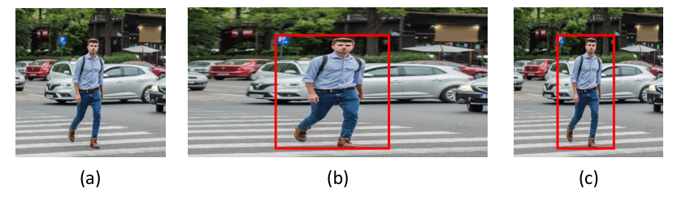

### 10.4.4 Detection across scales

### P11

As well as looking for objects in different positions in the image, we also need to look for objects at different scales and at different aspect ratios. For example, a tight bounding box drawn around a cat will have a different aspect ratio when the cat is sitting upright compared to when it is lying down. Instead of using multiple detectors with different sizes and shapes of input window, it is simpler but equivalent to use a fixed input window and to make multiple copies of the input image each with a different pair of horizontal and vertical scaling factors. The input window is then scanned over each of the image copies to detect objects, and the associated scaling factors are then used to transform the bounding box coordinates back into the original image space, as illustrated in Figure 10.24.

**Figure 10.24 Caption**: Illustration of the detection and localization of objects at multiple scales and aspect ratios using a fixed input window. The original image (a) is replicated multiple times and each copy is scaled in the horizontal and/or vertical directions, as illustrated for a horizontal scaling in (b). A fixed-sized window is then scanned over the scaled images. When an object is detected with high probability, as illustrated by the red box in (b), the corresponding window coordinates can be projected back into the original image space to determine the corresponding bounding box as shown in (c).

### 10.4.4 跨尺度检测

### P11

除了在图像中的不同位置寻找物体之外，我们还需要在不同尺度和不同宽高比下寻找物体。例如，围绕一只猫画出的紧密边界框，当猫直立坐着时与当它躺下时会有不同的宽高比。与其使用多个具有不同输入窗口大小和形状的检测器，一种更简单但等价的做法是使用固定输入窗口，并制作输入图像的多个副本，每个副本具有不同的水平和垂直缩放因子对。然后，将输入窗口在每个图像副本上扫描以检测物体，随后使用相关的缩放因子将边界框坐标变换回原始图像空间，如图 10.24 所示。

**图 10.24 说明**：使用固定输入窗口在多个尺度和宽高比下检测和定位物体的示意图。原始图像（a）被复制多次，每个副本在水平和/或垂直方向上缩放，如（b）中水平缩放所示。然后，一个固定大小的窗口在缩放后的图像上扫描。当以高概率检测到物体时，如（b）中红色框所示，相应的窗口坐标可以投影回原始图像空间，以确定对应的边界框，如（c）所示。

---

## 重点总结

1. **多尺度与多宽高比的必要性**  
   物体在图像中可能以不同尺度出现，也可能具有不同宽高比（如猫直立与躺下），因此检测器需要处理这些变化。

2. **固定窗口 + 图像缩放**  
   与其使用多种不同大小和形状的输入窗口，不如使用固定输入窗口，并对输入图像制作多个不同水平/垂直缩放因子的副本。

3. **在缩放副本上扫描窗口**  
   将固定大小的输入窗口在每个缩放后的图像副本上扫描，以检测物体。

4. **坐标变换回原始空间**  
   在缩放副本中检测到物体后，利用该副本的缩放因子，将窗口坐标变换回原始图像空间，得到对应的边界框。

5. **图 10.24 的流程**  
   - (a) 原始图像；
   - (b) 水平缩放后的副本，固定窗口扫描并检测到物体（红框）；
   - (c) 将检测框坐标投影回原始图像空间，得到最终边界框。

## 难点总结

1. **理解“固定窗口 + 图像缩放”与“多尺度窗口”的等价性**  
   需要理解对图像进行缩放再使用固定窗口，等价于使用不同大小的窗口在原始图像上检测。

2. **宽高比的处理**  
   水平与垂直方向可以独立缩放，从而覆盖不同宽高比的物体，这一点需要结合图 10.24(b) 理解。

3. **坐标变换回原始图像空间**  
   需要理解如何根据缩放因子将缩放副本中的窗口坐标反向变换回原始图像坐标，得到正确的边界框。

4. **计算成本与效率**  
   虽然这种方法避免了多个不同形状的检测器，但仍需在多个缩放副本上扫描窗口，需要理解其计算代价与实现方式。

5. **与滑动窗口的结合**  
   本节方法是在滑动窗口基础上扩展而来的，需要理解它如何与 10.4.3 中的滑动窗口及卷积化高效实现结合。