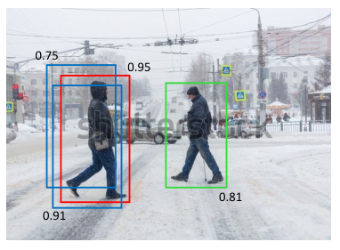

### 10.4.5 Non-max suppression

### P12

By scanning a trained convolutional network over an image, it is possible to detect multiple instances of the same class of object within the image as well as instances of objects from other classes. However, this also tends to produce multiple detections of the same object at similar locations, as illustrated in Figure 10.25. This can be addressed using *non-max suppression*, which, for each object class in turn, works as follows. It first runs the sliding window over the whole image and evaluates the probability of an object of that class being present at each location. Next it eliminates all the associated bounding boxes whose probability is below some threshold, say 0.7, giving a result of the kind illustrated in Figure 10.25. The box with the highest probability is considered to be a successful detection, and the corresponding bounding box is recorded as a prediction. Next, any other boxes whose IoU with the successful detection box exceeds some threshold, say 0.5, is discarded. This is intended to eliminate multiple nearby detections of the same object. Then of the remaining boxes, the one with the highest probability is declared to be another successful detection, and the elimination step is repeated. The process continues until all bounding boxes have either been discarded or declared as successful detections.

**Figure 10.25 Caption**: Schematic illustration of multiple detections of the same object at nearby
locations, along with their associated probabilities. The red bounding box corresponds to the highest overall probability. Non-max suppression eliminates the other overlapping candidate bounding boxes shown in blue, while preserving the detection of another instance of the same object class shown by the bounding box in green.

### 10.4.5 非极大值抑制

### P12

通过在图像上扫描训练好的卷积网络，可以在图像中检测到同一类别物体的多个实例，以及来自其他类别的物体实例。然而，这往往也会对同一物体在相近位置产生多次检测，如图 10.25 所示。这可以通过*非极大值抑制*来解决。对于每个物体类别，依次执行如下操作：首先在整个图像上运行滑动窗口，并评估该类别物体出现在每个位置的概率。接着，消除所有概率低于某个阈值（例如 0.7）的相关边界框，得到如图 10.25 所示的结果。将概率最高的框视为一次成功检测，并记录相应的边界框作为预测。然后，丢弃任何与成功检测框的 IoU 超过某个阈值（例如 0.5）的其他框。这样做的目的是消除对同一物体的多个邻近检测。接着，在剩余的框中，将概率最高的框宣布为另一次成功检测，并重复消除步骤。该过程持续进行，直到所有边界框要么被丢弃，要么被宣布为成功检测。

**图 10.25 说明**：同一物体在相近位置产生多次检测及其相关概率的示意图。红色边界框对应于总体概率最高的检测。非极大值抑制消除了其他重叠的候选边界框（蓝色所示），同时保留了同一物体类别的另一个实例的检测（绿色边界框所示）。

---

## 重点总结

1. **多次检测问题**  
   滑动窗口扫描图像时，同一物体在相近位置往往会产生多个检测框，需要后处理来消除冗余。

2. **非极大值抑制的基本流程**  
   对每个类别依次执行：
   - 在整个图像上运行滑动窗口，评估每个位置的类别概率；
   - 消除概率低于阈值（如 0.7）的边界框；
   - 选择概率最高的框作为成功检测并记录；
   - 丢弃与成功检测框 IoU 超过阈值（如 0.5）的其他框；
   - 在剩余框中重复上述步骤，直到所有框被处理。

3. **两个关键阈值**  
   - 概率阈值（如 0.7）：过滤低置信度检测；
   - IoU 阈值（如 0.5）：判定哪些框与已选检测框重叠过多，应被抑制。

4. **保留不同物体的检测**  
   非极大值抑制在消除同一物体冗余检测的同时，保留同一类别不同实例的检测（如图 10.25 中绿色框）。

5. **按类别独立处理**  
   非极大值抑制对每个物体类别分别进行，避免不同类别之间相互干扰。

## 难点总结

1. **理解“非极大值抑制”的名称与含义**  
   “非极大值”指不是概率最高的那些框，“抑制”指丢弃它们；需要理解该算法是迭代地选最大并抑制重叠框。

2. **两个阈值的作用与选择**  
   概率阈值用于过滤低置信度框，IoU 阈值用于判定重叠程度；需要理解阈值设置对检测结果的影响。

3. **迭代过程的顺序**  
   需要明确每一步：先选最高概率框 → 记录 → 抑制与其 IoU 超阈值的框 → 在剩余框中重复，直到处理完所有框。

4. **IoU 在非极大值抑制中的应用**  
   需要结合 10.4.2 中 IoU 的定义，理解为什么用 IoU 来判断两个框是否指向同一物体。

5. **保留不同实例与抑制冗余的平衡**  
   需要理解为什么绿色框不会被红色框抑制，以及如何通过 IoU 阈值控制这种平衡。

6. **与滑动窗口、多尺度检测的结合**  
   非极大值抑制通常是在滑动窗口和多尺度检测之后的后处理步骤，需要理解它在整个目标检测流程中的位置。
   