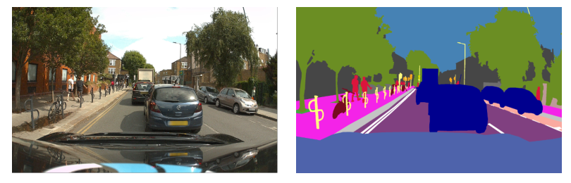

## 10.5 Image Segmentation

In an image classification problem, an entire image is assigned to a single class label. We have seen that more detailed information is provided if multiple objects are detected and their positions recorded using bounding boxes. An even more detailed analysis is obtained with *semantic segmentation* in which every pixel of an image is assigned to one of a predefined set of classes. This means that the output space will have the same dimensionality as the input image and can therefore be conveniently represented as an image with the same number of pixels. Although the input image will generally have three channels for R, G, and B, the output array will have $C$ channels, if there are $C$ classes, representing the probability for each class. If we associate a different (arbitrarily chosen) colour with each class, then the prediction of a segmentation network can be represented as an image in which each pixel is coloured according to the class having the highest probability, as illustrated in Figure 10.26.

**Figure 10.26 Caption**: Example of an image and its corresponding semantic segmentation in which each pixel is coloured according to its class. For example, blue pixels correspond to the class ‘car’, red pixels to the class ‘pedestrian’, and orange pixels to the class ‘traffic light’. [Courtesy of Wayve Technologies Ltd.]

### 10.5.1 Convolutional segmentation

A simple way to approach a semantic segmentation problem would be to construct a convolutional network that takes as input a rectangular section of the image centred on a pixel and that has a single softmax output that classifies that pixel. By applying such a network to each pixel in turn, the entire image can be segmented (this would require edge padding around the image depending on the size of the input window). However, this approach would be extremely inefficient due to redundant calculations caused by overlapping patches. As we have seen, we can remove this inefficiency by grouping together the forward-pass calculations for different input locations into a single network, which results in a model in which the final fully connected layers are also convolutional. We could therefore create a CNN in which each layer has the same dimensionality as the input image, by having stride 1 at each layer with same padding and no pooling. Each output unit has a softmax activation function with weights that are shared across all outputs. Although this could work, such a network would still need many layers, with multiple channels in each layer, to learn the complex internal representations needed to achieve high accuracy, and overall this would be prohibitively costly for images of reasonable resolution.

## 10.5 图像分割

在图像分类问题中，整张图像被分配到一个单一类别标签。我们已经看到，如果检测到多个物体并用边界框记录它们的位置，就能提供更详细的信息。通过*语义分割*可以获得更详细的分析，其中图像的每个像素都被分配到预定义类别集合中的一个类别。这意味着输出空间将与输入图像具有相同的维度，因此可以方便地表示为具有相同像素数的图像。尽管输入图像通常有三个通道 R、G、B，但如果存在 $C$ 个类别，输出数组将有 $C$ 个通道，表示每个类别的概率。如果我们为每个类别关联一种不同的（任意选择的）颜色，那么分割网络的预测可以表示为一张图像，其中每个像素根据概率最高的类别着色，如图 10.26 所示。

**图 10.26 说明**：一张图像及其对应语义分割的示例，其中每个像素根据其类别着色。例如，蓝色像素对应类别“汽车”，红色像素对应类别“行人”，橙色像素对应类别“交通灯”。[由 Wayve Technologies Ltd. 提供。]

### 10.5.1 卷积分割

处理语义分割问题的一种简单方法是构建一个卷积网络，它以图像中以某个像素为中心的矩形区域作为输入，并具有一个 softmax 输出，用于对该像素进行分类。通过依次将这样的网络应用于每个像素，就可以分割整张图像（根据输入窗口大小，这需要在图像周围进行边缘填充）。然而，由于重叠图像块导致的冗余计算，这种方法会极其低效。正如我们已经看到的，可以通过将不同输入位置的前向传播计算组合到单个网络中来消除这种低效，从而得到一个最终全连接层也是卷积层的模型。因此，我们可以创建一个 CNN，其中每一层都与输入图像具有相同的维度，方法是让每一层步幅为 1、使用相同填充且不使用池化。每个输出单元都有一个 softmax 激活函数，其权重在所有输出之间共享。尽管这可能可行，但这样的网络仍然需要许多层，且每层有多个通道，才能学到实现高精度所需的复杂内部表示，总体而言，对于合理分辨率的图像，这将过于昂贵。

---

## 重点总结

1. **语义分割的定义**  
   语义分割将图像中的每个像素分配到预定义类别集合中的一个类别，输出空间与输入图像具有相同维度。

2. **输出表示**  
   - 输入图像通常有 3 个通道（R、G、B）；
   - 输出数组有 $C$ 个通道（$C$ 为类别数），表示每个像素属于各类别的概率；
   - 可用不同颜色表示每个类别，生成分割图像。

3. **逐像素分类的简单方法**  
   以每个像素为中心取矩形区域输入 CNN，用 softmax 输出分类该像素，逐像素处理即可分割整张图像，但需要边缘填充。

4. **逐像素分类的低效性**  
   由于重叠图像块导致大量冗余计算，逐像素应用 CNN 极其低效。

5. **卷积化改进**  
   将不同输入位置的前向传播计算组合到单个网络中，使最终全连接层也变为卷积层，从而共享计算。

6. **保持维度的方法**  
   让每层步幅为 1、使用相同填充且不使用池化，可使每层与输入图像维度相同；每个输出单元共享 softmax 权重。

7. **计算成本问题**  
   尽管卷积化可行，但要达到高精度仍需多层多通道，对合理分辨率图像计算成本过高。

## 难点总结

1. **语义分割与分类、检测的区别**  
   需要理解分类是整图一个标签，检测是物体级别加边界框，而分割是像素级别分类。

2. **输出维度的理解**  
   需要理解为什么输出数组有 $C$ 个通道，以及如何将其可视化为彩色分割图。

3. **逐像素 CNN 的冗余计算**  
   需要理解重叠图像块导致重复计算，以及为什么这种朴素方法效率极低。

4. **卷积化消除冗余的原理**  
   需要理解如何将不同位置的前向传播合并为一个卷积网络，使全连接层也卷积化。

5. **保持维度的条件**  
   需要理解步幅为 1、相同填充、无池化这三个条件如何共同保证每层输出与输入维度相同。

6. **精度与计算成本的权衡**  
   需要理解为什么简单卷积分割网络虽然概念上可行，但在实际中因层数多、通道多而计算成本过高。
   