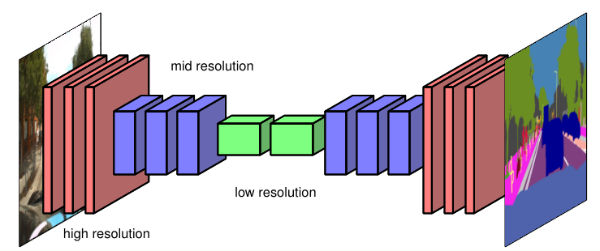
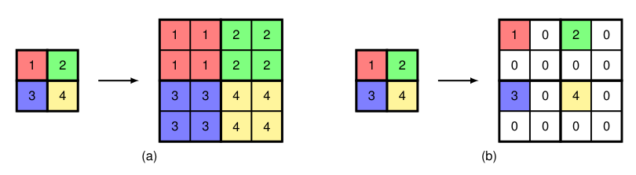
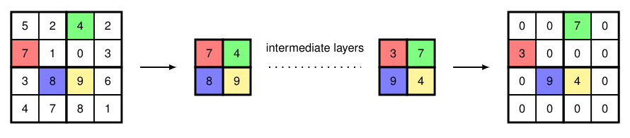

### 10.5.2 Up-sampling

As we have already seen, most convolutional networks use several levels of down-sampling so that as the number of channels increases, the size of the feature maps decreases, keeping the overall size and cost of the network tractable, while allowing the network to extract semantically meaningful high-order features from the image. We can use this concept to create a more efficient architecture for semantic segmentation by taking a standard deep convolutional network and adding additional learnable layers that take the low-dimensional internal representation and transform it back up to the original image resolution (Long, Shelhamer, and Darrell, 2014; Noh, Hong, and Han, 2015; Badrinarayanan, Kendall, and Cipolla, 2015), as illustrated in Figure 10.27.

**Figure 10.27 Caption**: Illustration of a convolutional neural network used for semantic image segmentation, showing the reduction in the dimensionality of the feature maps through a series of strided convolutions and/or pooling operations, followed by a series of transpose convolutions and/or unpooling which increase the dimensionality back up to that of the original image.

To do this we need a way to reverse the down-sampling effects of strided convolutions and pooling operations. Consider first the up-sampling analogue of pooling, where the output layer has a larger number of units than the input layer, for example with each input unit corresponding to a $2 \times 2$ block of output units. The question is then what values to use for the outputs. To find an up-sampling analogue of average pooling, we can simply copy over each input value into all the corresponding output units, as shown in Figure 10.28(a). We see that applying average pooling to the output of this operation regenerates the input.

**Figure 10.28 Caption**: Illustration of unpooling operations showing (a) an analogue of average pooling and (b) an analogue of max-pooling.

For max-pooling, we can consider the operation shown in Figure 10.28(b) in which each input value is copied into the first unit of the corresponding output block, and the remaining values in each block are set to zero. Again we see that applying a max-pooling operation to the output layer regenerates the input layer. This is sometimes called *max-unpooling*. Assigning the non-zero value to the first element of the output block seems arbitrary, and so a modified approach can be used that also preserves more of the spatial information from the down-sampling layers (Badrinarayanan, Kendall, and Cipolla, 2015). This is done by choosing a network architecture in which each max-pooling down-sampling layer has a corresponding up-sampling layer later in the network. Then during down-sampling, a record is kept of which element in each block had the maximum value, and then in the corresponding up-sampling layer, the non-zero element is chosen to have the same location, as illustrated for $2 \times 2$ max-pooling in Figure 10.29.

**Figure 10.29 Caption**: Some of the spatial information from a max-pooling layer, shown on the left, can be preserved by noting the location of the maximum value for each 2 × 2 block in the input array, and then in the corresponding up-sampling layer, placing the non-zero entry at the corresponding location in the output array.

### 10.5.2 上采样

正如我们已经看到的，大多数卷积网络使用若干级下采样，使得随着通道数增加，特征图尺寸减小，从而保持网络整体规模和成本可控，同时允许网络从图像中提取语义上有意义的高阶特征。我们可以利用这一概念，为语义分割创建更高效的架构：取一个标准深度卷积网络，并添加额外的可学习层，将低维内部表示变换回原始图像分辨率（Long, Shelhamer, and Darrell, 2014; Noh, Hong, and Han, 2015; Badrinarayanan, Kendall, and Cipolla, 2015），如图 10.27 所示。

**图 10.27 说明**：用于语义图像分割的卷积神经网络示意图，展示了通过一系列跨步卷积和/或池化操作使特征图维度降低，随后通过一系列转置卷积和/或反池化将维度提升回原始图像维度。

为此，我们需要一种方法来逆转跨步卷积和池化操作的下采样效果。首先考虑池化的上采样对应操作，其中输出层比输入层有更多的单元，例如每个输入单元对应一个 $2 \times 2$ 的输出单元块。问题在于输出应使用什么值。为了找到平均池化的上采样对应操作，我们可以简单地将每个输入值复制到所有对应的输出单元中，如图 10.28(a) 所示。我们看到，对该操作的输出应用平均池化可以重新生成输入。

**图 10.28 说明**：反池化操作示意图，展示了 (a) 平均池化的对应操作和 (b) 最大池化的对应操作。

对于最大池化，我们可以考虑图 10.28(b) 所示的操作，其中每个输入值被复制到对应输出块的第一个单元，而每个块中其余值设为零。我们再次看到，对输出层应用最大池化操作可以重新生成输入层。这有时称为*最大反池化*。将非零值分配给输出块的第一个元素似乎有些随意，因此可以使用一种改进方法，同时保留更多来自下采样层的空间信息（Badrinarayanan, Kendall, and Cipolla, 2015）。这是通过选择一种网络架构来实现的，其中每个最大池化下采样层在网络后面都有一个对应的上采样层。然后在下采样期间，记录每个块中哪个元素具有最大值，然后在对应的上采样层中，选择非零元素具有相同的位置，如图 10.29 中 $2 \times 2$ 最大池化所示。

**图 10.29 说明**：最大池化层（左侧所示）的部分空间信息可以通过记录输入数组中每个 $2 \times 2$ 块最大值的位置来保留，然后在对应的上采样层中，将非零项放置在输出数组中的对应位置。

---

## 重点总结

1. **下采样的作用**  
   大多数卷积网络使用下采样：通道数增加时特征图尺寸减小，保持网络规模和成本可控，同时提取高阶语义特征。

2. **语义分割的高效架构**  
   在标准深度卷积网络基础上添加可学习上采样层，将低维内部表示变换回原始图像分辨率，如图 10.27 所示。

3. **上采样的必要性**  
   需要逆转跨步卷积和池化操作的下采样效果，才能得到与原图同分辨率的分割输出。

4. **平均池化的上采样对应操作（反池化）**  
   将每个输入值复制到对应的 $2 \times 2$ 输出块中，如图 10.28(a)。对其输出应用平均池化可恢复输入。

5. **最大池化的上采样对应操作（最大反池化）**  
   将每个输入值复制到对应输出块的第一个单元，其余设为零，如图 10.28(b)。对其输出应用最大池化可恢复输入。

6. **保留空间信息的改进方法**  
   在下采样时记录每个块中最大值的位置，上采样时将非零元素放在相同位置，如图 10.29 所示。这比固定放在第一个元素更合理，并保留更多空间信息。

## 难点总结

1. **理解下采样与上采样的对称性**  
   需要理解下采样降低分辨率、上采样恢复分辨率，以及二者在分割网络中的配合方式。

2. **反池化与池化的逆关系**  
   需要理解为什么将输入值复制到输出块后，再应用池化能恢复输入，这体现了池化与反池化在信息传递上的对应关系。

3. **平均池化与最大池化的不同上采样方式**  
   - 平均池化：每个输入值复制到整个输出块；
   - 最大池化：输入值放到输出块第一个位置，其余为零。

4. **最大反池化中位置选择的随意性**  
   将非零值固定放在第一个元素是任意的，需要理解为什么改进方法要记录最大值位置。

5. **最大值位置记录与上采样对应**  
   需要理解图 10.29 中下采样记录最大值位置、上采样将非零元素放到相同位置的过程，以及它如何保留空间信息。

6. **与转置卷积的关系**  
   图 10.27 中提到转置卷积和/或反池化，需要理解反池化是上采样的一种方式，而转置卷积是另一种可学习的上采样方式。
   