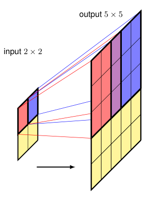

### 10.5.3 Fully convolutional networks

The up-sampling methods considered above are fixed functions, much like the average-pooling and max-pooling down-sampling operations. We can also use a *learned* up-sampling that is analogous to strided convolution for down-sampling. In strided convolution, each unit on the output map is connected via shared learnable weights to a small patch on the input map, and as we move one step through the output array, the filter is moved two or more steps across the input array, and hence the output array has lower dimensionality than the input array. For up-sampling, we use a filter that connects one pixel in the input array to a patch in the output array, and then chose the architecture so that as we move one step across the input array, we move two or more steps across the output array (Dumoulin and Visin, 2016). This is illustrated for $3 \times 3$ filters, and an output stride of 2, in Figure 10.30. Note that there are output cells for which multiple filter positions overlap, and the corresponding output values can be found either by summing or by averaging the contributions from the individual filter positions.

**Figure 10.30 Caption**: Illustration of transpose convolution for a $3 \times 3$ filter with an output stride of 2. This can be thought of as the inverse operation to a $3 \times 3$ convolution. The red output patch is given by multiplying the kernel by the activation of the red unit in the input layer, and
similarly for the blue output patch. The activations of cells for which patches overlap are calculated by summing or averaging the contributions from the individual patches.

This up-sampling is called *transpose convolution* because, if the down-sampling convolution is expressed in matrix form, the corresponding up-sampling is given by the transpose matrix. It is also called ‘fractionally strided convolution’ because the stride of a standard convolution is the ratio of the step size in the output layer to the step size in the input layer. In Figure 10.30, for example, this ratio is $1/2$. Note that this is sometimes also referred to as ‘deconvolution’, but it is better to avoid this term since deconvolution is widely used in mathematics to mean the inverse of the operation of convolution used in functional analysis, which is a different concept. If we have a network architecture with no pooling layers, so that the down-sampling and up-sampling are done purely using convolutions, then the architecture is known as a *fully convolutional network* (Long, Shelhamer, and Darrell, 2014). It can take an arbitrarily sized image and will output a segmentation map of the same size.

### 10.5.3 全卷积网络

上面考虑的上采样方法是固定函数，很像平均池化和最大池化下采样操作。我们也可以使用一种*可学习的*上采样，它类似于用于下采样的跨步卷积。在跨步卷积中，输出图上的每个单元通过共享的可学习权重连接到输入图上的一个小块；当我们沿输出数组移动一步时，滤波器在输入数组上移动两步或更多步，因此输出数组的维度低于输入数组。对于上采样，我们使用一个滤波器，将输入数组中的一个像素连接到输出数组中的一个小块，然后选择架构，使得当我们沿输入数组移动一步时，在输出数组上移动两步或更多步（Dumoulin and Visin, 2016）。图 10.30 中展示了 $3 \times 3$ 滤波器、输出步幅为 2 的情况。注意，有些输出单元会有多个滤波器位置重叠，相应的输出值可以通过对各个滤波器位置的贡献求和或取平均来得到。

**图 10.30 说明**：$3 \times 3$ 滤波器、输出步幅为 2 的转置卷积示意图。这可以看作是 $3 \times 3$ 卷积的逆操作。红色输出块由核乘以输入层中红色单元的激活值得到，蓝色输出块同理。对于块重叠的单元，其激活值通过对各个块的贡献求和或取平均来计算。

这种上采样称为*转置卷积*，因为如果将下采样卷积表示为矩阵形式，那么对应的上采样由转置矩阵给出。它也被称为“分数步幅卷积”，因为标准卷积的步幅是输出层步长与输入层步长之比。例如在图 10.30 中，这个比值为 $1/2$。注意，这有时也被称为“反卷积”，但最好避免这个术语，因为反卷积在数学中被广泛用于表示泛函分析中卷积操作的逆，这是一个不同的概念。如果我们有一个没有池化层的网络架构，使得下采样和上采样完全使用卷积完成，那么该架构被称为*全卷积网络*（Long, Shelhamer, and Darrell, 2014）。它可以接受任意大小的图像，并输出相同大小的分割图。

---

## 重点总结

1. **固定上采样与可学习上采样**  
   反池化等上采样方法是固定函数；也可以使用*可学习的*上采样，类似于跨步卷积下采样。

2. **转置卷积的原理**  
   - 下采样（跨步卷积）：输出单元通过共享权重连接输入小块，输出维度低于输入；
   - 上采样（转置卷积）：输入一个像素连接到输出一个小块，沿输入移动一步时输出移动两步或更多步，输出维度高于输入。

3. **重叠输出的处理**  
   当多个滤波器位置在输出上重叠时，输出值可以通过对各个位置的贡献求和或取平均得到。

4. **转置卷积的名称来源**  
   - *转置卷积*：因为下采样卷积写成矩阵形式时，上采样由转置矩阵给出；
   - *分数步幅卷积*：标准卷积步幅是输出步长与输入步长之比，图 10.30 中为 $1/2$。

5. **避免使用“反卷积”一词**  
   “反卷积”在数学中表示泛函分析中卷积操作的逆，与这里所说的上采样是不同的概念，因此最好避免使用。

6. **全卷积网络（FCN）**  
   如果网络没有池化层，下采样和上采样完全由卷积完成，则称为全卷积网络。它可以接受任意大小的图像，并输出相同大小的分割图。

## 难点总结

1. **理解转置卷积与跨步卷积的对称关系**  
   需要理解下采样时输出维度降低、上采样时输出维度升高，以及二者在步幅上的对应关系。

2. **转置卷积的矩阵解释**  
   需要理解为什么下采样卷积表示为矩阵后，上采样对应其转置矩阵，这是“转置卷积”名称的由来。

3. **分数步幅的含义**  
   需要理解步幅是输出步长与输入步长之比，图 10.30 中输出步幅为 2、输入步长为 1，因此比值为 $1/2$，称为分数步幅卷积。

4. **重叠输出的计算**  
   需要理解图 10.30 中红色和蓝色输出块重叠时，输出值如何通过求和或平均得到。

5. **“反卷积”术语的辨析**  
   需要区分数学中的反卷积与深度学习中的转置卷积，避免概念混淆。

6. **全卷积网络的优势**  
   需要理解为什么没有池化层、完全由卷积构成的全卷积网络可以接受任意大小输入并输出相同大小分割图。
   