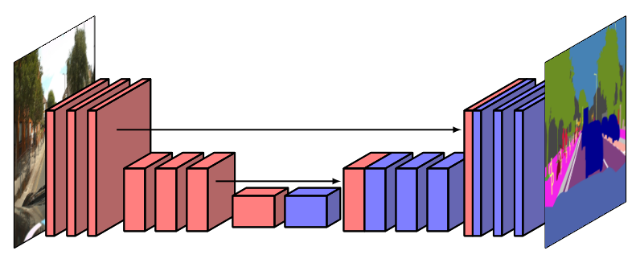

### 10.5.4 The U-net architecture

We have seen that the down-sampling associated with strided convolutions and pooling allows the number of channels to be increased without the size of the network becoming prohibitive. This also has the effect of reducing the spatial resolution and hence discarding positional information as the signals flow through the network. Although this is fine for image classification, the loss of spatial information is a problem for semantic segmentation as we want to classify each pixel. One approach for addressing this is the *U-net* architecture (Ronneberger, Fischer, and Brox, 2015) illustrated in Figure 10.31, where the name comes from the U-shape of the diagram.

**Figure 10.31 Caption**: The U-net architecture has a symmetrical arrangement of down-sampling and up-sampling layers, and the output from each down-sampling layer is concatenated with the corresponding up-sampling layer.

The core concept is that for each down-sampling layer there is a corresponding up-sampling layer, and the final set of channel activations at each down-sampling layer is concatenated with the corresponding first set of channels in the up-sampling layer, thereby giving those layers access to higher-resolution spatial information. Note that $1 \times 1$ convolutions may be used in the final layer of a U-net to reduce the number of channels down to the number of classes, which is then followed by a softmax activation function.

### 10.5.4 U-net 架构

我们已经看到，与跨步卷积和池化相关的下采样允许增加通道数，同时不会使网络规模变得过于庞大。这也会降低空间分辨率，因此随着信号在网络中流动，位置信息会被丢弃。尽管这对图像分类来说没问题，但空间信息的丢失对语义分割来说是个问题，因为我们想要对每个像素进行分类。解决这个问题的一种方法是*U-net* 架构（Ronneberger, Fischer, and Brox, 2015），如图 10.31 所示，其名称来自示意图的 U 形。

**图 10.31 说明**：U-net 架构具有对称排列的下采样层和上采样层，每个下采样层的输出与对应的上采样层进行拼接。

其核心概念是，对于每个下采样层，都有一个对应的上采样层，并且每个下采样层最终的通道激活集合与上采样层中对应的第一组通道进行拼接，从而使这些层能够访问更高分辨率的空间信息。注意，U-net 的最后一层可以使用 $1 \times 1$ 卷积将通道数减少到类别数，然后接一个 softmax 激活函数。

---

## 重点总结

1. **下采样的作用与代价**  
   跨步卷积和池化导致下采样，允许增加通道数而不使网络规模过大，但会降低空间分辨率并丢弃位置信息。

2. **空间信息对语义分割的重要性**  
   图像分类可以容忍空间信息丢失，但语义分割需要逐像素分类，因此空间信息丢失是一个问题。

3. **U-net 架构的提出**  
   U-net（Ronneberger, Fischer, and Brox, 2015）用于解决语义分割中空间信息丢失的问题，其名称来自 U 形示意图。

4. **U-net 的核心结构**  
   - 对称排列的下采样层和上采样层；
   - 每个下采样层都有对应的上采样层；
   - 下采样层最终的通道激活与对应上采样层的第一组通道进行拼接。

5. **拼接的作用**  
   通过拼接，上采样层可以访问更高分辨率的空间信息，从而在逐像素分类时保留更多位置细节。

6. **最后一层的处理**  
   U-net 最后一层可使用 $1 \times 1$ 卷积将通道数减少到类别数，然后接 softmax 激活函数。

## 难点总结

1. **理解 U-net 的 U 形结构**  
   需要结合图 10.31 理解下采样路径与上采样路径如何对称排列，形成 U 形。

2. **下采样与上采样的对应关系**  
   需要理解每个下采样层都与一个上采样层对应，以及这种对应如何帮助恢复空间分辨率。

3. **拼接（concatenation）与相加的区别**  
   需要理解 U-net 使用的是通道拼接，而不是逐元素相加，以及拼接如何保留高分辨率信息。

4. **空间信息与语义信息的权衡**  
   需要理解下采样提供语义信息但丢失空间信息，上采样恢复分辨率，而拼接则让上采样层同时获得语义与空间信息。

5. **$1 \times 1$ 卷积的作用**  
   需要理解最后一层 $1 \times 1$ 卷积如何将通道数映射到类别数，以及它与 softmax 的配合方式。

6. **与全卷积网络的关系**  
   U-net 是一种全卷积网络，需要理解它如何继承全卷积网络可接受任意大小输入并输出相同大小分割图的特性。
   