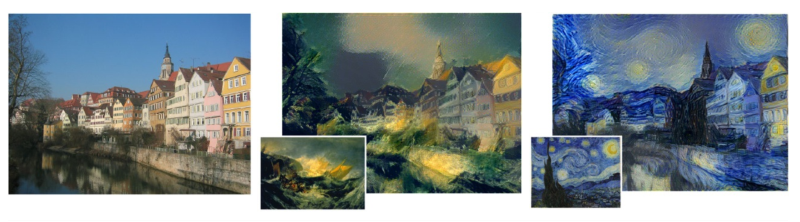

## 10.6. Style Transfer

As we have seen, early layers in a deep convolutional network learn to detect simple features such as edges and textures whereas later layers learn to detect more complex entities such as objects. We can exploit this property to re-render an image in the style of a different image using a process called *neural style transfer* (Gatys, Ecker, and Bethge, 2015). This is illustrated in Figure 10.32.

**Figure 10.32 Caption**: An example of neural style transfer showing a photograph of a canal scene (left) that has been rendered in the style of The Wreck of a Transport Ship by J. M. W. Turner (centre) and in the style of The Starry Night by Vincent van Gogh (right). In each case the image used to provide the style is shown in the inset. [From Gatys, Ecker, and Bethge (2015) with permission.]

Our goal is to generate a synthetic image $\mathbf{G}$ whose ‘content’ is defined by an image $\mathbf{C}$ and whose ‘style’ is taken from some other image $\mathbf{S}$. This is achieved by defining an error function $E(\mathbf{G})$ given by the sum of two terms, one of which encourages $\mathbf{G}$ to have a similar content to $\mathbf{C}$ whereas the other encourages $\mathbf{G}$ to have a similar style to $\mathbf{S}$:

$$
E(\mathbf{G}) = E_{\text{content}}(\mathbf{G}, \mathbf{C}) + E_{\text{style}}(\mathbf{G}, \mathbf{S}). \tag{10.13}
$$

The concepts of content and style are defined implicitly by the functional forms of these two terms. We can then find $\mathbf{G}$ by starting from a randomly initialized image and using gradient descent to minimize $E(\mathbf{G})$.

To define $E_{\text{content}}(\mathbf{G}, \mathbf{C})$, we can pick a particular convolutional layer in the network and measure the activations of the units in that layer when image $\mathbf{G}$ is used as input and also when image $\mathbf{C}$ is used as input. We can then encourage the corresponding pre-activations to be similar by using a sum-of-squares error function of the form

$$
E_{\text{content}}(\mathbf{G}, \mathbf{C}) = \sum_{i,j,k} \{a_{ijk}(\mathbf{G}) - a_{ijk}(\mathbf{C})\}^2 \tag{10.14}
$$

where $a_{ijk}(\mathbf{G})$ denotes the pre-activation of the unit at position $(i, j)$ in channel $k$ of that layer when the input image is $\mathbf{G}$, and similarly for $a_{ijk}(\mathbf{C})$. The choice of which layer to use in defining the pre-activations will influence the final result, with earlier layers aiming to match low-level features like edges and later layers matching more complex structures or even entire objects.

In defining $E_{\text{style}}(\mathbf{G}, \mathbf{C})$, the intuition is that style is determined by the co-occurrence of features from different channels within a convolutional layer. For example, if the style image $\mathbf{S}$ is such that vertical edges are generally associated with orange blobs, then we would like the same to be true for the generated image $\mathbf{G}$. However, although $E_{\text{content}}(\mathbf{G}, \mathbf{C})$ tries to match features in $\mathbf{G}$ at the same locations as corresponding features in $\mathbf{C}$, for the style error $E_{\text{style}}(\mathbf{G}, \mathbf{S})$ we want $\mathbf{G}$ to have characteristics that match those of $\mathbf{S}$ but taken from any location, and so we take an average over locations in a feature map. Again, consider a particular convolutional layer. We can measure the extent to which a feature in channel $k$ co-occurs with the corresponding feature in channel $k'$ for input image $\mathbf{G}$ by forming the cross-correlation matrix

$$
F_{kk'}(\mathbf{G}) = \sum_{i=1}^{I} \sum_{j=1}^{J} a_{ijk}(\mathbf{G})a_{ijk'}(\mathbf{G}) \tag{10.15}
$$

where $I$ and $J$ are the dimensions of the feature maps in this particular convolutional layer, and the product $a_{ijk}a_{ijk'}$ will be large if both features are activated. If there are $K$ channels in this layer, then $F_{kk'}$ form the elements of a $K \times K$ matrix, called the *style matrix*. We can measure the extent to which the two images $\mathbf{G}$ and $\mathbf{S}$ have the same style by comparing their style matrices using

$$
E_{\text{style}}(\mathbf{G}, \mathbf{S}) = \frac{1}{(2IJK)^2} \sum_{k=1}^{K} \sum_{k'=1}^{K} \{F_{kk'}(\mathbf{G}) - F_{kk'}(\mathbf{S})\}^2. \tag{10.16}
$$

Although we could again make use of a single layer, more pleasing results are obtained by using contributions from multiple layers in the form

$$
E_{\text{style}}(\mathbf{G}, \mathbf{S}) = \sum_{l} \lambda_l E_{\text{style}}^{(l)}(\mathbf{G}, \mathbf{S}) \tag{10.17}
$$

where $l$ denotes the convolutional layer. The coefficients $\lambda_l$ determine the relative weighting between the different layers and also the weighting relative to the content error term. These weighting coefficients are adjusted empirically using subjective judgement.

## 10.6 风格迁移

正如我们所看到的，深度卷积网络中的早期层学习检测诸如边缘和纹理之类的简单特征，而后期层学习检测诸如物体之类的更复杂实体。我们可以利用这一性质，使用一种称为*神经风格迁移*的过程，将一张图像以另一张图像的风格重新渲染（Gatys, Ecker, and Bethge, 2015）。这在图 10.32 中进行了说明。

**图 10.32 说明**：神经风格迁移的一个示例，展示了一张运河场景照片（左），它被以 J. M. W. Turner 的《运输船的残骸》的风格（中）以及 Vincent van Gogh 的《星夜》的风格（右）重新渲染。在每种情况下，用于提供风格的图像显示在插图中。[经 Gatys, Ecker, and Bethge (2015) 许可转载。]

我们的目标是生成一张合成图像 $\mathbf{G}$，其“内容”由图像 $\mathbf{C}$ 定义，其“风格”取自另一张图像 $\mathbf{S}$。这是通过定义一个误差函数 $E(\mathbf{G})$ 来实现的，该函数由两项之和组成，其中一项鼓励 $\mathbf{G}$ 具有与 $\mathbf{C}$ 相似的内容，而另一项鼓励 $\mathbf{G}$ 具有与 $\mathbf{S}$ 相似的风格：

$$
E(\mathbf{G}) = E_{\text{content}}(\mathbf{G}, \mathbf{C}) + E_{\text{style}}(\mathbf{G}, \mathbf{S}). \tag{10.13}
$$

内容和风格的概念由这两项的泛函形式隐式定义。然后我们可以从随机初始化的图像开始，使用梯度下降来最小化 $E(\mathbf{G})$，从而找到 $\mathbf{G}$。

为了定义 $E_{\text{content}}(\mathbf{G}, \mathbf{C})$，我们可以在网络中选择一个特定的卷积层，并测量当图像 $\mathbf{G}$ 作为输入以及图像 $\mathbf{C}$ 作为输入时，该层中单元的激活值。然后我们可以使用如下形式的平方和误差函数，鼓励相应的预激活值相似：

$$
E_{\text{content}}(\mathbf{G}, \mathbf{C}) = \sum_{i,j,k} \{a_{ijk}(\mathbf{G}) - a_{ijk}(\mathbf{C})\}^2 \tag{10.14}
$$

其中 $a_{ijk}(\mathbf{G})$ 表示当输入图像为 $\mathbf{G}$ 时，该层中通道 $k$ 位置 $(i, j)$ 处单元的预激活值，$a_{ijk}(\mathbf{C})$ 同理。选择哪一层来定义预激活值会影响最终结果：较早的层旨在匹配边缘等低层特征，较晚的层则匹配更复杂的结构甚至完整物体。

在定义 $E_{\text{style}}(\mathbf{G}, \mathbf{C})$ 时，直觉是风格由卷积层内不同通道特征共现决定。例如，如果风格图像 $\mathbf{S}$ 中垂直边缘通常与橙色斑块相关联，那么我们希望生成的图像 $\mathbf{G}$ 也是如此。然而，尽管 $E_{\text{content}}(\mathbf{G}, \mathbf{C})$ 试图让 $\mathbf{G}$ 中的特征与 $\mathbf{C}$ 中对应特征在相同位置匹配，对于风格误差 $E_{\text{style}}(\mathbf{G}, \mathbf{S})$，我们希望 $\mathbf{G}$ 具有与 $\mathbf{S}$ 匹配的特征，但可以来自任意位置，因此我们对特征图中的位置取平均。再次考虑一个特定的卷积层。我们可以通过形成互相关矩阵来度量输入图像 $\mathbf{G}$ 中通道 $k$ 的特征与通道 $k'$ 中对应特征共现的程度：

$$
F_{kk'}(\mathbf{G}) = \sum_{i=1}^{I} \sum_{j=1}^{J} a_{ijk}(\mathbf{G})a_{ijk'}(\mathbf{G}) \tag{10.15}
$$

其中 $I$ 和 $J$ 是该特定卷积层中特征图的维度，如果两个特征都被激活，乘积 $a_{ijk}a_{ijk'}$ 将会很大。如果该层有 $K$ 个通道，那么 $F_{kk'}$ 构成一个 $K \times K$ 矩阵的元素，称为*风格矩阵*。我们可以通过使用下式比较图像 $\mathbf{G}$ 和 $\mathbf{S}$ 的风格矩阵，来度量它们具有相同风格的程度：

$$
E_{\text{style}}(\mathbf{G}, \mathbf{S}) = \frac{1}{(2IJK)^2} \sum_{k=1}^{K} \sum_{k'=1}^{K} \{F_{kk'}(\mathbf{G}) - F_{kk'}(\mathbf{S})\}^2. \tag{10.16}
$$

尽管我们可以再次使用单层，但通过使用多层的贡献可以获得更令人满意的结果，形式如下：

$$
E_{\text{style}}(\mathbf{G}, \mathbf{S}) = \sum_{l} \lambda_l E_{\text{style}}^{(l)}(\mathbf{G}, \mathbf{S}) \tag{10.17}
$$

其中 $l$ 表示卷积层。系数 $\lambda_l$ 决定不同层之间的相对权重，以及相对于内容误差项的权重。这些权重系数通过主观判断经验性地调整。

---

## 重点总结

1. **神经风格迁移的基本思想**  
   利用 CNN 早期层检测简单特征（边缘、纹理）、后期层检测复杂实体（物体）的性质，将一张图像以另一张图像的风格重新渲染。

2. **目标与误差函数**  
   生成图像 $\mathbf{G}$，其内容来自图像 $\mathbf{C}$，风格来自图像 $\mathbf{S}$。误差函数为：
   $$
   E(\mathbf{G}) = E_{\text{content}}(\mathbf{G}, \mathbf{C}) + E_{\text{style}}(\mathbf{G}, \mathbf{S})
   $$
   从随机初始化图像开始，用梯度下降最小化 $E(\mathbf{G})$ 得到 $\mathbf{G}$。

3. **内容误差**  
   式（10.14）定义内容误差：选择某一卷积层，比较 $\mathbf{G}$ 与 $\mathbf{C}$ 在该层的预激活值，使用平方和误差。选择哪一层会影响结果：浅层匹配低层特征，深层匹配复杂结构。

4. **风格误差与风格矩阵**  
   - 风格由卷积层内不同通道特征的共现决定；
   - 式（10.15）定义互相关矩阵 $F_{kk'}(\mathbf{G})$，即风格矩阵；
   - 式（10.16）通过比较 $\mathbf{G}$ 与 $\mathbf{S}$ 的风格矩阵来定义风格误差；
   - 对位置取平均，使风格可以来自任意位置。

5. **多层风格贡献**  
   式（10.17）将多层风格误差加权求和，系数 $\lambda_l$ 决定各层权重以及相对于内容误差的权重，需通过主观判断经验性调整。

## 难点总结

1. **内容与风格的隐式定义**  
   内容和风格没有显式定义，而是由误差函数的泛函形式隐式定义，需要理解式（10.14）和式（10.16）如何分别捕捉内容和风格。

2. **内容误差中位置匹配的要求**  
   内容误差要求 $\mathbf{G}$ 与 $\mathbf{C}$ 在相同位置具有相似的预激活值，因此使用逐位置平方和误差。

3. **风格误差中位置无关的要求**  
   风格误差不要求位置匹配，而是通过风格矩阵对位置取平均，捕捉特征的共现统计，因此风格可以来自任意位置。

4. **风格矩阵（Gram 矩阵）的含义**  
   式（10.15）中的 $F_{kk'}$ 实际上是特征图通道之间的互相关矩阵（通常称为 Gram 矩阵），需要理解它如何度量不同通道特征的共现程度。

5. **式（10.16）中的归一化因子**  
   $\frac{1}{(2IJK)^2}$ 是归一化因子，需要理解它如何平衡不同层、不同尺寸特征图之间的误差量级。

6. **多层加权与超参数调整**  
   式（10.17）中 $\lambda_l$ 的选择直接影响风格迁移效果，需要理解不同层权重如何影响风格的粗细程度，以及如何通过主观判断调整这些超参数。
   