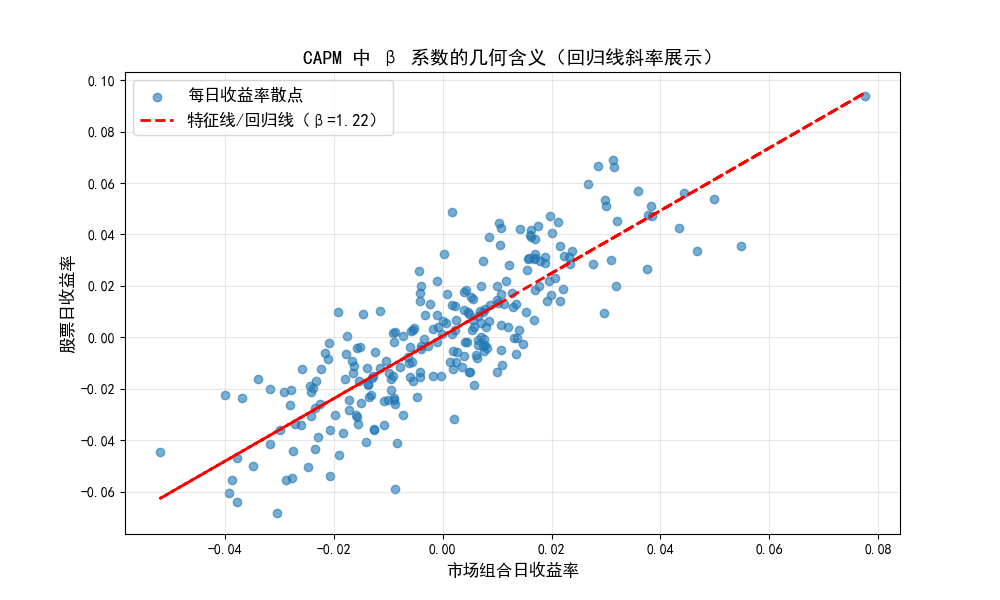

# 一、资本资产定价模型(CAPM)的理论知识

## 问题A1：什么是资本资产定价模型？

**提问：** 
在投资中，我们常说“高风险伴随高回报”，但究竟怎样的回报才算得上是“合理”的？作为现代金融学的基石理论之一，资本资产定价模型（CAPM）是如何通过量化“系统性风险”，来为资产的预期收益率提供一个科学定价标准的？

<details>
<summary>解答：</summary>

资本资产定价模型（Capital Asset Pricing Model，简称 CAPM）是现代金融学的基石理论之一，由威廉·夏普等学者在1960年代提出。它主要用于描述资产的预期收益率与其系统性风险（不可分散风险）之间的线性关系。其核心思想是：投资者承担的风险决定了其应得的回报，但只有无法通过分散化投资消除的系统性风险才应该得到补偿。其基本公式为：
$$
E(R_i) = R_f + \beta_i \times [E(R_m) - R_f],
$$
即资产的预期收益率等于无风险收益率加上该资产的风险溢价。

</details>

## 问题A2：CAPM模型中的贝塔（$\beta$）系数代表什么含义？

**提问：** 
CAPM 模型认为只有系统性风险才能获得补偿，那么这种“随大盘波动的系统性风险”究竟该如何量化？作为该模型的灵魂指标，贝塔（$\beta$）系数是如何衡量资产对市场变动的敏感度的？不同取值范围的 $\beta$ 又分别代表了怎样的资产特性？

<details>
<summary>解答：</summary>

贝塔（$\beta$）系数是 CAPM 模型的灵魂，用于衡量单个资产或投资组合相对于整个市场组合的系统性风险敏感度。
- 当 $\beta = 1$ 时，说明该资产的波动与市场整体同步，风险等于市场平均水平。
- 当 $\beta > 1$ 时，说明该资产的波动性大于市场（如科技股），市场上涨时它涨得更多，下跌时也跌得更凶。
- 当 $\beta < 1$ 时，说明该资产的波动性小于市场（如公用事业股），具有防御属性。
- 当 $\beta < 0$ 时，说明该资产的回报与市场反向变动（理论上存在的避险资产）。

</details>

## 问题A3：CAPM模型成立需要哪些基本假设条件？

**提问：** 
在现实世界中，市场充满了摩擦与不确定性，而 CAPM 却推导出了一个极其优美的线性定价公式。为了在数学上实现这种完美的市场均衡，该模型究竟剥离了哪些现实干扰，构建了怎样严格的理想化假设前提？

<details>
<summary>解答：</summary>

CAPM 建立在几个严格的理想化假设之上，主要包括：
1. 市场是有效的，信息完全且自由流通，新信息能迅速反映在证券价格中。
2. 投资者可以按无风险利率自由借入或贷出资金。
3. 所有投资者对资产的预期收益率、方差和协方差的判断完全一致（同质预期）。
4. 市场不存在交易成本、税收，且资产可以无限细分。
5. 投资者是风险厌恶的，仅根据预期收益和方差（均值-方差）来进行投资决策。

</details>

---

# 二、资本资产定价模型的例子计算

## 问题B1：利用CAPM公式计算预期收益率

**提问：** 
假设当前市场上的无风险利率（$R_f$）为 3%，市场组合的预期收益率（$E(R_m)$）为 10%。如果某科技公司的贝塔系数（$\beta$）为 1.5，请计算该科技公司股票的预期收益率。

<details>
<summary>解答：</summary>

**解题思路：**
直接将已知条件代入 CAPM 公式 $E(R_i) = R_f + \beta_i \times [E(R_m) - R_f]$ 进行计算。

**计算过程：**
- 无风险利率 $$R_f = 3\%$$
- 市场预期收益率 $$E(R_m) = 10\%$$
- 贝塔系数 $$\beta = 1.5$$

$$E(R_i) = 3\% + 1.5 \times (10\% - 3\%) = 3\% + 1.5 \times 7\% = 3\% + 10.5\% = 13.5\%$$

**结论：**
该科技公司股票的预期收益率为 **13.5%**。

</details>

---

## 问题B2：根据预期收益率反推贝塔系数

**提问：** 
已知某只股票的预期收益率为 12%，无风险利率为 2%，市场风险溢价（即 $E(R_m) - R_f$）为 5%。请问该股票的贝塔系数（$\beta$）是多少？

<details>
<summary>解答：</summary>

**解题思路：**
将 CAPM 公式 $E(R_i) = R_f + \beta_i \times [E(R_m) - R_f]$ 进行变形，求解 $\beta_i$。

**计算过程：**
- 股票预期收益率 $E(R_i) = 0.12$
- 无风险利率 $R_f = 0.02$
- 市场风险溢价 $[E(R_m) - R_f] = 0.05$

公式变形为：$$\beta_i = \frac{E(R_i) - R_f}{E(R_m) - R_f}$$

代入数值：$$\beta = \frac{0.12 - 0.02}{0.05} = \frac{0.10}{0.05} = 2.0$$

**结论：**
该股票的贝塔系数为 **2.0**。

</details>

---

## 问题B3：投资组合的贝塔系数计算

**提问：** 
某投资者将 60% 的资金投资于股票A（$\beta_A = 1.2$），将 40% 的资金投资于股票B（$\beta_B = 0.8$）。请问该投资组合的整体贝塔系数是多少？

<details>
<summary>解答：</summary>

**解题思路：**
投资组合的贝塔系数是其内部各资产贝塔系数的加权平均值，权重为各资产在组合中的资金占比。

**计算过程：**
- 股票A权重 $w_A = 0.60$，贝塔 $\beta_A = 1.2$
- 股票B权重 $w_B = 0.40$，贝塔 $\beta_B = 0.8$

组合贝塔 
$$\beta_P = w_A \times \beta_A + w_B \times \beta_B = 0.6 \times 1.2 + 0.4 \times 0.8 = 1.04$$

**结论：**
该投资组合的整体贝塔系数为 **1.04**。

</details>

---

## 问题B4：判断资产是否被低估或高估

**提问：** 
假设无风险利率为 4%，市场预期收益率为 9%。股票X的贝塔值为 1.4，但其实际预期回报率被评估为 13%。根据 CAPM 模型，该股票是被高估还是被低估？投资者应该采取什么策略？

<details>
<summary>解答：</summary>

**解题思路：**
1.  首先，使用 CAPM 模型计算出股票X在当前风险水平（$\beta=1.4$）下“理论上”应该有的公允收益率。
2.  然后，将这个理论收益率与题目给出的“实际预期回报率”进行比较。
3.  如果实际预期回报率 > 理论收益率，说明该股票提供的回报超过了其风险应有的补偿，即被**低估**，值得买入。
4.  如果实际预期回报率 < 理论收益率，说明该股票提供的回报不足以补偿其风险，即被**高估**，应考虑卖出。

**计算过程：**
- 无风险利率 $R_f = 0.04$
- 市场预期收益率 $E(R_m) = 0.09$
- 股票X贝塔 $\beta_X = 1.4$

**第一步：计算CAPM理论收益率**
$$E(R_X)_{理论} = 0.04 + 1.4 \times (0.09 - 0.04) = 0.11$$

**第二步：比较与判断**
- CAPM理论收益率 = 11%
- 实际预期回报率 = 13%

因为 13\% > 11\%，即实际预期回报率高于理论收益率。

**结论：**
该股票被**低估**了。投资者应该采取**买入**策略。

</details>

---

# 三、资本资产定价模型的编程实验

### 问题C1 

<!-- **提问：**  -->
1. 编写 Python 程序，模拟股票与市场的日度收益率数据，从统计角度验证 CAPM 模型中贝塔（$\beta$）系数的计算逻辑。
2. 利用协方差公式求解 $\beta$ 值，代入 CAPM 公式测算预期收益率，以检验理论定价的合理性。
3. 通过绘制收益率散点图与特征回归线，直观地展示 $\beta$ 作为回归线斜率的几何含义，建立对系统性风险的可视化认知。

<details>
<summary>代码与结果：</summary>

以下 Python 代码演示了如何通过模拟数据计算 CAPM 模型的核心参数（$\beta$ 和预期收益率），并绘制出直观反映 $\beta$ 几何含义的散点回归图。

```python
import numpy as np
import matplotlib.pyplot as plt

# 解决 Matplotlib 中文显示问题
plt.rcParams['font.sans-serif'] = ['SimHei']
plt.rcParams['axes.unicode_minus'] = False

def capm_demo():
    # 1. 模拟数据：假设某股票和市场组合的日度收益率（共252个交易日）
    # 设置随机种子，保证每次运行结果一致，便于复现
    np.random.seed(42)
    
    # 模拟市场组合的日收益率，均值为0.05%，标准差为2%
    market_returns = np.random.normal(0.0005, 0.02, 252)
    
    # 模拟股票收益率
    # 设定理论 β = 1.2，Alpha = 0.0002，特异风险标准差 = 0.015
    # 股票收益 = Alpha + β * 市场收益 + 特异风险（即非系统性风险）
    stock_returns = 0.0002 + 1.2 * market_returns + np.random.normal(0, 0.015, 252)

    # 2. 计算 β 系数：β = 资产与市场的协方差 / 市场的方差
    # np.cov 计算协方差矩阵，[0, 1] 位置是股票与市场的协方差
    covariance = np.cov(stock_returns, market_returns)[0, 1]
    # np.var 计算市场的方差
    market_variance = np.var(market_returns)
    # 计算贝塔值
    beta = covariance / market_variance
    print(f"股票的 β 系数：{beta:.2f}（理论设定为 1.2）")

    # 3. 计算 CAPM 预期收益率
    risk_free_rate = 0.02  # 假设年化无风险利率为 2%
    # 将市场日收益率年化（乘以252个交易日）
    market_return_annual = np.mean(market_returns) * 252
    # 套用 CAPM 公式计算预期年化收益率
    expected_return = risk_free_rate + beta * (market_return_annual - risk_free_rate)
    print(f"市场组合年化收益率：{market_return_annual:.2%}")
    print(f"CAPM 预期年化收益率：{expected_return:.2%}")

    # 4. 可视化：股票收益率 vs 市场收益率（β 为回归线斜率）
    plt.figure(figsize=(10, 6))
    # 绘制散点图，展示每日股票与市场的收益率关系
    plt.scatter(market_returns, stock_returns, alpha=0.6, label='每日收益率散点')
    
    # 绘制回归线（特征线），直观展示 β 的几何含义
    # np.polyfit 进行一次多项式拟合，返回 [斜率, 截距]
    z = np.polyfit(market_returns, stock_returns, 1)
    p = np.poly1d(z) # 创建多项式函数
    # 绘制回归线，斜率 z[0] 即为计算出的 β 值
    plt.plot(market_returns, p(market_returns), "r--", linewidth=2, 
             label=f'特征线/回归线（β={z[0]:.2f}）')
    
    plt.xlabel('市场组合日收益率', fontsize=12)
    plt.ylabel('股票日收益率', fontsize=12)
    plt.title('CAPM 中 β 系数的几何含义（回归线斜率展示）', fontsize=14)
    plt.legend(fontsize=12)
    plt.grid(alpha=0.3)
    plt.show()

if __name__ == "__main__":
    capm_demo()
```

### 结果输出：

```txt
股票的 β 系数：1.19（理论设定为 1.2）
市场组合年化收益率：1.35%
CAPM 预期年化收益率：1.52%
```



</details>
