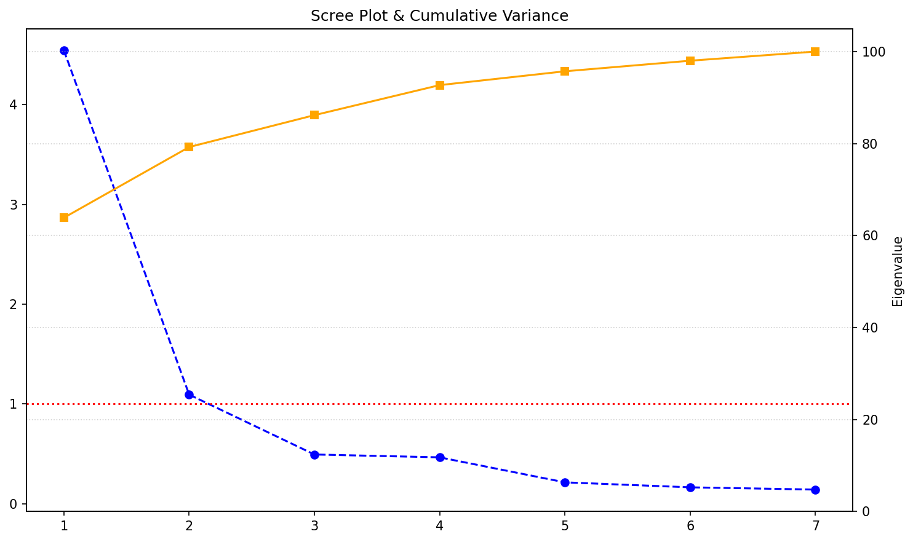
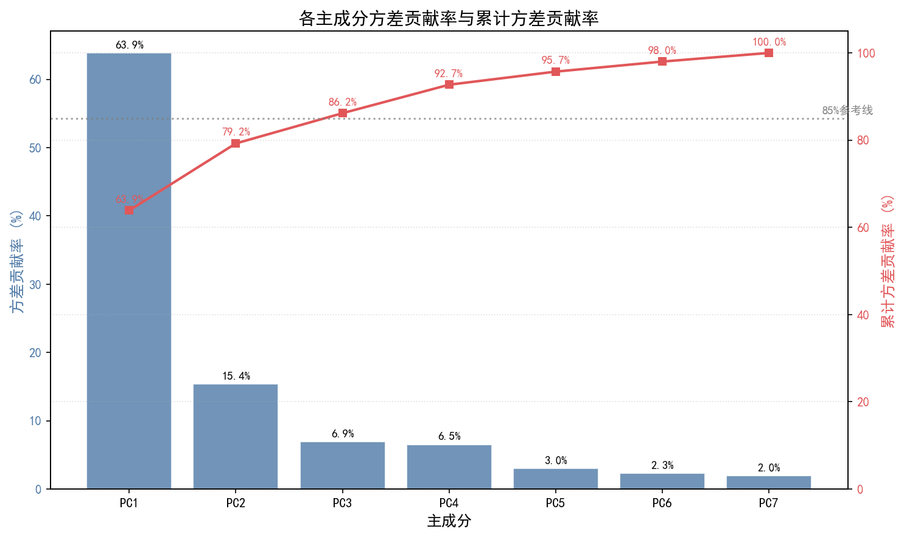
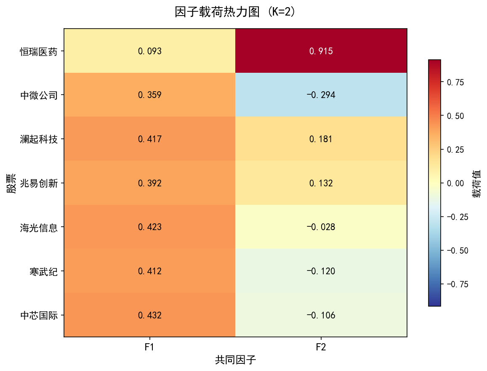
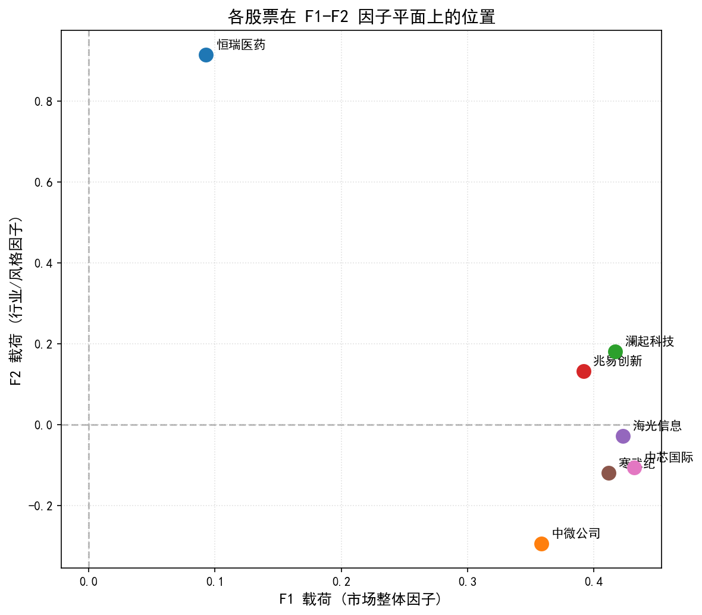
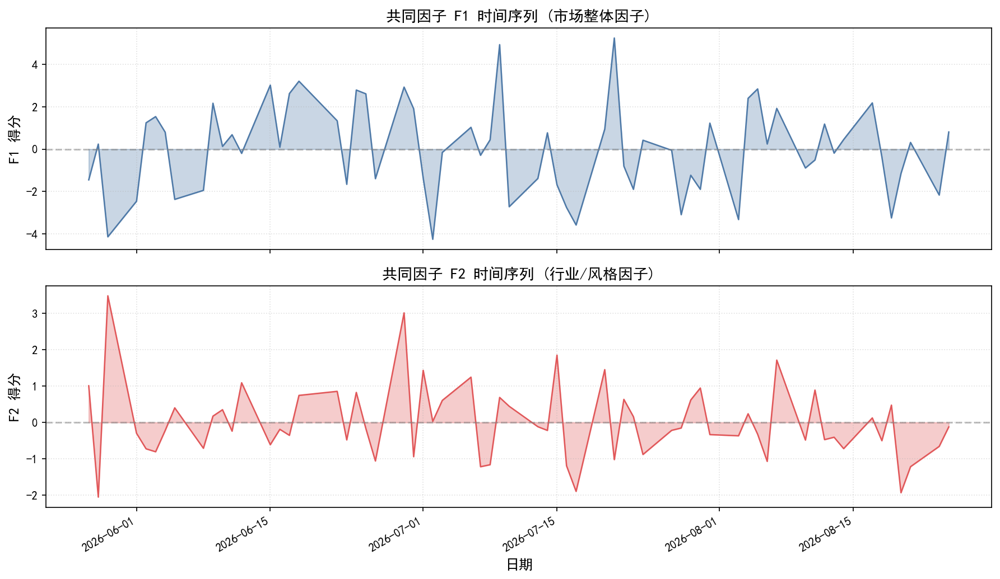
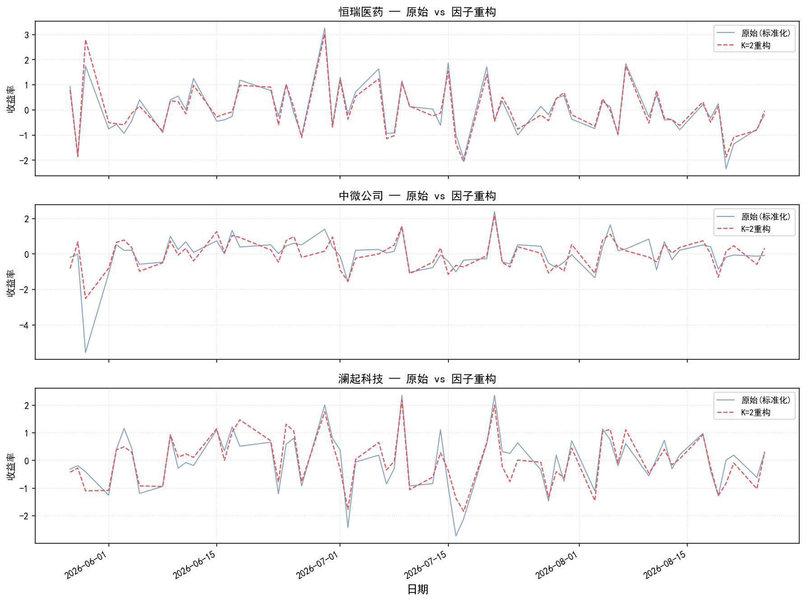

# 套利定价模型 

1. 多因子线性模型
2. 不含残差的线性因子模型的套利定价理论

## 一、套利定价理论 (APT) 基础问题

### 问1. APT与CAPM核心差异

**问题：** 
与资本资产定价模型 (CAPM) 相比，套利定价理论 (APT) 在基本假设和市场因素方面有哪些显著的不同？

<details>
<summary>解答：</summary>

套利定价理论 (APT) 与资本资产定价模型 (CAPM) 的核心差异主要体现在以下两个方面：

1. **市场因素的设定不同：**
   - **CAPM** 是一个**单因子模型**。它认为资产的预期收益率仅由一个系统性风险因子（即市场投资组合的超额收益率）决定。
   - **APT** 是一个**多因子模型**。它允许资产的预期收益率受到多个宏观经济或市场因子（如通货膨胀率、GDP增长率、利率变化等）的共同影响。

2. **基本假设与推导基础不同：**
   - **CAPM** 建立在严格的“均值-方差有效性”和“市场均衡”假设之上。它要求所有投资者都持有市场投资组合，且市场必须处于完美的均衡状态。
   - **APT** 建立在**无套利原则**之上。它不需要假设投资者具有均值-方差偏好，也不需要假设市场处于完美均衡。APT 仅要求市场中不存在无风险的套利机会；如果存在套利机会，理性的投资者会迅速通过交易消除它，从而推导出资产的定价关系。

</details>

---

### 问2. 因子载荷与残差项含义

**问题：** 
在多因子线性模型中，公式 
$$
R_i = a_i + b_{i1}F_1 + \cdots + b_{ik}F_k + \varepsilon_i
$$
里的 $b_{ik}$ 和 $\varepsilon_i$ 分别代表什么含义？

<details>
<summary>解答：</summary>

在多因子线性模型 $R_i = a_i + b_{i1}F_1 + \cdots + b_{ik}F_k + \varepsilon_i$ 中：

1. **$b_{ik}$（因子载荷/敏感系数）：**
   代表资产 $i$ 的收益率对第 $k$ 个因子 $F_k$ 变动的**敏感程度**。
   - **数学含义**：当因子 $F_k$ 变动 1 个单位时，资产 $i$ 的预期收益率将变动 $b_{ik}$ 个单位。
   - **金融含义**：它衡量了该资产所承担的第 $k$ 种系统性风险的大小。例如，如果某股票对“利率因子”的 $b$ 值为 2，说明利率每上升 1%，该股票预期会额外上涨（或下跌，取决于正负号）2%。

2. **$\varepsilon_i$（残差项/特异性风险）：**
   代表由**公司特有因素**（非系统性风险）引起的收益率波动。
   - 这部分波动与所有的公共因子 $F_1, \dots, F_k$ **完全无关**。
   - 在 APT 的严格假设中，不同资产之间的残差项是互不相关的（即 $Cov(\varepsilon_i, \varepsilon_j) = 0$），且残差项的期望值为零（$E(\varepsilon_i) = 0$）。通过构建充分分散的投资组合，这部分风险可以被完全消除。

</details>

---

### 问3. 套利组合构建策略

**问题：** 
根据课文中的单因子模型例子，当三种股票的期望收益率和敏感系数不满足线性关系时，投资者可以构建一个怎样的“套利组合”来获利？

<details>
<summary>解答：</summary>

当三种股票的期望收益率和敏感系数不满足 APT 所要求的线性关系时，意味着市场中存在**定价错误**，投资者可以构建一个**零投资、零风险、正收益**的套利组合来获利。具体构建策略如下：

1. **识别定价偏差**：
   首先，根据市场中已正确定价的资产，推算出隐含的因子风险溢价。然后，找出那个“期望收益率偏离了理论定价线”的资产（例如，其实际期望收益率高于理论值，说明被低估）。

2. **构建套利组合权重 ($w_1, w_2, w_3$)**：
   通过买入被低估的股票、卖空被高估的股票，构建一个满足以下三个严格条件的投资组合：
   - **零净投资**：$w_1 + w_2 + w_3 = 0$。即买入股票的总金额等于卖空股票的总金额，投资者无需投入任何自有资金。
   - **零因子风险**：$w_1 b_1 + w_2 b_2 + w_3 b_3 = 0$。即组合对公共因子的综合敏感度为零，彻底消除系统性风险。
   - **正期望收益**：$w_1 E(R_1) + w_2 E(R_2) + w_3 E(R_3) > 0$。由于资产定价存在偏差，满足前两个条件的组合必然会产生一个无风险的净正收益。

3. **套利结果**：
   随着大量投资者进行上述套利操作，被低估资产的价格将上涨（收益率下降），被高估资产的价格将下跌（收益率上升），直到所有资产的期望收益率重新回到线性关系上，套利机会随之消失。

</details>

---

## 二、统计与数学问题

### 问4. 误差与因子正交假设

**问题：** 
在多因子线性模型的向量形式 $\mathbf{R} = \mathbf{a} + \mathbf{BF} + \boldsymbol{\varepsilon}$ 中，假设 $E(\boldsymbol{\varepsilon}\mathbf{F}^T) = \mathbf{0}_{n \times k}$ 的经济学或统计学意义是什么？

<details>
<summary>解答：</summary>

**统计学意义：** 
该假设表明残差项 $\boldsymbol{\varepsilon}$ 与因子 $\mathbf{F}$ 之间是不相关的（即正交）。在几何上，这意味着残差向量与因子向量所张成的子空间垂直。如果存在相关性，说明模型未能完全提取因子中包含的定价信息，遗漏的变量被留在了残差中，这将导致普通最小二乘法（OLS）估计量失去一致性。

**经济学意义：** 
在多因子资产定价模型（如APT）中，因子代表了系统性风险，而残差 $\boldsymbol{\varepsilon}$ 代表了特异性风险（非系统性风险）。该假设意味着资产的特异性收益不能被任何公共因子所解释，即特异性风险是纯粹的“噪音”，不包含任何可被定价的风险溢价。如果残差与因子相关，说明所谓的“特异性风险”中实际上还隐藏着尚未被模型识别的系统性风险来源。

</details>

---

### 问5. 无套利组合期望收益

**问题：** 
课文中提到，当一个投资组合 $\mathbf{w}$ 满足 $\mathbf{l}^T \mathbf{w} = 0$ 且 $\mathbf{b}_k^T \mathbf{w} = 0$ 时，根据无套利假设，其期望收益率 $E(\mathbf{R})^T \mathbf{w}$ 必须等于多少？这背后的线性代数原理是什么？

<details>
<summary>解答：</summary>

**期望收益率：** 
根据无套利假设，该投资组合的期望收益率 $E(\mathbf{R})^T \mathbf{w}$ 必须严格等于 **0**。

**线性代数原理：** 
$\mathbf{l}^T \mathbf{w} = 0$ 表示组合中各资产权重之和为零（即不需要净投资，是一个自融资组合）；$\mathbf{b}_k^T \mathbf{w} = 0$ 表示该组合对所有 $k$ 个系统性因子的暴露度均为零。在线性代数中，这意味着组合权重向量 $\mathbf{w}$ 位于由全1向量 $\mathbf{l}$ 和因子载荷矩阵 $\mathbf{B}$ 所张成的行空间的正交补空间中。根据套利定价理论（APT），资产的期望超额收益完全由其因子暴露决定。既然该组合既不需要净投资，又没有任何因子风险暴露，它就是一个无风险的零投资组合。在无套利原则下，无风险且零投资的组合不能产生任何正的或负的期望收益，否则就构成了无风险套利机会。

</details>

---

### 问6. 风险溢价因子经济意义

**问题：** 
在 K 因子模型中，风险溢价因子 $\lambda_k$ 具有明确的经济意义。请描述 $\lambda_k$ 代表的是一个满足什么特定条件的投资组合的超额收益率？

<details>
<summary>解答：</summary>

$\lambda_k$ 代表的是一个**纯因子投资组合**（Pure Factor Portfolio）的超额收益率。

该特定投资组合必须满足以下两个条件：
1. **对第 $k$ 个因子的暴露度为 1**：即组合对第 $k$ 个因子的载荷 $\mathbf{b}_k^T \mathbf{w} = 1$。
2. **对其他所有因子的暴露度为 0**：即对任意 $j \neq k$，有 $\mathbf{b}_j^T \mathbf{w} = 0$。
3. **无净投资（自融资）**：即组合权重之和 $\mathbf{l}^T \mathbf{w} = 0$。

在经济学上，$\lambda_k$ 是投资者为了承担第 $k$ 种系统性风险而要求获得的额外补偿（风险溢价）。由于该组合完全隔离了其他所有因子的影响，其超额收益纯粹反映了第 $k$ 个因子的风险溢价。

**追问：** 纯因子投资组合是否一定唯一？

答：纯因子投资组合**不一定唯一**。

从数学推导的角度来看，纯因子投资组合的构建通常涉及矩阵的伪逆（如 Moore-Penrose 伪逆）或 Cholesky 分解等运算。这些数学变换本身产生的矩阵往往不是唯一的，但这并不影响最终因子收益率的估计结果。

此外，从因子暴露的定义来看，最理想的纯因子组合是找到一个股票组合，使其在目标因子上的暴露为 1，同时在其他所有因子上的暴露为 0。但在实际应用中，考虑到因子暴露的具体定义，满足这些严格条件的持仓组合可能并不存在，因此需要对模型做出适当的调整，这也进一步说明了寻找绝对唯一的纯因子组合是不现实的。

不过，尽管纯因子投资组合在股票权重配比上不一定唯一，但它们在理论分析中具有重要的指导意义。在量化投资中，我们通常会计算这些纯因子组合的模拟收益率作为因子收益率，以此来剥离出特定因子的风险溢价，从而为投资组合的构建和收益归因提供指导。

</details>

---

### 问7. 大数法则与残差风险

**问题：** 
对于一个等权重投资组合（即 $w_i = 1/n$），当资产数量 $n$ 很大时，其残差项的方差 $\sigma^2(\varepsilon_P)$ 会如何变化？这对投资组合的总风险有何影响？

<details>
<summary>解答：</summary>

**残差方差的变化：** 
假设各资产的特异性风险（残差）相互独立，且方差有上界 $\bar{\sigma}^2_\varepsilon$。对于等权重组合，其残差方差为：
$$ \sigma^2(\varepsilon_P) = \sum_{i=1}^n w_i^2 \sigma^2(\varepsilon_i) = \frac{1}{n^2} \sum_{i=1}^n \sigma^2(\varepsilon_i) \leq \frac{\bar{\sigma}^2_\varepsilon}{n} $$
根据大数法则，当资产数量 $n$ 趋于无穷大时，$\sigma^2(\varepsilon_P)$ 将以 $1/n$ 的速度收敛于 **0**。

**对总风险的影响：** 
投资组合的总方差由系统性风险（因子风险）和非系统性风险（残差风险）组成。随着 $n$ 的增大，非系统性风险被完全分散并趋于零。这意味着，在充分分散的等权重投资组合中，**总风险将完全由系统性风险（因子暴露）决定**。这也从数学上解释了为什么在多因子模型中，只有系统性因子才能获得风险溢价，而特异性风险因为可以通过分散化免费消除，所以在均衡状态下没有风险补偿。

</details>

---

## 三、数量金融实验与编程问题

### 问8. PCA因子提取方法

**题目：** 
假设你有一个包含 n 种资产历史收益率的数据集，如何运用主成分分析 (PCA) 或因子分析来识别和提取影响这些资产收益率的 K 个共同因子 ($F_1, \dots, F_K$)？

<details>
<summary>解答：</summary>

**题目解释：**
在数量金融中，我们通常面临包含众多资产（如几十只股票）的历史收益率数据。这些资产的涨跌往往受到某些共同因素（如宏观经济、行业政策）的驱动，导致它们之间存在高度相关性。主成分分析（PCA）旨在通过数学变换，从这些高维数据中提取出少数几个互不相关的“共同因子”（$F_1, \dots, F_K$），从而简化数据并揭示资产波动的核心驱动力。

**解答思路：**
1. **数据准备**：读取收盘价数据，计算对数收益率，并进行 Z-score 标准化（消除量纲影响）。
2. **执行 PCA**：对标准化后的收益率矩阵进行主成分分析。
3. **确定因子数 K**：通过累计方差贡献率或碎石图确定保留的主成分数量。
4. **提取因子得分**：将原始数据投影到主成分上，得到每个交易日的因子收益率（即共同因子 $F$ 的时间序列）。
5. **分析因子载荷**：查看每只股票在因子上的权重，解释因子的经济含义。

</details>

---

### 问9. 套利机会检验算法

**题目：** 
给定一组资产的期望收益率向量 $E(\mathbf{R})$ 和它们对单个因子的敏感系数向量 $\mathbf{b}$，如何编写程序来检验这些资产是否存在套利机会？如果存在，如何计算出套利组合的权重 $\mathbf{w}$？

<details>
<summary>解答：</summary>

**题目解释：**
在套利定价理论（APT）中，如果资产的期望收益率与其对因子的敏感系数（因子载荷）之间不存在严格的线性关系，市场中就会存在无风险套利机会。本题要求编写程序，检验给定的期望收益率和因子敏感系数是否满足无套利条件；如果不满足，则构建一个能获利的套利组合。

**解答思路：**
1. **理论检验**：根据 APT，期望收益率应满足 $E(\mathbf{R}) = \mathbf{a} + \mathbf{B}\lambda$。对于单因子模型，若不存在套利，所有资产在 $E(R_i)$ 对 $b_i$ 的回归中应完美落在一条直线上。
2. **构建套利组合**：寻找一个权重向量 $\mathbf{w}$，满足三个条件：
   - 零净投资：$\sum w_i = 0$
   - 零因子风险：$\sum w_i b_i = 0$
   - 正期望收益：$\sum w_i E(R_i) > 0$
3. **编程求解**：利用线性代数（如零空间 `null_space`）找到满足前两个条件的组合，然后检验其期望收益是否大于0。

</details>

---

### 问10. 因子载荷矩阵回归估计

**题目：** 
在确定了 K 个因子后，如何通过多元线性回归模型，利用资产的历史收益率数据来估计每只资产 i 对各因子的敏感系数矩阵 $\mathbf{B}$ (即所有的 $b_{ik}$)？

<details>
<summary>解答：</summary>

**题目解释：**
在提取出 $K$ 个共同因子（如通过 PCA 得到的因子得分）后，我们需要量化每只股票对这些因子的敏感程度，即因子载荷矩阵 $\mathbf{B}$。这可以通过将每只股票的历史收益率对因子收益率进行多元线性回归来实现。

**解答思路：**
1. **准备数据**：获取资产的历史收益率矩阵和对应时间段的因子得分矩阵。
2. **逐资产回归**：对每一只股票，将其收益率作为因变量（$Y$），因子得分作为自变量（$X$）。
3. **提取系数**：多元线性回归的斜率系数即为该股票对各个因子的敏感系数（$b_{i1}, b_{i2}, \dots$）。
4. **汇总结果**：将所有股票的回归系数拼接成因子载荷矩阵 $\mathbf{B}$。

</details>

---

## 四、编程问题的代码与输出结果

<details>
<summary>Python代码</summary>

```python
"""
数量金融实验 - 完整分析脚本
=============================================
包含三道题：
  问8. PCA因子提取方法
  问9. 套利机会检验算法
  问10. 因子载荷矩阵回归估计

数据要求：同目录下需要有一个 closing.csv 文件，
         格式为：日期,恒瑞医药,中微公司,澜起科技,兆易创新,海光信息,寒武纪,中芯国际
"""

import pandas as pd
import numpy as np
from sklearn.preprocessing import StandardScaler
from sklearn.decomposition import PCA

# ============================================================
# 问8. PCA因子提取方法
# ============================================================
print("=" * 60)
print("问8. PCA因子提取方法")
print("=" * 60)

# --- 第1步：读取收盘价，计算对数收益率 ---
df = pd.read_csv('closing.csv', parse_dates=['日期'], index_col='日期')
# 对数收益率: ln(P_t / P_{t-1})，dropna()去掉第一行NaN
log_returns = np.log(df / df.shift(1)).dropna()
print(f"股票数量: {len(log_returns.columns)}")
print(f"交易日数: {len(log_returns)}")

# --- 第2步：Z-score标准化（均值为0，方差为1） ---
scaler = StandardScaler()
returns_scaled = scaler.fit_transform(log_returns)

# --- 第3步：全成分PCA，用于判断K取多少 ---
pca_full = PCA()
pca_full.fit(returns_scaled)

eigenvalues = pca_full.explained_variance_          # 特征值
var_ratio = pca_full.explained_variance_ratio_       # 方差贡献率
cum_var_ratio = np.cumsum(var_ratio)                 # 累计方差贡献率

# 打印各主成分的特征值和累计方差贡献率
result_df = pd.DataFrame({
    '主成分': [f'PC{i+1}' for i in range(len(eigenvalues))],
    '特征值': eigenvalues.round(4),
    '方差贡献率(%)': (var_ratio * 100).round(2),
    '累计方差贡献率(%)': (cum_var_ratio * 100).round(2)
})
print("\n【PCA 特征值与方差贡献率】")
print(result_df.to_string(index=False))

# Kaiser准则：特征值>1的主成分个数
kaiser_k = np.sum(eigenvalues > 1)
print(f"\nKaiser准则建议 K = {kaiser_k}")

# --- 第4步：指定K=2，提取因子得分和载荷矩阵 ---
K = 2
pca_k2 = PCA(n_components=K)
pca_k2.fit(returns_scaled)

# 因子得分：每个交易日在F1、F2上的值
factor_scores = pca_k2.transform(returns_scaled)
factor_df = pd.DataFrame(
    factor_scores,
    columns=['F1', 'F2'],
    index=log_returns.index
)
print(f"\n【共同因子得分 (前5行)】")
print(factor_df.head())

# 因子载荷矩阵：每只股票在F1、F2上的权重
loadings = pd.DataFrame(
    pca_k2.components_.T,
    columns=['F1', 'F2'],
    index=log_returns.columns
)
print(f"\n【因子载荷矩阵】")
print(loadings.round(4))

# --- 第5步：绘制碎石图 ---
import matplotlib.pyplot as plt

plt.figure(figsize=(10, 6))
plt.plot(range(1, len(eigenvalues)+1), eigenvalues, marker='o', linestyle='--', color='b', label='Eigenvalues')
plt.axhline(y=1, color='r', linestyle=':', label='Kaiser Threshold (y=1)')
plt.twinx()
plt.plot(range(1, len(cum_var_ratio)+1), cum_var_ratio*100, marker='s', linestyle='-', color='orange', label='Cumulative Variance (%)')
plt.ylabel('Cumulative Variance (%)')
plt.ylim(0, 105)
plt.title('Scree Plot & Cumulative Variance')
plt.xlabel('Principal Component Number')
plt.ylabel('Eigenvalue')
plt.xticks(range(1, len(eigenvalues)+1))
plt.grid(True, linestyle=':', alpha=0.6)
plt.tight_layout()
plt.savefig('scree_plot.png', dpi=150, bbox_inches='tight')
plt.show()
print("碎石图已保存为 scree_plot.png")


# --- 第6步：绘制方差贡献率柱状图 ---
plt.rcParams['font.sans-serif'] = ['SimHei']
plt.rcParams['axes.unicode_minus'] = False

fig, ax1 = plt.subplots(figsize=(10, 6))
x_labels = [f'PC{i+1}' for i in range(len(eigenvalues))]
bars = ax1.bar(x_labels, var_ratio * 100, color='#4E79A7', alpha=0.8, edgecolor='white')
ax1.set_xlabel('主成分', fontsize=12)
ax1.set_ylabel('方差贡献率 (%)', fontsize=12, color='#4E79A7')
ax1.tick_params(axis='y', labelcolor='#4E79A7')
ax1.set_title('各主成分方差贡献率与累计方差贡献率', fontsize=14)

# 在每个柱子顶部标注数值
for bar, val in zip(bars, var_ratio * 100):
    ax1.text(bar.get_x() + bar.get_width()/2, bar.get_height() + 0.5,
             f'{val:.1f}%', ha='center', va='bottom', fontsize=9)

# 右轴：累计方差贡献率折线
ax2 = ax1.twinx()
ax2.plot(x_labels, cum_var_ratio * 100, marker='s', linestyle='-', color='#E15759', linewidth=2, label='累计方差贡献率')
ax2.set_ylabel('累计方差贡献率 (%)', fontsize=12, color='#E15759')
ax2.tick_params(axis='y', labelcolor='#E15759')
ax2.set_ylim(0, 105)

# 在累计折线上标注数值
for i, val in enumerate(cum_var_ratio * 100):
    ax2.text(i, val + 1.5, f'{val:.1f}%', ha='center', va='bottom', fontsize=9, color='#E15759')

# 添加85%参考线
ax2.axhline(y=85, color='gray', linestyle=':', alpha=0.7)
ax2.text(len(eigenvalues)-0.5, 86, '85%参考线', fontsize=9, color='gray')

plt.grid(True, linestyle=':', alpha=0.4, axis='y')
plt.tight_layout()
plt.savefig('variance_contribution.png', dpi=150, bbox_inches='tight')
plt.show()
print("方差贡献率柱状图已保存为 variance_contribution.png")

# --- 第7步：绘制因子载荷热力图 ---
import matplotlib
# 使用 matplotlib 内置的颜色映射，不依赖 seaborn
fig, ax = plt.subplots(figsize=(8, 6))

# 将载荷矩阵转为 numpy 数组
loadings_arr = loadings.values
stocks = loadings.index.tolist()
factors = loadings.columns.tolist()

# 绘制热力图
im = ax.imshow(loadings_arr, cmap='RdYlBu_r', aspect='auto', vmin=-np.max(np.abs(loadings_arr)), vmax=np.max(np.abs(loadings_arr)))

# 设置坐标轴标签
ax.set_xticks(range(len(factors)))
ax.set_xticklabels(factors, fontsize=12)
ax.set_yticks(range(len(stocks)))
ax.set_yticklabels(stocks, fontsize=11)

# 在每个格子中标注数值
for i in range(len(stocks)):
    for j in range(len(factors)):
        val = loadings_arr[i, j]
        # 根据背景色深浅选择文字颜色
        text_color = 'white' if abs(val) > 0.5 * np.max(np.abs(loadings_arr)) else 'black'
        ax.text(j, i, f'{val:.3f}', ha='center', va='center', fontsize=11, color=text_color, fontweight='bold')

# 添加颜色条
cbar = fig.colorbar(im, ax=ax, shrink=0.8)
cbar.set_label('载荷值', fontsize=11)

ax.set_title('因子载荷热力图 (K=2)', fontsize=14, pad=15)
ax.set_xlabel('共同因子', fontsize=12)
ax.set_ylabel('股票', fontsize=12)

plt.tight_layout()
plt.savefig('factor_loadings_heatmap.png', dpi=150, bbox_inches='tight')
plt.show()
print("因子载荷热力图已保存为 factor_loadings_heatmap.png")

# --- 第8步：绘制因子载荷散点图（F1 vs F2 平面） ---
fig, ax = plt.subplots(figsize=(8, 7))

for i, stock in enumerate(loadings.index):
    f1_val = loadings.loc[stock, 'F1']
    f2_val = loadings.loc[stock, 'F2']
    ax.scatter(f1_val, f2_val, s=120, zorder=5)
    # 标注股票名称（稍微偏移避免遮挡点）
    ax.annotate(stock, (f1_val, f2_val), textcoords="offset points",
                xytext=(8, 5), fontsize=10)

# 添加坐标轴参考线
ax.axhline(y=0, color='gray', linestyle='--', alpha=0.5)
ax.axvline(x=0, color='gray', linestyle='--', alpha=0.5)

ax.set_xlabel('F1 载荷 (市场整体因子)', fontsize=12)
ax.set_ylabel('F2 载荷 (行业/风格因子)', fontsize=12)
ax.set_title('各股票在 F1-F2 因子平面上的位置', fontsize=14)
ax.grid(True, linestyle=':', alpha=0.4)

plt.tight_layout()
plt.savefig('factor_loadings_scatter.png', dpi=150, bbox_inches='tight')
plt.show()
print("因子载荷散点图已保存为 factor_loadings_scatter.png")

# --- 第9步：绘制因子得分时间序列图 ---
fig, axes = plt.subplots(2, 1, figsize=(12, 7), sharex=True)

# F1 时间序列
axes[0].plot(factor_df.index, factor_df['F1'], color='#4E79A7', linewidth=1.2)
axes[0].fill_between(factor_df.index, factor_df['F1'], alpha=0.3, color='#4E79A7')
axes[0].axhline(y=0, color='gray', linestyle='--', alpha=0.5)
axes[0].set_ylabel('F1 得分', fontsize=12)
axes[0].set_title('共同因子 F1 时间序列 (市场整体因子)', fontsize=13)
axes[0].grid(True, linestyle=':', alpha=0.4)

# F2 时间序列
axes[1].plot(factor_df.index, factor_df['F2'], color='#E15759', linewidth=1.2)
axes[1].fill_between(factor_df.index, factor_df['F2'], alpha=0.3, color='#E15759')
axes[1].axhline(y=0, color='gray', linestyle='--', alpha=0.5)
axes[1].set_ylabel('F2 得分', fontsize=12)
axes[1].set_xlabel('日期', fontsize=12)
axes[1].set_title('共同因子 F2 时间序列 (行业/风格因子)', fontsize=13)
axes[1].grid(True, linestyle=':', alpha=0.4)

# 自动旋转日期标签
fig.autofmt_xdate(rotation=30)
plt.tight_layout()
plt.savefig('factor_scores_timeseries.png', dpi=150, bbox_inches='tight')
plt.show()
print("因子得分时间序列图已保存为 factor_scores_timeseries.png")

# --- 第10步：绘制因子重构 vs 原始收益率对比图（选取前2只股票展示） ---
# 用 K=2 个因子重构原始收益率，展示还原效果
reconstructed = pca_k2.inverse_transform(factor_scores)  # 重构标准化后的数据

# 选取前3只股票做对比展示
show_stocks = log_returns.columns[:3].tolist()
fig, axes = plt.subplots(len(show_stocks), 1, figsize=(12, 3 * len(show_stocks)), sharex=True)

if len(show_stocks) == 1:
    axes = [axes]

for idx, stock in enumerate(show_stocks):
    col_idx = list(log_returns.columns).index(stock)
    original = returns_scaled[:, col_idx]     # 标准化后的原始收益率
    recon = reconstructed[:, col_idx]          # 重构后的收益率

    axes[idx].plot(log_returns.index, original, label='原始(标准化)', color='#4E79A7', alpha=0.7, linewidth=1)
    axes[idx].plot(log_returns.index, recon, label='K=2重构', color='#E15759', linestyle='--', linewidth=1.2)
    axes[idx].set_ylabel('收益率', fontsize=10)
    axes[idx].set_title(f'{stock} — 原始 vs 因子重构', fontsize=12)
    axes[idx].legend(fontsize=9)
    axes[idx].grid(True, linestyle=':', alpha=0.4)

axes[-1].set_xlabel('日期', fontsize=12)
fig.autofmt_xdate(rotation=30)
plt.tight_layout()
plt.savefig('factor_reconstruction.png', dpi=150, bbox_inches='tight')
plt.show()
print("因子重构对比图已保存为 factor_reconstruction.png")

# --- 计算重构精度（R²）---
print("\n【因子重构精度 (R²)】")
from sklearn.metrics import r2_score
for stock in log_returns.columns:
    col_idx = list(log_returns.columns).index(stock)
    r2 = r2_score(returns_scaled[:, col_idx], reconstructed[:, col_idx])
    print(f"  {stock}: R² = {r2:.4f}")


# ============================================================
# 问9. 套利机会检验算法
# ============================================================
print("\n" + "=" * 60)
print("问9. 套利机会检验算法")
print("=" * 60)

# 假设给定3只资产的期望收益率和因子敏感系数
E_R = np.array([0.10, 0.12, 0.08])   # 期望收益率
b = np.array([1.0, 1.2, 0.8])         # 因子敏感系数

# --- 第1步：构建约束矩阵A ---
# 第一行：全1向量（零净投资约束 w1+w2+w3=0）
# 第二行：因子敏感系数（零因子风险约束 w1*b1+w2*b2+w3*b3=0）
A = np.vstack([np.ones(len(E_R)), b])

# --- 第2步：用SVD求零空间 ---
# 零空间中的向量满足：零投资 + 零因子风险
U, S, Vt = np.linalg.svd(A)
# 最小奇异值对应的右奇异向量就是零空间基向量
null_vec = Vt.T[:, -1]

# --- 第3步：检验套利机会 ---
portfolio_return = np.dot(E_R, null_vec)
if abs(portfolio_return) > 1e-6:
    # 如果收益为负，反转权重即可获利
    if portfolio_return < 0:
        null_vec = -null_vec
        portfolio_return = -portfolio_return
    print(f"存在套利机会！")
    print(f"套利组合权重 w = {null_vec.round(4)}")
    print(f"期望收益率 = {portfolio_return:.6f}")
else:
    print("市场无套利机会，所有资产定价符合单因子模型。")


# ============================================================
# 问10. 因子载荷矩阵回归估计
# ============================================================
print("\n" + "=" * 60)
print("问10. 因子载荷矩阵回归估计")
print("=" * 60)

import statsmodels.api as sm

# --- 第1步：准备自变量X（因子得分，添加常数项） ---
X = sm.add_constant(factor_df)  # factor_df 来自问8的结果

# --- 第2步：逐只股票进行多元线性回归 ---
loadings_matrix = pd.DataFrame(index=log_returns.columns, columns=['截距', 'b_F1', 'b_F2'])

for stock in log_returns.columns:
    Y = log_returns[stock]           # 因变量：某只股票的收益率
    model = sm.OLS(Y, X).fit()       # OLS回归
    loadings_matrix.loc[stock, '截距'] = model.params['const']
    loadings_matrix.loc[stock, 'b_F1'] = model.params['F1']
    loadings_matrix.loc[stock, 'b_F2'] = model.params['F2']

# --- 第3步：输出因子载荷矩阵B ---
print("【估计的因子载荷矩阵 B】")
print(loadings_matrix.round(4))

print("\n" + "=" * 60)
print("全部分析完成！")
print("=" * 60)
```

</details>

---

<details>
<summary>输出图表</summary>













</details>

---

<details>
<summary>输出数据</summary>

```txt
============================================================
问8. PCA因子提取方法
============================================================
股票数量: 7
交易日数: 64

【PCA 特征值与方差贡献率】
主成分    特征值  方差贡献率(%)  累计方差贡献率(%)
PC1 4.5424     63.88       63.88
PC2 1.0928     15.37       79.24
PC3 0.4929      6.93       86.18
PC4 0.4645      6.53       92.71
PC5 0.2136      3.00       95.71
PC6 0.1638      2.30       98.01
PC7 0.1412      1.99      100.00

Kaiser准则建议 K = 2

【共同因子得分 (前5行)】
                  F1        F2
日期                            
2026-05-27 -1.452385  1.009302
2026-05-28  0.237545 -2.051544
2026-05-29 -4.144801  3.482817
2026-06-01 -2.462884 -0.296078
2026-06-02  1.243283 -0.724084

【因子载荷矩阵】
          F1      F2
恒瑞医药  0.0929  0.9150
中微公司  0.3586 -0.2937
澜起科技  0.4169  0.1810
兆易创新  0.3919  0.1322
海光信息  0.4231 -0.0281
寒武纪   0.4119 -0.1196
中芯国际  0.4320 -0.1060
碎石图已保存为 scree_plot.png
方差贡献率柱状图已保存为 variance_contribution.png
因子载荷热力图已保存为 factor_loadings_heatmap.png
因子载荷散点图已保存为 factor_loadings_scatter.png
因子得分时间序列图已保存为 factor_scores_timeseries.png
因子重构对比图已保存为 factor_reconstruction.png

【因子重构精度 (R²)】
  恒瑞医药: R² = 0.9391
  中微公司: R² = 0.6678
  澜起科技: R² = 0.8125
  兆易创新: R² = 0.7057
  海光信息: R² = 0.8014
  寒武纪: R² = 0.7740
  中芯国际: R² = 0.8466

============================================================
问9. 套利机会检验算法
============================================================
市场无套利机会，所有资产定价符合单因子模型。

============================================================
问10. 因子载荷矩阵回归估计
============================================================
【估计的因子载荷矩阵 B】
            截距      b_F1      b_F2
恒瑞医药 -0.000885  0.002419  0.023823
中微公司 -0.004211   0.02688 -0.022013
澜起科技 -0.005263  0.026592  0.011546
兆易创新 -0.004462  0.023846  0.008044
海光信息 -0.006021  0.017846 -0.001187
寒武纪  -0.005216  0.021203 -0.006158
中芯国际 -0.003401  0.018695 -0.004586

============================================================
全部分析完成！
============================================================
```

</details>
