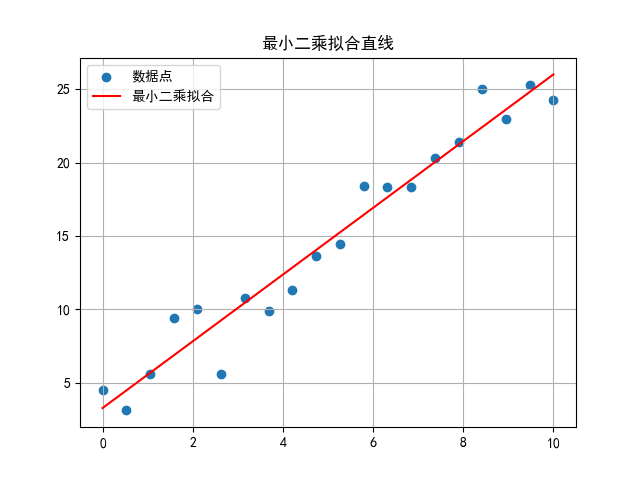
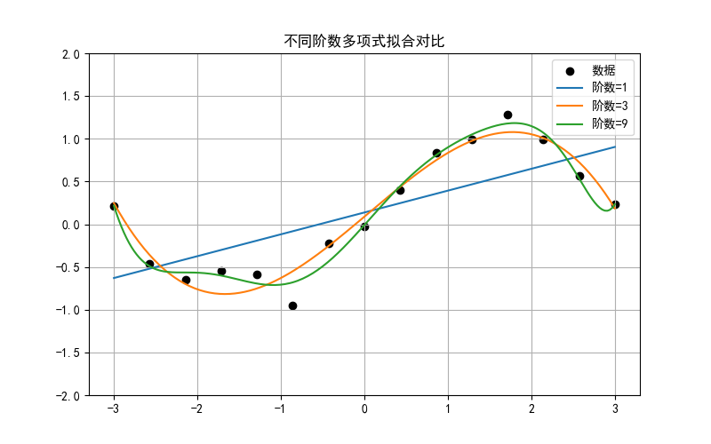

# 数据拟合的基本概念

## 问1. 最小二乘法如何确定拟合直线

<details>
<summary>问题：</summary>

已知一组数据点 \((x_i, y_i)\)，想用一条直线 \(y = ax + b\) 去拟合它们。什么叫做“最小二乘法”？它如何确定 \(a\) 和 \(b\)？

</details>

<details>
<summary>解答：</summary>

最小二乘法的核心思想是：让每个数据点到拟合直线的竖直偏差（残差）的平方和最小。也就是说，求解 \(a, b\)，使得

\[
S(a,b)=\sum_{i=1}^{n}(y_i-ax_i-b)^2
\]

达到最小。对 \(a\)、\(b\) 分别求偏导并令其为 0，就得到正规方程，解出 \(a, b\)。

```python
import numpy as np
import matplotlib.pyplot as plt

# 造一组带噪声的数据
np.random.seed(0)
x = np.linspace(0, 10, 20)
y = 2.5 * x + 1.0 + np.random.normal(0, 2, 20)

# 最小二乘拟合直线
a, b = np.polyfit(x, y, 1)
print(f"拟合直线：y = {a:.3f}x + {b:.3f}")

plt.scatter(x, y, label="数据点")
plt.plot(x, a*x + b, 'r', label="最小二乘拟合")
plt.legend(); plt.grid(True)
plt.title("最小二乘拟合直线")
plt.show()
```



</details>

---

## 问2. 残差平方和衡量什么

<details>
<summary>问题：</summary>

拟合出一条曲线后，怎么衡量它和数据点整体偏离多少？残差平方和（RSS）是怎么定义的？

</details>

<details>
<summary>解答：</summary>

残差是每个点的真实值与拟合值之差 \(e_i = y_i - \hat{y}_i\)。残差平方和就是

\[
\text{RSS}=\sum_{i=1}^{n}(y_i-\hat{y}_i)^2.
\]

RSS 越小，说明拟合曲线整体上越贴近数据。它是最小二乘法直接优化的目标，也是很多评价指标的基础。

```python
import numpy as np

x = np.array([1, 2, 3, 4, 5])
y = np.array([2.1, 3.9, 6.2, 7.8, 10.1])

a, b = np.polyfit(x, y, 1)
y_hat = a * x + b
rss = np.sum((y - y_hat)**2)
print(f"残差：{y - y_hat}")
print(f"残差平方和 RSS = {rss:.4f}")
```

输出结果：
```
残差：[ 0.06 -0.13  0.18 -0.21  0.1 ]
残差平方和 RSS = 0.1070
```
</details>

---

## 问3. 线性回归的“线性”指什么

<details>
<summary>问题：</summary>

线性回归中的“线性”是指自变量 \(x\) 必须是一次方吗？如果模型是 \(y = a x^2 + b\)，还能叫线性回归吗？

</details>

<details>
<summary>解答：</summary>

线性回归的“线性”指的是对参数线性，而不是对自变量线性。\(y = a x^2 + b\) 对 \(a, b\) 仍是线性的，所以它依然是线性回归，只是把 \(x^2\) 当作一个新的特征。只要模型能写成 \(y = \sum_j \beta_j \phi_j(x)\) 的形式，且 \(\beta_j\) 以一次方出现，就属于线性回归框架。

```python
import numpy as np

x = np.array([1, 2, 3, 4, 5])
y = np.array([2.2, 5.1, 9.8, 16.3, 24.9])

# 把 x^2 当作特征，做线性回归
X = np.column_stack([x2, x, np.ones_like(x)])
beta, *_ = np.linalg.lstsq(X, y, rcond=None)
print("系数 [a, b, c] =", beta)
print("模型：y = %.2f x^2 + %.2f x + %.2f" % tuple(beta))
```
</details>

---

## 问4. 多项式拟合的阶数怎么选

<details>
<summary>问题：</summary>

用多项式拟合一组数据时，阶数取 1、3、9 会有什么不同？阶数越高越好吗？

</details>

<details>
<summary>解答：</summary>

阶数太低会欠拟合，曲线无法反映数据的弯曲趋势；阶数太高会过拟合，曲线穿过每个点但在点之间剧烈摆动，对新数据预测很差。合理做法是用交叉验证或信息准则选择适中阶数，兼顾拟合精度与泛化能力。

```python
import numpy as np
import matplotlib.pyplot as plt

np.random.seed(0)
x = np.linspace(-3, 3, 15)
y = np.sin(x) + np.random.normal(0, 0.2, len(x))
xs = np.linspace(-3, 3, 200)

plt.figure(figsize=(8, 5))
plt.scatter(x, y, color='k', label='数据')
for deg in [1, 3, 9]:
    coef = np.polyfit(x, y, deg)
    plt.plot(xs, np.polyval(coef, xs), label=f"阶数={deg}")
plt.ylim(-2, 2); plt.legend(); plt.grid(True)
plt.title("不同阶数多项式拟合对比")
plt.show()
```



</details>

---

## 问5. 过拟合是怎样发生的

<details>
<summary>问题：</summary>

一个模型在训练数据上误差几乎为 0，但在新数据上表现很差，这是为什么？如何判断是否过拟合？

</details>

<details>
<summary>解答：</summary>

过拟合指模型把训练数据中的噪声和偶然波动也当成规律学了进去，导致它对训练集拟合极好，却无法推广到新数据。判断方法是对比训练误差和验证误差：训练误差很低、验证误差明显偏高，通常就是过拟合。增加数据、降低模型复杂度、加入正则化都能缓解。

```python
import numpy as np
from sklearn.pipeline import make_pipeline
from sklearn.preprocessing import PolynomialFeatures
from sklearn.linear_model import LinearRegression
from sklearn.model_selection import train_test_split
from sklearn.metrics import mean_squared_error

np.random.seed(0)
x = np.linspace(0, 1, 30)
y = np.sin(2*np.pi*x) + np.random.normal(0, 0.2, 30)
X = x.reshape(-1, 1)

Xtr, Xte, ytr, yte = train_test_split(X, y, test_size=0.3, random_state=0)

for deg in [1, 3, 15]:
    model = make_pipeline(PolynomialFeatures(deg), LinearRegression())
    model.fit(Xtr, ytr)
    print(f"阶数={deg:2d}  训练MSE={mean_squared_error(ytr, model.predict(Xtr)):.4f}"
          f"  测试MSE={mean_squared_error(yte, model.predict(Xte)):.4f}")
```
</details>

---

## 问6. 正则化如何抑制过拟合

<details>
<summary>问题：</summary>

在拟合时给损失函数加一个惩罚项，比如 \(\lambda\sum \beta_j^2\)，为什么能减轻过拟合？\(\lambda\) 起什么作用？

</details>

<details>
<summary>解答：</summary>

正则化通过在损失函数中加入对参数大小的惩罚，限制模型参数不要过大，从而降低模型复杂度、抑制过拟合。\(\lambda\) 是正则化强度：\(\lambda=0\) 等价于普通最小二乘；\(\lambda\) 越大，参数被压得越小，模型越平滑，但太大又会欠拟合。常用形式有岭回归（L2）和 Lasso（L1）。

```python
import numpy as np
from sklearn.linear_model import Ridge
from sklearn.preprocessing import PolynomialFeatures
from sklearn.pipeline import make_pipeline

np.random.seed(0)
x = np.linspace(0, 1, 20)
y = np.sin(2*np.pi*x) + np.random.normal(0, 0.2, 20)
X = x.reshape(-1, 1)

for alpha in [0, 1e-3, 0.1, 10]:
    model = make_pipeline(PolynomialFeatures(10), Ridge(alpha=alpha))
    model.fit(X, y)
    print(f"alpha={alpha:<6} 训练RSS={np.sum((y-model.predict(X))2):.4f}")
```
</details>

---

## 问7. 决定系数 \(R^2\) 怎么理解

<details>
<summary>问题：</summary>

拟合之后常看到 \(R^2=0.95\) 这样的数字，它代表什么含义？越大越好吗？

</details>

<details>
<summary>解答：</summary>

决定系数 \(R^2\) 衡量模型解释了因变量总变异的比例：

\[
R^2 = 1 - \frac{\sum (y_i-\hat{y}_i)^2}{\sum (y_i-\bar{y})^2}.
\]

\(R^2=1\) 表示完美拟合，\(R^2=0\) 表示模型不比直接用均值预测更好。它越接近 1 通常越好，但要注意：加入更多特征总会让 \(R^2\) 不降，所以比较不同复杂度模型时应看调整过的 \(R^2\)。

```python
import numpy as np
from sklearn.metrics import r2_score

x = np.array([1, 2, 3, 4, 5])
y = np.array([2.1, 3.9, 6.2, 7.8, 10.1])
a, b = np.polyfit(x, y, 1)
y_hat = a * x + b

print(f"R² = {r2_score(y, y_hat):.4f}")
```

输出结果：

```txt
R² = 0.9973
```

</details>

---

## 问8. 均方误差与均方根误差

<details>
<summary>问题：</summary>

评价回归模型时，MSE 和 RMSE 分别怎么算？它们和残差平方和有什么关系？

</details>

<details>
<summary>解答：</summary>

均方误差 MSE 是残差平方和除以样本数：

\[
\text{MSE}=\frac{1}{n}\sum_{i=1}^n (y_i-\hat{y}_i)^2.
\]

均方根误差 RMSE 是 MSE 的平方根，量纲与 \(y\) 相同，便于直观解释。三者关系是：\(\text{RMSE}=\sqrt{\text{MSE}}=\sqrt{\text{RSS}/n}\)。

```python
import numpy as np
from sklearn.metrics import mean_squared_error

x = np.array([1, 2, 3, 4, 5])
y = np.array([2.1, 3.9, 6.2, 7.8, 10.1])
a, b = np.polyfit(x, y, 1)
y_hat = a * x + b

mse = mean_squared_error(y, y_hat)
rmse = np.sqrt(mse)
rss = np.sum((y - y_hat)  2)
print(f"RSS={rss:.4f}  MSE={mse:.4f}  RMSE={rmse:.4f}")
```
</details>

---

## 问9. 梯度下降如何最小化损失

<details>
<summary>问题：</summary>

如果损失函数很复杂，无法直接解出解析解，怎么用梯度下降一步步找到使损失最小的参数？

</details>

<details>
<summary>解答：</summary>

梯度下降的核心是：沿着损失函数梯度的反方向更新参数，因为梯度指向函数上升最快的方向。更新公式为

\[
\theta \leftarrow \theta - \eta \nabla L(\theta),
\]

其中 \(\eta\) 是学习率。学习率太大会震荡甚至发散，太小则收敛很慢。反复迭代，直到损失不再明显下降。

```python
import numpy as np
import matplotlib.pyplot as plt

# 目标：拟合 y = 3x + 2
np.random.seed(0)
x = np.linspace(0, 5, 30)
y = 3 * x + 2 + np.random.normal(0, 1, 30)

a, b = 0.0, 0.0
lr = 0.01
for epoch in range(2000):
    y_hat = a * x + b
    da = -2 * np.mean(x * (y - y_hat))
    db = -2 * np.mean(y - y_hat)
    a -= lr * da
    b -= lr * db

print(f"梯度下降结果：a={a:.3f}, b={b:.3f}")
plt.scatter(x, y)
plt.plot(x, a*x + b, 'r')
plt.title("梯度下降拟合直线")
plt.grid(True)
plt.show()
```
</details>

---

## 问10. 交叉验证为什么更可靠

<details>
<summary>问题：</summary>

如果只用一次训练集/测试集划分来评估模型，结果可能受划分方式影响。交叉验证是怎么解决这个问题的？

</details>

<details>
<summary>解答：</summary>

\(K\) 折交叉验证把数据分成 \(K\) 份，每次用其中 \(K-1\) 份训练、剩下 1 份验证，重复 \(K\) 次，最后取平均误差。这样每个样本都参与过验证，评估结果更稳定、更能反映模型的泛化能力，尤其适合数据量不大或需要选择超参数的情形。

```python
import numpy as np
from sklearn.model_selection import cross_val_score
from sklearn.linear_model import LinearRegression
from sklearn.preprocessing import PolynomialFeatures
from sklearn.pipeline import make_pipeline

np.random.seed(0)
x = np.linspace(0, 1, 40)
y = np.sin(2*np.pi*x) + np.random.normal(0, 0.2, 40)
X = x.reshape(-1, 1)

for deg in [1, 3, 10]:
    model = make_pipeline(PolynomialFeatures(deg), LinearRegression())
    scores = cross_val_score(model, X, y, cv=5,
                             scoring='neg_mean_squared_error')
    print(f"阶数={deg:2d}  5折CV平均MSE={-scores.mean():.4f}")
```
</details>

---
