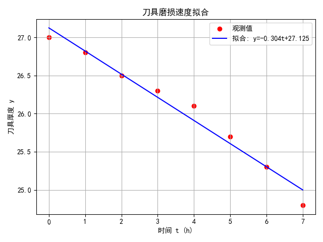
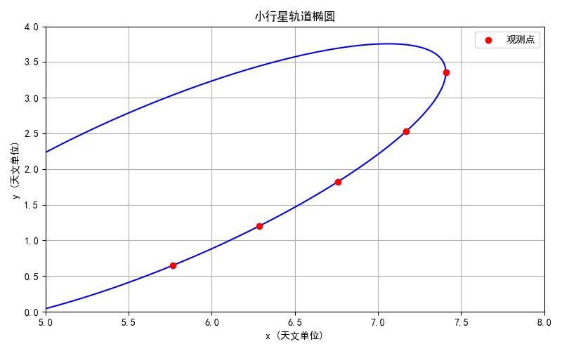
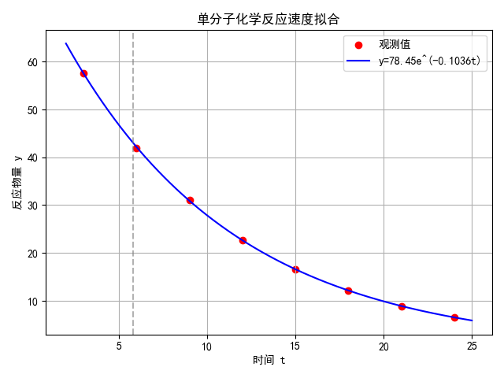
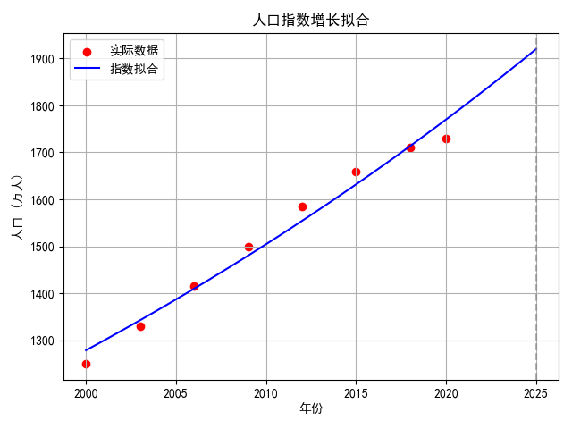
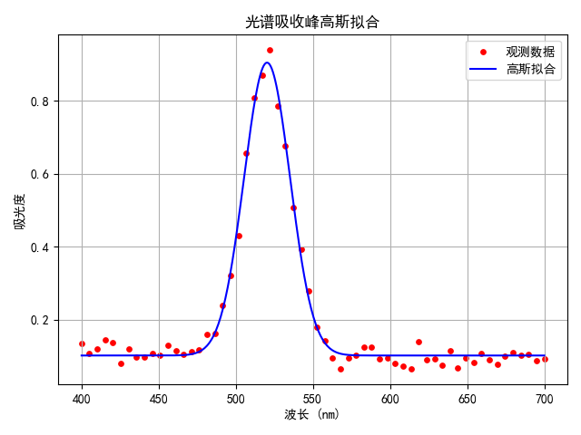

# 数据拟合的实际例子

## 问11. 刀具磨损速度的线性拟合

<details>
<summary>问题：</summary>
每隔 1 小时测量一次刀具厚度，得到 8 组数据 $(t_i, y_i)$。试根据这些数据建立刀具厚度 $y$ 与时间 $t$ 之间的经验公式 $y = at + b$，并评价拟合效果。

| $t_i$ | 0 | 1 | 2 | 3 | 4 | 5 | 6 | 7 |
|---|---|---|---|---|---|---|---|---|
| $y_i$ | 27.0 | 26.8 | 26.5 | 26.3 | 26.1 | 25.7 | 25.3 | 24.8 |

</details>

<details>
<summary>解答：</summary>

这是典型的一元线性最小二乘拟合。设模型为 $y = at + b$，目标是最小化残差平方和

\[
S(a,b)=\sum_{i=1}^{8}(y_i-at_i-b)^2.
\]

对 $a,b$ 求偏导并令其为 0，得到正规方程，可用 `np.polyfit` 或 `scipy.optimize.curve_fit` 求解。

从数据看，刀具厚度随时间近似线性下降，拟合直线的斜率 $a$ 即为磨损速度（单位：厚度/小时），截距 $b$ 为初始厚度。

```python
import numpy as np
import matplotlib.pyplot as plt

plt.rcParams['font.sans-serif'] = ['SimHei']
plt.rcParams['axes.unicode_minus'] = False

t = np.array([0, 1, 2, 3, 4, 5, 6, 7], dtype=float)
y = np.array([27.0, 26.8, 26.5, 26.3, 26.1, 25.7, 25.3, 24.8])

# 最小二乘拟合 y = a t + b
a, b = np.polyfit(t, y, 1)
print(f"拟合结果：y = {a:.4f} t + {b:.4f}")

y_hat = a * t + b
rss = np.sum((y - y_hat)**2)
r2 = 1 - rss / np.sum((y - y.mean())**2)
print(f"残差平方和 RSS = {rss:.5f}, 决定系数 R² = {r2:.5f}")

plt.scatter(t, y, color='red', label='观测值')
plt.plot(t, y_hat, 'b-', label=f'拟合: y={a:.3f}t+{b:.3f}')
plt.xlabel('时间 t (h)'); plt.ylabel('刀具厚度 y')
plt.title('刀具磨损速度拟合')
plt.legend(); plt.grid(True)
plt.tight_layout(); plt.show()
```

结果表明刀具厚度大约每小时减少 0.3 个单位，线性模型可以很好地描述这一磨损过程。



</details>

---

## 问12. 小行星轨道椭圆的拟合

<details>
<summary>问题：</summary>

已知小行星轨道上 5 个观测点 $(x_i, y_i)$，

| 坐标 | 1 | 2 | 3 | 4 | 5 |
|---|---|---|---|---|---|
| $x$ | 5.764 | 6.286 | 6.759 | 7.168 | 7.408 |
| $y$ | 0.648 | 1.202 | 1.823 | 2.526 | 3.360 |

轨道为椭圆，其一般方程为

\[
a_1x^2+a_2xy+a_3y^2+a_4x+a_5y+1=0.
\]

试根据数据确定系数 $a_1,a_2,a_3,a_4,a_5$，并画出轨道曲线。

</details>

<details>
<summary>解答：</summary>

椭圆方程中含有 5 个未知参数，每个观测点给出一个方程。把常数项 1 移到右边：

\[
a_1x_i^2+a_2x_iy_i+a_3y_i^2+a_4x_i+a_5y_i=-1.
\]

这是一个超定线性方程组 $A\boldsymbol{\alpha}=\mathbf{b}$，可用最小二乘求解。把 5 个点的数据代入，得到 5×5 的线性系统，直接解即可。求出系数后，用隐函数绘图或参数化绘制椭圆。

```python
import numpy as np
import matplotlib.pyplot as plt

plt.rcParams['font.sans-serif'] = ['SimHei']
plt.rcParams['axes.unicode_minus'] = False

x = np.array([5.764, 6.286, 6.759, 7.168, 7.408])
y = np.array([0.648, 1.202, 1.823, 2.526, 3.360])

# 构造设计矩阵 A，右端向量 b = -1
A = np.column_stack([x**2, x*y, y**2, x, y])
b = -np.ones_like(x)

# 最小二乘求解
coef, *_ = np.linalg.lstsq(A, b, rcond=None)
a1, a2, a3, a4, a5 = coef
print("椭圆系数：")
print(f"a1={a1:.6f}, a2={a2:.6f}, a3={a3:.6f}, a4={a4:.6f}, a5={a5:.6f}")

# 画轨道曲线
X, Y = np.meshgrid(np.linspace(5, 8, 400), np.linspace(0, 4, 400))
F = a1*X**2 + a2*X*Y + a3*Y**2 + a4*X + a5*Y + 1

plt.figure(figsize=(8, 5))
plt.contour(X, Y, F, levels=[0], colors='b')
plt.scatter(x, y, color='red', zorder=5, label='观测点')
plt.xlabel('x (天文单位)'); plt.ylabel('y (天文单位)')
plt.title('小行星轨道椭圆')
plt.legend(); plt.grid(True)
plt.tight_layout(); plt.show()
```

输出结果：

```txt
椭圆系数：
a1=0.050766, a2=-0.070219, a3=0.038126, a4=-0.453091, a5=0.264257
```



画出的曲线即为小行星绕太阳运行的椭圆轨道，5 个观测点都落在曲线上。

</details>

---

## 问13. 带约束的函数拟合

<details>
<summary>问题：</summary>

已知 $x,y$ 的 8 组观测值，

| $x$ | 3 | 5 | 6 | 7 | 4 | 8 | 5 | 9 |
|---|---|---|---|---|---|---|---|---|
| $y$ | 4 | 9 | 5 | 3 | 8 | 5 | 8 | 5 |

拟合函数 $y = ae^x + b\ln x$，同时满足约束 $a\geqslant 0$，$b\geqslant 0$，$a+b\leqslant 1$。如何求解？

</details>

<details>
<summary>解答：</summary>

模型对参数 $a,b$ 是线性的：

\[
y = a\,e^x + b\,\ln x,
\]

所以可以写成线性最小二乘形式，只是参数受不等式约束。这类问题可用 `scipy.optimize.minimize` 配合 SLSQP 方法，把约束写成字典形式。

无约束最小二乘解若落在可行域内即为答案；若不在，则约束优化会找到边界上的最优解。

```python
import numpy as np
from scipy.optimize import minimize

x = np.array([3, 5, 6, 7, 4, 8, 5, 9], dtype=float)
y = np.array([4, 9, 5, 3, 8, 5, 8, 5], dtype=float)

# 目标函数：残差平方和
def loss(p):
    a, b = p
    return np.sum((a*np.exp(x) + b*np.log(x) - y) ** 2)

# 约束
cons = [{'type': 'ineq', 'fun': lambda p: p[0]},      # a >= 0
        {'type': 'ineq', 'fun': lambda p: p[1]},      # b >= 0
        {'type': 'ineq', 'fun': lambda p: 1 - p[0] - p[1]}]  # a+b <= 1

res = minimize(loss, x0=[0.01, 0.01], constraints=cons, method='SLSQP')
a, b = res.x
print(f"拟合结果：a = {a:.6f}, b = {b:.6f}")
print(f"约束检查：a>=0: {a>=0}, b>=0: {b>=0}, a+b<=1: {a+b<=1}")
print(f"残差平方和 = {res.fun:.6f}")
```

输出结果：

```txt
拟合结果：a = 0.000478, b = 0.999522
约束检查：a>=0: True, b>=0: True, a+b<=1: True
残差平方和 = 158.069499
```

从数据看，$e^x$ 增长很快，而 $y$ 值不大，所以最优解倾向于让 $a$ 很小、$b$ 较大，约束条件会把这些参数限制在边界上。

</details>

---

## 问14. 单分子化学反应速度的经验公式

<details>
<summary>问题：</summary>

某单分子化学反应中，反应物量 $y$ 随时间 $t$ 变化的数据如表，

| $t_i$ | 3 | 6 | 9 | 12 | 15 | 18 | 21 | 24 |
|---|---|---|---|---|---|---|---|---|
| $y_i$ | 57.6 | 41.9 | 31.0 | 22.7 | 16.6 | 12.2 | 8.9 | 6.5 |

试定出经验公式 $y = ke^{mt}$，并预测 $t = 5.8$ 时的 $y$ 值。

</details>

<details>
<summary>解答：</summary>

模型 $y = ke^{mt}$ 对参数是非线性的，但两边取对数可化为线性：

\[
\ln y = \ln k + m t.
\]

令 $Y = \ln y$，$A = \ln k$，$B = m$，则 $Y = A + Bt$，用线性最小二乘可先求出初值，再用 `curve_fit` 精拟合。

(a) 初值估计：对 $\ln y$ 与 $t$ 做线性回归，得到 $m$ 与 $k$ 的估计。

(b) 非线性拟合：直接用 `scipy.optimize.curve_fit` 对 $y = ke^{mt}$ 拟合，然后代入 $t = 5.8$ 求预测值。

```python
import numpy as np
import matplotlib.pyplot as plt
from scipy.optimize import curve_fit

plt.rcParams['font.sans-serif'] = ['SimHei']
plt.rcParams['axes.unicode_minus'] = False

t = np.array([3, 6, 9, 12, 15, 18, 21, 24], dtype=float)
y = np.array([57.6, 41.9, 31.0, 22.7, 16.6, 12.2, 8.9, 6.5])

# (a) 对数线性化估初值
B, A = np.polyfit(t, np.log(y), 1)
m0, k0 = B, np.exp(A)
print(f"初值估计：k0 = {k0:.4f}, m0 = {m0:.6f}")

# (b) 非线性拟合
def model(t, k, m):
    return k * np.exp(m * t)

popt, pcov = curve_fit(model, t, y, p0=[k0, m0])
k, m = popt
print(f"非线性拟合：k = {k:.4f}, m = {m:.6f}")
print(f"t = 5.8 时，y 预测值 = {model(5.8, k, m):.4f}")

ts = np.linspace(2, 25, 200)
plt.scatter(t, y, color='red', label='观测值')
plt.plot(ts, model(ts, k, m), 'b-', label=f'y={k:.2f}e^({m:.4f}t)')
plt.axvline(5.8, color='gray', linestyle='--', alpha=0.6)
plt.xlabel('时间 t'); plt.ylabel('反应物量 y')
plt.title('单分子化学反应速度拟合')
plt.legend(); plt.grid(True)
plt.tight_layout(); plt.show()
```

指数模型很好地描述了反应物随时间衰减的规律，$m$ 为负值表示衰减速率。



</details>

---

## 问15. 二元非线性函数拟合 $z = ae^{bx} + cy^2$

<details>
<summary>问题：</summary>

已知 $x, y, z$ 的 8 组观测值，

| $x$ | 6 | 2 | 6 | 7 | 4 | 2 | 5 | 9 |
|---|---|---|---|---|---|---|---|---|
| $y$ | 4 | 9 | 5 | 3 | 8 | 5 | 8 | 2 |
| $z$ | 5 | 2 | 1 | 9 | 7 | 4 | 3 | 3 |

拟合函数 $z = ae^{bx} + cy^2$，其中 $a, b, c$ 为待定参数。

</details>

<details>
<summary>解答：</summary>

该模型对 $a, c$ 是线性的，但对 $b$ 是非线性的，因此整体需要非线性最小二乘。用 `scipy.optimize.curve_fit`，把自变量写成两列 $[x, y]$，参数向量为 $[a, b, c]$。

初值可以这样取：$b$ 先试小值（如 0.1），$a, c$ 用线性最小二乘粗估。

```python
import numpy as np
import matplotlib.pyplot as plt
from scipy.optimize import curve_fit

x = np.array([6, 2, 6, 7, 4, 2, 5, 9], dtype=float)
y = np.array([4, 9, 5, 3, 8, 5, 8, 2], dtype=float)
z = np.array([5, 2, 1, 9, 7, 4, 3, 3], dtype=float)

def model(X, a, b, c):
    x, y = X
    return a * np.exp(b * x) + c * y**2

# 初值：a=1, b=0.1, c=0.1
popt, pcov = curve_fit(model, (x, y), z, p0=[1.0, 0.1, 0.1], maxfev=20000)
a, b, c = popt
print(f"拟合结果：a = {a:.4f}, b = {b:.4f}, c = {c:.4f}")

z_hat = model((x, y), *popt)
rss = np.sum((z - z_hat) ** 2)
print(f"残差平方和 RSS = {rss:.4f}")

# 可视化：三维散点与拟合曲面
from mpl_toolkits.mplot3d import Axes3D
fig = plt.figure(figsize=(9, 6))
ax = fig.add_subplot(111, projection='3d')
ax.scatter(x, y, z, color='red', s=40, label='观测值')

Xg, Yg = np.meshgrid(np.linspace(1, 10, 40), np.linspace(1, 10, 40))
Zg = model((Xg, Yg), *popt)
ax.plot_surface(Xg, Yg, Zg, cmap='viridis', alpha=0.6)
ax.set_xlabel('x'); ax.set_ylabel('y'); ax.set_zlabel('z')
ax.set_title('z = ae^(bx) + cy² 拟合曲面')
plt.tight_layout(); plt.show()
```

由于数据点较少且噪声较大，拟合参数可能与“真值”有偏差，但整体趋势能被曲面捕捉。

</details>

---

## 问16. 用指数模型拟合中国人口增长趋势

<details>
<summary>问题：</summary>

给定 2000–2020 年间某地区若干年的人口数据（单位：万人），试用指数模型 $P = P_0 e^{rt}$ 拟合人口增长趋势，估计增长率 $r$，并预测 2025 年的人口。

</details>

<details>
<summary>解答：</summary>
人口在资源充足时近似按指数增长，模型为

\[
P(t)=P_0 e^{rt},
\]

其中 $P_0$ 是初始人口，$r$ 是增长率，$t$ 是以年为单位的时间。两边取对数后可用线性回归估初值，再用 `curve_fit` 精拟合。这是数据拟合在经济与人口统计中的典型应用。

```python
import numpy as np
import matplotlib.pyplot as plt
from scipy.optimize import curve_fit

plt.rcParams['font.sans-serif'] = ['SimHei']
plt.rcParams['axes.unicode_minus'] = False

# 模拟某地区人口数据（万人）
year = np.array([2000, 2003, 2006, 2009, 2012, 2015, 2018, 2020], dtype=float)
pop = np.array([1250, 1330, 1415, 1500, 1585, 1660, 1710, 1730], dtype=float)
t = year - year[0]

def model(t, P0, r):
    return P0 * np.exp(r * t)

popt, pcov = curve_fit(model, t, pop, p0=[1250, 0.02])
P0, r = popt
print(f"拟合：P0 = {P0:.2f} 万人, 年增长率 r = {r:.4%}")

t_pred = 2025 - year[0]
print(f"2025 年预测人口 ≈ {model(t_pred, P0, r):.1f} 万人")

ts = np.linspace(0, 25, 200)
plt.scatter(year, pop, color='red', label='实际数据')
plt.plot(year[0] + ts, model(ts, P0, r), 'b-', label='指数拟合')
plt.axvline(2025, color='gray', linestyle='--', alpha=0.6)
plt.xlabel('年份'); plt.ylabel('人口 (万人)')
plt.title('人口指数增长拟合')
plt.legend(); plt.grid(True)
plt.tight_layout(); plt.show()
```

输出结果：

```txt
拟合：P0 = 1278.79 万人, 年增长率 r = 1.6253%
2025 年预测人口 ≈ 1919.8 万人
```



指数模型在早期人口增长阶段拟合较好；若人口趋于饱和，应考虑 Logistic 模型。

</details>

---

## 问17. 用高斯函数拟合光谱吸收峰

<details>
<summary>问题：</summary>

某光谱实验测得一组波长 $\lambda$ 与吸光度 $A$ 的数据，在中心波长附近出现一个吸收峰。试用高斯函数

\[
A(\lambda)=A_0\exp\!\left(-\frac{(\lambda-\mu)^2}{2\sigma^2}\right)+B
\]

拟合该吸收峰，估计峰位 $\mu$、峰宽 $\sigma$ 和基线 $B$。

</details>

<details>
<summary>解答：</summary>

光谱吸收峰常近似为高斯形状，拟合目的是提取峰位、峰宽等物理量。这里用带基线的四参数高斯模型，初值可取：$A_0$ 为峰高，$\mu$ 为峰值对应波长，$\sigma$ 为半峰宽的粗略值，$B$ 为两端基线。用 `curve_fit` 求解即可。

这是化学、物理实验中非线性最小二乘的经典应用，也可以加上噪声看拟合的鲁棒性。

```python
import numpy as np
import matplotlib.pyplot as plt
from scipy.optimize import curve_fit

plt.rcParams['font.sans-serif'] = ['SimHei']
plt.rcParams['axes.unicode_minus'] = False

np.random.seed(0)
lam = np.linspace(400, 700, 60)
A_true = 0.8 * np.exp(-((lam - 520)**2) / (2 * 15**2)) + 0.1
A = A_true + np.random.normal(0, 0.02, lam.size)

def gauss(x, A0, mu, sigma, B):
    return A0 * np.exp(-((x - mu)**2) / (2 * sigma**2)) + B

popt, pcov = curve_fit(gauss, lam, A, p0=[0.8, 520, 15, 0.1])
A0, mu, sigma, B = popt
print(f"峰高 A0 = {A0:.4f}")
print(f"峰位 μ = {mu:.2f} nm")
print(f"峰宽 σ = {sigma:.2f} nm")
print(f"基线 B = {B:.4f}")

xs = np.linspace(400, 700, 400)
plt.scatter(lam, A, color='red', s=15, label='观测数据')
plt.plot(xs, gauss(xs, *popt), 'b-', label='高斯拟合')
plt.xlabel('波长 (nm)'); plt.ylabel('吸光度')
plt.title('光谱吸收峰高斯拟合')
plt.legend(); plt.grid(True)
plt.tight_layout(); plt.show()
```

拟合得到的 $\mu$ 即吸收峰中心波长，$\sigma$ 反映峰的宽度，可用于进一步分析物质成分。



</details>

---

