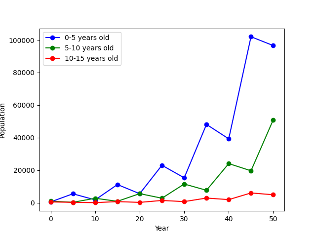

# 莱斯利种群模型

内容提要：种群不同年龄段的数量随着时间的变化规律。

## 一、问题描述
设某个动物种群的最大生存年龄为15年。按5年为间隔，将这个种群分成三组，分别是 0-5岁，5-10岁和10-15岁。
设初始时刻，这三个年龄组的动物数量分别为 500, 1000 和 500. 
设着三个年龄组的动物在5年内的繁殖率分别为 0, 4 和 3. 
设第一组到第二组、第二组到第三组的存活率分别是 0.5 和 0.25. 
求这三个年龄组的动物数量随着时间的演化规律。

## 二、建立模型
这里是每5年进行一次种群数量的计算。设自然数 $t=0,1,2,\cdots$. 
设在第 $5t$ 年的时候，第 $k$ 组的动物数量为 $x(k,t)$, 其中 $k=1,2,3$. 
则由题目可得初始值为 
$$
\left\{\begin{array}{rcl}
x(1,0) &=& 500, \\ 
x(2,0) &=& 1000, \\ 
x(3,0) &=& 500. 
\end{array}\right. 
$$
根据题目所给的假设条件，每过5年，考虑繁殖率与存活率，三组数量的演化规律是
$$
\left\{\begin{array}{rcl}
x(1,t+1) &=& 4x(2,t) + 3x(3,t), \\ 
x(2,t+1) &=& 0.5x(1,t), \\ 
x(3,t+1) &=& 0.25x(2,t). 
\end{array}\right. 
$$
写成矩阵形式，可得
$$
\begin{pmatrix} x(1,t+1)  \\ x(2,t+1) \\ x(3,t+1) \end{pmatrix}
=\begin{pmatrix} 0&4&3 \\  0.5 &0 & 0 \\ 0 & 0.25 & 0  \end{pmatrix}
\begin{pmatrix} x(1,t)  \\ x(2,t) \\ x(3,t) \end{pmatrix}.
$$
于是可得第 $5t$ 年时候的数量与初始年份的数量的关系为
$$
\begin{pmatrix} x(1,t)  \\ x(2,t) \\ x(3,t) \end{pmatrix}
=\begin{pmatrix} 0&4&3 \\  0.5 &0 & 0 \\ 0 & 0.25 & 0  \end{pmatrix}^n
\begin{pmatrix} x(1,0)  \\ x(2,0) \\ x(3,0) \end{pmatrix}
=\begin{pmatrix} 0&4&3 \\  0.5 &0 & 0 \\ 0 & 0.25 & 0  \end{pmatrix}^n
\begin{pmatrix} 500  \\ 1000 \\ 500 \end{pmatrix}.
$$

为计算矩阵 $A$ 的 $n$ 次幂 $A^n$, 可以先将矩阵 $A$ 对角化，即找到可逆矩阵 $P$, 使得 $P^{-1}AP=B$ 为对角阵。
根据矩阵乘法的结合律，可得  
$$
A^n= (PBP^{-1})^n = (PBP^{-1})(PBP^{-1})\cdots (PBP^{-1}) = PB^nP^{-1}. 
$$
因为矩阵 $B$ 是对角阵，所以 $B^n$ 的计算非常方便，只需要将对角线的元素分别求 $n$ 次方。
这样就可以简化矩阵 $A$ 的幂次的计算。

### 插图

每过五年的状态变化示意图。因为有繁殖率，所以这个不是马尔可夫链的状态转移概率图。

<!-- TODO -->

## 三、编程计算
首先载入数值计算模块和函数画图模块。
```python
import numpy as np
import matplotlib.pyplot as plt
```

设置初始值、繁殖率和存活率。
```python
x0=np.array([500,1000,500])
A=np.array([[0,5,4],[0.5,0,0],[0,0.25,0]])
```

我们考虑10次迭代，即50年的时间。先设置一个3乘11的全零矩阵，用于存放三个年龄组在不同年份的数量。
```python
N=10
x=np.zeros([3,N+1],dtype=int)
x[0,0]=500
x[1,0]=1000
x[2,0]=500
```

按照繁殖率和存活率，进行一代代的计算。这里我们没有使用矩阵对角化的方法。
```python
for t in range(N):
    x[0,t+1] = x[1,t]*4 + x[2,t]*3
    x[1,t+1] = x[0,t]*0.5
    x[2,t+1] = x[1,t]*0.25
```

输出第50年的时候，三个年龄组的种群数量。
```python
T=N*5
print('The population of the year %d is: '%T)
print(x[0,N],x[1,N],x[2,N])
```

画出0-50年中，三个年龄组的种群数量的变化情况。
```python
tt=np.linspace(start=0,stop=T,num=N+1)
plt.plot(tt,x[0,:],'bo-',label='0-5 years old')
plt.plot(tt,x[1,:],'go-',label='5-10 years old')
plt.plot(tt,x[2,:],'ro-',label='10-15 years old')
plt.legend(loc='upper left')
plt.xlabel('Year')
plt.ylabel('Population')
plt.show()
```

## 四、回答问题

第一组的数量增长很快，第二组的数量也稳步增长，第三组的数量比较平缓地增长。
在第50年的时候，三组的数量分别为 96575, 51007 和 4907. 
三个年龄组的数量随时间的变化如图。




## 五、练习题

在某国家，每年有比例为$p$ 的农村居民移居城镇，有比例为 $q$ 的城镇居民移居农村。
假设该国总人数不变，且上述人口迁移的规律也不变。
设$n$ 年后的农村人口和城镇人口占总人口的比例分别为 $x_n$ 和 $y_n$, 则有 $x_n+y_n=1$. 

1. 求关系式 $\begin{bmatrix} x_{n+1} \\ y_{n+1} \end{bmatrix} = A \begin{bmatrix} x_{n} \\ y_{n} \end{bmatrix}$ 中的矩阵 $A$. 
2. 设目前农村人口与城镇人口相等。求通项 $(x_n,y_n)$, 以及长期趋势。

## 六、参考文献 

1. 司守奎,孙玺菁. **Python数学建模算法与应用**, 国防工业出版社. 2022年1月第1版. 
2. P. H. Leslie. **On the use of matrices in certain population mathematics**, Biometrika, 1945 (33): 213-245. 
3. Leslie matrix, Encyclopedia of Mathematics, https://encyclopediaofmath.org/wiki/Leslie_matrix. 
