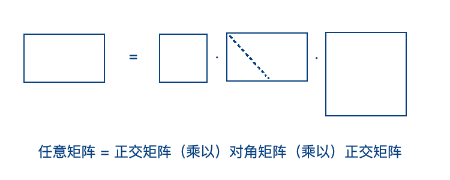
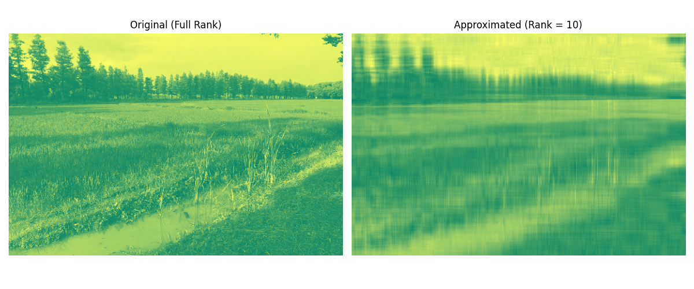

# 奇异值分解与数据压缩 

内容提要：将一个矩阵数据用更少的空间保存。

## 一、问题描述
一张图片一般是长方形的，每个像素由一个整数或一个浮点型数据表示。
这样的图片可以由一个矩阵来保存，称为 bmp 格式。
使用矩阵的奇异值分解的方法，用更少的空间来保存这个矩阵的数据。


## 二、建立模型

### 2.1 奇异值分解定理

设有 $m\times n$ 阶的矩阵 $A$, 奇异值分解是说存在 $m$ 阶正交矩阵 $U$,  $n$ 阶正交矩阵 $V$, 以及 $m\times n$ 阶矩阵 $\Sigma$, 其对角线之外的元素都是零，其对角线元素都是非负的，使得
$$
A = U\Sigma V^T, 
$$
其中 $V^T$ 是 $V$ 的转置。
矩阵 $\Sigma$ 的对角线元素从大到小排列，设为 
$$
\sigma_1\ge \sigma_2\ge\cdots\ge\sigma_r\ge 0, 
$$
称为奇异值。其中 $r=R(A)$ 为矩阵 $A$ 的秩。

### 2.2 数据压缩的基本思路

压缩的基本思路是选取这些奇异值的前面较大的几个，设为
$\sigma_1, \sigma_2, \cdots, \sigma_p$, 
其中 $p<r$, 而将后面较小的奇异值 
$\sigma_{p+1}, \sigma_{p+2}, \cdots, \sigma_r$ 
都忽略为零，从而得到矩阵 $\Sigma_1$. 这时相应的数据矩阵就转化为
$$
A_1 = U\Sigma_1 V^T.  
$$
注意到矩阵 $A_1$ 的秩为 $p$. 

记矩阵 $\Sigma_{11}$ 为对角线元素为 $\sigma_1, \sigma_2, \cdots, \sigma_p$ 的对角矩阵，则 $\Sigma_1$ 可以写成分块矩阵的形式 
$$
\Sigma_1 = \begin{pmatrix} \Sigma_{11} & O \\ O & O \end{pmatrix}.  
$$
将矩阵 $U$ 按照左右分块，其中左边矩阵为 $p$ 个列向量，右边矩阵为 $m-p$ 的列向量，可记
$$
U = \begin{pmatrix} U_1 & U_2 \end{pmatrix}.  
$$
将矩阵 $V^T$ 按照上下分块，其中上边矩阵为 $p$ 个行向量，下边矩阵为 $n-p$ 的行向量，可记
$$
V^T = \begin{pmatrix} V_1^T \\ V_2^T \end{pmatrix}.  
$$
于是按照分块矩阵的乘法，可得 
$$
A_1 = U\Sigma_1 V^T = 
\begin{pmatrix} U_1 & U_2 \end{pmatrix}
\begin{pmatrix} \Sigma_{11} & O \\ O & O \end{pmatrix}
\begin{pmatrix} V_1^T \\ V_2^T \end{pmatrix} 
= U_1\Sigma_{11} V_1^T. 
\tag{1}
$$

这意味着为了保存矩阵 $A_1$,  只需要保存矩阵 $U_1$, $\Sigma_{11}$ 与 $V_1^T$. 
注意到矩阵 $U_1$ 是 $m\times m$ 阶矩阵 $U$ 的左边的 $p$ 个列向量，
矩阵 $V_1^T$ 是 $n\times n$ 阶矩阵 $V^T$ 的上面的 $p$ 个行向量，
因此，所需要保存的数据个数为
$$
pm+p+pn. 
$$
当 $p$ 远远小于 $m$ 与 $n$ 的时候，这个数字会远远少于原始矩阵的 $mn$ 个数据。

### 2.3 SVD算法示意图




## 三、编程计算

读取所给的图像，得到 $400\times 600\times 3$ 的矩阵数据。这个图像是彩色的，有 RGBA 四层，每层都是一个 $400\times 600$ 的矩阵数据。
首先读入图像，保存为矩阵 $A$. 然后记矩阵 $B$ 是 $A$ 的第一层。
```python
import numpy as np
import matplotlib.pyplot as plt

A=plt.imread('rice3.png')
B=A[:,:,0]
```

调用 svd 函数进行奇异值分解，返回两个正交矩阵，和一个对角矩阵。
```python
U,S,Vh = np.linalg.svd(B)
```

设 $p=10$, 取正交矩阵 $U$ 的前 $p$ 个列向量，取对角矩阵 $\Sigma$ 的左上角的 $p\times p$ 矩阵，取正交矩阵 $V^T$ 的上面 $p$ 个行向量。
```python
m=400; n=600; p=10
U1=U[:,0:p]
S11=np.diag(S[0:p])
Vh1=Vh[0:p,:]
```

为恢复图像，按照分块矩阵的乘法，只需要计算等式(1) 的最右边。
```python
B1=U1@S11@Vh1
```

分左右显示原图和仅使用10个奇异值得到的恢复图像，并分别计算存储所需空间。
```python
fig = plt.figure()
ax=fig.add_subplot(121)
ax.imshow(B,cmap='summer')
bx=fig.add_subplot(122)
bx.imshow(B1,cmap='summer')

print('Number of floats in the left figure: ',np.size(B))
print('Number of floats in the right figure: ',np.size(U1)+np.size(S11)+np.size(Vh1))
```

## 四、回答问题

我们取了原图RGB数据的第一个二维矩阵数据，得到一个 $400\times 600$ 的矩阵。
使用奇异值分解，然后取前10个奇异值。然后重新计算矩阵，画出两个矩阵的图像。
左图使用240000个浮点型数值，右图使用10100个浮点型数值。压缩比例大约是1:24. 



## 五、练习题

1. 手工计算下述矩阵的奇异值分解，
$$
A = \begin{pmatrix} -3 & 0 \\ 0 & 2 \end{pmatrix}. 
$$

2. 程序计算下述矩阵的奇异值分解，
$$
B = \begin{pmatrix} 3&2&-2&-3 \\ 2&4&-1&-5 \end{pmatrix}. 
$$

3. 叙述一些常见的矩阵分解方法，包括奇异值分解、特征值分解、QR 分解、LU 分解、Cholesky 分解、Schur 分解、极分解。

## 六、参考文献 

1. 司守奎,孙玺菁. **Python数学建模算法与应用**, 国防工业出版社. 2022年1月第1版. 

2. Kenneth H. Rosen 著, 袁崇义, 屈婉玲, 张桂芸等译. **离散数学及其应用**, 机械工业出版社，2013年4月第1版。

3. Timothy Sauer(著).裴玉茹.马赓宇(译). **数值分析**. 机械工业出版社. 2018年8月第1版. 

4. Gilbert Strang. **Linear Algebra and Learning from Data**. Wellesley-Cambridge Press, 2019. 

5. Tim Baumann. **Image Compression with Singular Value Decomposition**. 
http://timbaumann.info/svd-image-compression-demo/

