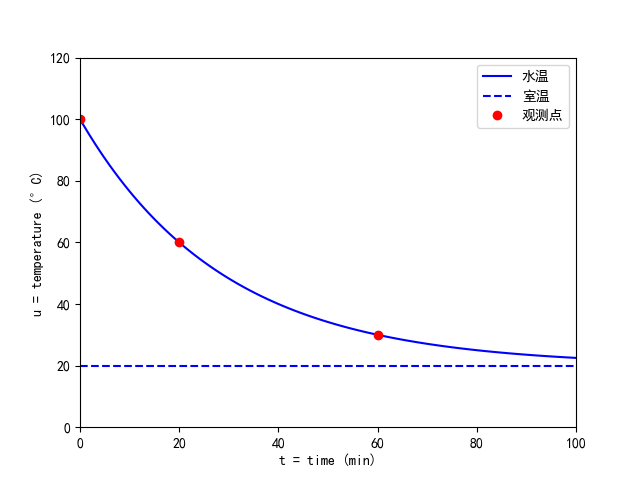

# 热水变凉的过程

内容提要：物体放在空气中慢慢冷却，计算温度随时间的函数表达式。

## 1. 问题描述

设室温为20度。将一杯热水放在空气中，初始温度为100度。20分钟后测得温度为60度。

1. 计算温度关于时间的函数表达式，并求什么时候水温降到30度？
2. 实验测量数据，验证牛顿关于冷却的定律。

## 2. 建立模型

设这杯水在时刻 $t$ 时的温度为 $u(t)$, 根据牛顿冷却定律，当物体表面与周围环境存在温度差时，单位时间内改变的温度与环境的温度差成正比，设比例系数为 $k$, 可得
$$
\frac{du}{dt} = -k (u-20). 
$$

为了求解这个微分方程，我们分离变量，可得
$$
\frac{du}{u-20} = -k dt. 
$$

因为热水的初始温度大于空气温度，所以对 $t>0$ 总有 $u(t)>20$, 于是两边积分，可得
$$
\ln(u-20) = -kt + C,  
$$
其中 $C$ 是待定的常数。

## 3. 数值计算

代入 $u(0)=100$ 与 $u(20)=60$, 可得两个方程
$$
\left\{\begin{array}{rcl}
\ln(100-20) &=& -k(0) + C, \\ 
\ln(60-20) &=& -k(20) + C. 
\end{array}\right. 
$$

由此求得
$$
C = \ln(80), \,\, k=\frac{\ln(80)-\ln(40)}{20} = \frac{\ln(2)}{20}. 
$$

最后可得水温与时间的函数关系为
$$
u(t) = 20 + e^Ce^{-kt} = 20 + 80e^{-\frac{\ln (2)}{20}t} = 20 + 80(2)^{-\frac{t}{20}}. 
$$

当水温为30度时，有等式
$$
 20 + 80(2)^{-\frac{t}{20}} = 30. 
$$
化简可得 
$$
(2)^{-\frac{t}{20}} = \frac{10}{80}. 
$$
求得 
$$
\frac{t}{20} = 3. 
$$
即 $t=60$ 分钟后，水温为30度。


## 4. 程序

下述程序画出函数（横坐标：时间，纵坐标：温度）图像。

```python
import numpy as np
import matplotlib.pyplot as plt

fig=plt.Figure()
ax=fig.add_subplot(111)
t=np.linspace(0,100,101)
k=np.log(2)/20
u=20+80*np.exp(-k*t)
u0=np.zeros_like(t)+20
ax.plot(t,u,'b-',t,u0,'b--')
ax.axis([0,100,0,120])
ax.plot([0,20,60],[100,60,30],'ro')
ax.set_xlabel('t = time')
ax.set_ylabel('u = temperature')
fig.savefig('ch3-1.png')
```

## 5. 回答问题

水温与时间的函数关系式为 
最后可得水温与时间的函数关系为
$$
u(t) = 20 + 80(2)^{-\frac{t}{20}}. 
$$
并且在60分钟之后，水温变为30度。水温与时间的函数图像见图1.




## 6. 实验测量


## 7. 参考文献 

1. 丁同仁、李承治，**常微分方程教程**，高等教育出版社，2022年3月第3版。

2. 司守奎,孙玺菁. **Python数学建模算法与应用**, 国防工业出版社. 2022年1月第1版. 

