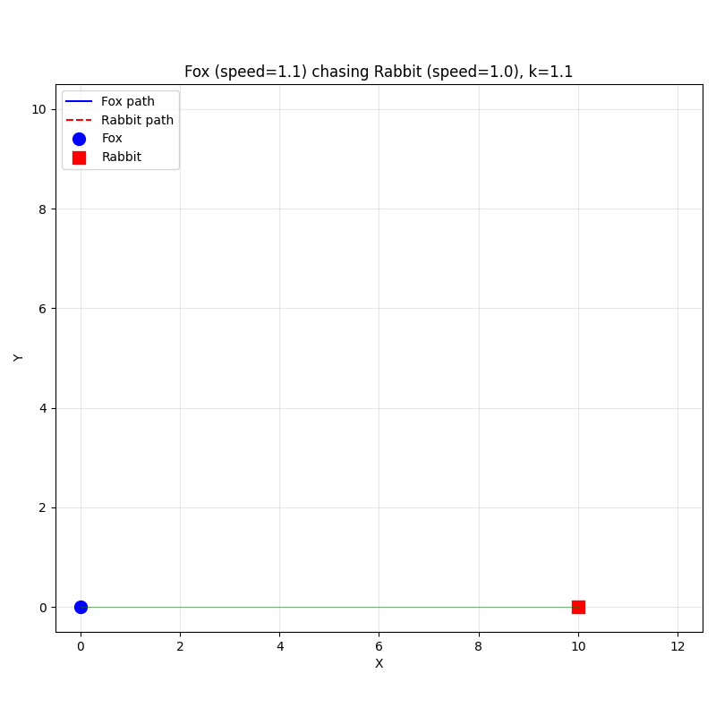

## 追击问题

### 问1. 追击问题的几何约束条件

<details>
<summary>问题：</summary>

在狐狸追击兔子的模型中，假设兔子沿直线逃跑，狐狸始终对准兔子。请问如何用数学语言描述“狐狸始终对准兔子”这一几何特征？

</details>

<details>
<summary>解答：</summary>

这一特征意味着在任意时刻 $t$，狐狸所在的点 $P(x,y)$ 与兔子所在的点 $Q(X(t), Y(t))$ 的连线，必须与狐狸轨迹曲线在 $P$ 点的切线重合。

用导数表示，即轨迹曲线 $y=y(x)$ 在点 $P$ 处的斜率 $\frac{dy}{dx}$ 等于直线 $PQ$ 的斜率：
$$ \frac{dy}{dx} = \frac{Y(t) - y}{X(t) - x} \tag{1}$$
这是建立追击模型最核心的几何方程。



</details>

---

### 问2. 速度关系的弧长表达

<details>
<summary>问题：</summary>

如果狐狸的速度是兔子速度的 $k$ 倍，如何利用弧长公式建立两者运动距离之间的关系？

</details>

<details>
<summary>解答：</summary>

由于时间 $t$ 相同，路程之比等于速度之比。设兔子跑了距离 $S_{rabbit}$，狐狸跑了弧长 $S_{fox}$，则有 $S_{fox} = k \cdot S_{rabbit}$。

利用弧长积分公式，狐狸跑过的路程为 $\int_0^x \sqrt{1+(y')^2} dx$（假设狐狸从原点出发，从左向右追）。如果兔子从$x$轴上点$(10,0)$出发沿$y$轴方向竖直向上跑，其距离为 $Y(t)$。因此可以建立积分方程：
$$ \int_0^x \sqrt{1+(\frac{dy}{dx})^2} dx = k \cdot Y(t) \tag{2} $$
这个方程将几何路径与运动学联系了起来。
</details>

---

### 问3. 消去时间变量 $t$

<details>
<summary>问题：</summary>

在建立微分方程时，我们通常希望得到只包含 $x, y, y', y''$ 的方程。请问如何通过对弧长方程求导来消去中间变量 $t$ 和兔子的坐标？

</details>

<details>
<summary>解答：</summary>

对弧长关系式两边关于 $x$ 求导。左边根据微积分基本定理变为 $\sqrt{1+(y')^2}$。右边利用链式法则，
$$\frac{d(k \cdot Y)}{dx} = k \frac{dY}{dt} \frac{dt}{dx}=kvt\frac{dt}{dx}\tag{3} $$

消去时间变量 $t$，最终得到一个关于 $y$ 对 $x$ 的二阶非线性微分方程：
$$ k(10-x)y'' = \sqrt{1+(y')^2} \tag{4}$$
</details>

---

### 问4. 降阶法求解二阶方程

<details>
<summary>问题：</summary>

得到的轨迹方程通常是二阶的（含有 $y''$），但不显含 $y$。请问如何使用“降阶法”将其转化为一阶微分方程求解？

</details>

<details>
<summary>解答：</summary>

令 $p = y' = \frac{dy}{dx}$，则 $y'' = \frac{dp}{dx}$。原方程变为关于 $p$ 和 $x$ 的一阶方程。

对于标准追击模型，方程通常化为分离变量形式：
$$ \frac{dp}{\sqrt{1+p^2}} = \frac{1}{k(10-x)} dx \tag{5}$$
两边积分即可求出 $p$（即斜率）关于 $x$ 的表达式，然后再对 $p$ 积分一次即可求得轨迹 $y(x)$。
</details>

---

### 问5. 初始条件的确定

<details>
<summary>问题：</summary>

在求解狐狸的轨迹方程时，需要确定初始条件。假设狐狸从 $(0,0)$ 出发，兔子从 $(10,0)$ 沿$y$轴向上跑，初始时刻的边界条件是什么？

</details>

<details>
<summary>解答：</summary>

我们需要两个条件来确定二阶方程的特解：
1. **位置条件**：$t=0$ 时，狐狸在原点，即 $y(0)=0$。
2. **方向条件**：$t=0$ 时，狐狸指向兔子（此时兔子在 $(10,0)$），连线水平，说明初始切线斜率为0，即 $y'(0)=0$。
这两个条件是解出唯一轨迹曲线的关键。
</details>

---

### 问6. 击中点的理论计算

<details>
<summary>问题：</summary>

如果狐狸速度是兔子的$1.1$倍 ($k=1.1$)，且兔子沿垂直于狐狸初始视线的方向逃跑。理论上狐狸将在兔子跑出多远时击中它？

</details>

<details>
<summary>解答：</summary>

根据推导出的通解公式，当狐狸追上兔子时，意味着狐狸的横坐标 $x$ 达到了兔子的横坐标（设为10）。

将 $x=10$ 代入解得的 $y(x)$ 表达式中。

<!-- 对于 $k=1.1$ 的情况，计算结果通常为 $y = \frac{5}{24}$（假设初始距离为1）。这意味着当兔子跑出初始间距的 $\frac{5}{24}$ 距离时，就会被抓获。 -->
</details>

---

### 问7. Python数值求解 (ODEINT)

<details>
<summary>问题：</summary>

解析解往往很难求，如何使用 Python 的 `scipy.integrate.odeint` 对一阶化后的方程组进行数值求解？

</details>

<details>
<summary>解答：</summary>

首先将二阶方程拆分为两个一阶方程：
1. $dy/dx = p$
2. $dp/dx = \frac{\sqrt{1+p^2}}{k(10-x)}$

定义一个函数 `model(state, x)` 返回 `[p, dp/dx]`。然后调用 `odeint(model, [0, 0], x_span)`，其中 `[0, 0]` 代表初始的 $y$ 和 $p$。注意处理 $x$ 接近 10 时的奇点问题。
</details>

---

### 问8. 速度比 $k$ 的影响分析

<details>
<summary>问题：</summary>

如果狐狸的速度远大于兔子（例如 $k=2$），轨迹曲线会有什么变化？如果 $k \le 1$ 会发生什么？

</details>

<details>
<summary>解答：</summary>

- 当 $k$ 较大（如2）时，狐狸能迅速修正方向，轨迹较直，很快击中。
- 当 $k$ 接近 1（如1.1）时，狐狸虽然比兔子快，但需要跑很长的弯路才能逐渐拉近距离，轨迹会非常弯曲，且追上所需的时间和距离会急剧增加。
- 若 $k \le 1$，数学上积分发散，意味着狐狸永远追不上兔子（或者只能无限逼近），这是著名的“阿基里斯与乌龟”悖论的变体。
</details>

---

### 问9. 拓展思考：兔子改变策略

<details>
<summary>问题：</summary>

本模型假设兔子做匀速直线运动。如果兔子发现狐狸后，开始沿着圆周跑或者试图远离狐狸跑，模型该如何修改？

</details>

<details>
<summary>解答：</summary>

这将导致方程右边的项发生变化。
1. **几何关系变复杂**：$PQ$ 连线的斜率不再是简单的函数，而是随时间 $t$ 变化的复杂函数 $Y(t), X(t)$。
2. **耦合性增强**：通常需要建立关于时间 $t$ 的参数方程组 $\frac{dx}{dt}, \frac{dy}{dt}$，而不是单纯的 $y(x)$ 轨迹方程。
这类问题通常无法求得解析解，必须完全依赖计算机进行数值模拟（如使用龙格-库塔法）。
</details>

---

### 问10. 动态图表制作

<details>
<summary>问题：</summary>
用python matplotlib animation做一个动画，在(x,y)平面上，动点(X(t),Y(t))=(1,vt)运动，其中v是常数。另一个动点(X(t),Y(t))从原点出发，对着(x,y)运动，速度大小为kv, 其中k是常数。
</details>

<details>
<summary>解答：</summary>

```python

import numpy as np
import matplotlib.pyplot as plt
from matplotlib.animation import FuncAnimation
from scipy.integrate import solve_ivp

# ============ 参数设置 ============
v = 1.0       # 兔子速度
k = 1.1       # 狐狸速度 = k * v（k > 1 才能追上）
kv = k * v    # 狐狸速度大小

# ============ 定义微分方程 ============
# 兔子位置: (10, v*t)
# 狐狸位置: (x, y)，始终对准兔子，速度大小为 kv
def fox_ode(t, state):
    x, y = state
    # 兔子当前位置
    rx, ry = 10.0, v * t
    # 狐狸到兔子的方向向量
    dx, dy = rx - x, ry - y
    dist = np.sqrt(dx**2 + dy**2)
    if dist < 1e-5:  # 已追上，停止运动
        return [0.0, 0.0]
    # 狐狸速度方向指向兔子，大小恒为 kv
    vx = kv * dx / dist
    vy = kv * dy / dist
    return [vx, vy]

# ============ 数值求解（用于动画数据） ============
t_span = (0, 10)
t_eval = np.linspace(t_span[0], t_span[1], 200)

sol = solve_ivp(fox_ode, t_span, [0.0, 0.0], t_eval=t_eval, method='RK45',
                events=lambda t, s: np.sqrt((10 - s[0])**2 + (v*t - s[1])**2) - 1e-6)

# 如果提前追上，截断时间
if sol.t_events[0].size > 0:
    t_hit = sol.t_events[0][0]
    mask = sol.t <= t_hit
    t_data = sol.t[mask]
    x_data = sol.y[0, mask]
    y_data = sol.y[1, mask]
else:
    t_data = sol.t
    x_data = sol.y[0]
    y_data = sol.y[1]

# 兔子轨迹
rx_data = np.ones_like(t_data)*10
ry_data = v * t_data

# ============ 创建动画 ============
fig, ax = plt.subplots(figsize=(8, 8))
ax.set_xlim(-0.5, 12.5)
ax.set_ylim(-0.5, max(2.5, v * t_data[-1] + 0.5))
ax.set_xlabel('X')
ax.set_ylabel('Y')
ax.set_title(f'Fox (speed={kv}) chasing Rabbit (speed={v}), k={k}')
ax.set_aspect('equal')
ax.grid(True, alpha=0.3)

# 轨迹线
fox_line, = ax.plot([], [], 'b-', lw=1.5, label='Fox path')
rabbit_line, = ax.plot([], [], 'r--', lw=1.5, label='Rabbit path')

# 动点
fox_dot, = ax.plot([], [], 'bo', markersize=10, label='Fox')
rabbit_dot, = ax.plot([], [], 'rs', markersize=10, label='Rabbit')

# 连线（狐狸始终对准兔子）
connect_line, = ax.plot([], [], 'g-', lw=0.8, alpha=0.5)

ax.legend(loc='upper left')

def init():
    fox_line.set_data([], [])
    rabbit_line.set_data([], [])
    fox_dot.set_data([], [])
    rabbit_dot.set_data([], [])
    connect_line.set_data([], [])
    return fox_line, rabbit_line, fox_dot, rabbit_dot, connect_line

def update(frame):
    i = frame
    # 更新狐狸
    fox_line.set_data(x_data[:i+1], y_data[:i+1])
    fox_dot.set_data([x_data[i]], [y_data[i]])
    # 更新兔子
    rabbit_line.set_data(rx_data[:i+1], ry_data[:i+1])
    rabbit_dot.set_data([rx_data[i]], [ry_data[i]])
    # 连线
    connect_line.set_data([x_data[i], rx_data[i]], [y_data[i], ry_data[i]])
    return fox_line, rabbit_line, fox_dot, rabbit_dot, connect_line

ani = FuncAnimation(fig, update, frames=len(t_data), init_func=init,
                    blit=True, interval=20, repeat=True)

plt.tight_layout()
plt.show()

# 如果需要保存为 GIF，取消下面注释：
# ani.save('fox_chases_rabbit.gif', writer='pillow', fps=30)

```

</details>

---

### 问11. 动态图表制作的编程思路

<details>
<summary>问题：</summary>
上一问中，实现狐狸追击兔子的动画的python脚本的编程思路是什么？分步骤解释一下。
</details>

<details>
<summary>解答：</summary>

实现“狐狸追击兔子”动画的 Python 脚本，其核心编程思路是将**物理运动学问题**转化为**数值微分方程求解问题**，最后通过**数据可视化**呈现。

以下是分步骤的详细解析：

#### 1. 物理建模与数学抽象
这是编程前的理论基础。我们需要将自然语言描述的“追击”转化为计算机可计算的数学公式。
- **兔子模型（目标）**：做匀速直线运动。位置随时间 $t$ 线性变化，即 $x_R(t) = x_0, y_R(t) = v \cdot t$。这在代码中是一个关于时间 $t$ 的显式函数，不需要积分求解。
- **狐狸模型（追踪者）**：做变加速曲线运动。
    - **方向约束**：速度向量 $\vec{v}_F$ 始终指向兔子当前位置。数学上表现为单位方向向量 $\vec{e} = \frac{\vec{P}_{rabbit} - \vec{P}_{fox}}{|\vec{P}_{rabbit} - \vec{P}_{fox}|}$。
    - **大小约束**：速率恒定为 $k \cdot v$。
    - **运动方程**：$\frac{d\vec{P}_{fox}}{dt} = (k \cdot v) \cdot \vec{e}$。这是一个一阶常微分方程组。

#### 2. 定义微分方程函数
在 Python 中，我们需要定义一个函数来描述狐狸的瞬时状态变化率（即导数）。
- **输入**：当前时间 $t$ 和当前状态 `state`（包含狐狸的坐标 $x, y$）。
- **逻辑**：
    1. 计算当前时刻兔子的坐标 $(1, v \cdot t)$。
    2. 计算狐狸与兔子的距离 `dist`。
    3. **碰撞检测**：如果 `dist` 极小（如小于 $10^{-6}$），说明已追上，返回速度为 0，防止除以零错误。
    4. **计算导数**：利用向量归一化原理，算出狐狸在 $x$ 和 $y$ 方向的分速度 $dx/dt$ 和 $dy/dt$。
- **输出**：返回速度向量 `[vx, vy]`。

#### 3. 数值求解
由于该微分方程是非线性的（分母含有根号下的平方和），很难求出解析解（除非是特定倍数关系），因此采用**数值积分法**。
- **工具**：使用 `scipy.integrate.solve_ivp`。
- **参数设置**：
    - `t_span`：模拟的时间范围。
    - `y0`：初始状态，狐狸在原点 `[0, 0]`。
    - `method`：通常使用 `RK45`（龙格-库塔法），这是一种高精度的自适应步长算法，能很好地处理曲线急剧变化的情况。
    - `events`（可选但推荐）：设置一个事件函数，当距离小于阈值时自动停止积分，这样能精确捕捉“追上”的那一刻，而不是让狐狸穿过兔子。

#### 4. 数据处理与准备
求解器返回的是离散的时间点和对应的坐标数组。为了制作平滑的动画，需要进行数据预处理。
- **提取轨迹**：从解对象 `sol` 中提取 `sol.t`（时间序列）、`sol.y[0]`（狐狸x坐标）、`sol.y[1]`（狐狸y坐标）。
- **同步兔子轨迹**：根据解出的时间序列，计算对应时刻兔子的坐标，确保两者在每一帧都是同步的。

#### 5. 可视化与动画渲染
使用 `matplotlib.animation` 将静态数据动起来。
- **初始化画布**：设置坐标轴范围（`set_xlim`, `set_ylim`），绘制背景网格或参考线。
- **创建图形对象**：
    - 用 `plot([], [])` 创建狐狸和兔子的点（Marker）。
    - 用 `plot([], [])` 创建两者的轨迹线（Line），初始数据为空。
- **定义更新函数 (`update`)**：这是动画的核心循环。
    - 输入：帧索引 `i`。
    - 操作：更新图形对象的数据（`set_data`），只绘制从 $0$ 到 $i$ 时刻的数据，从而产生“画线”的效果。
    - 返回：更新后的图形对象列表。
- **生成动画**：调用 `FuncAnimation`，绑定画布、更新函数和帧数，最后保存为 GIF 或 MP4 文件。

#### 6. 总结
整个流程遵循 **“物理规律 $\rightarrow$ 微分方程 $\rightarrow$ 数值解 $\rightarrow$ 逐帧渲染”** 的逻辑链条。这种方法不仅适用于狐狸追兔子，也适用于导弹拦截、行星轨道模拟等所有涉及动态追踪的系统。

这个思路其实是个万能模板。

</details>

---
