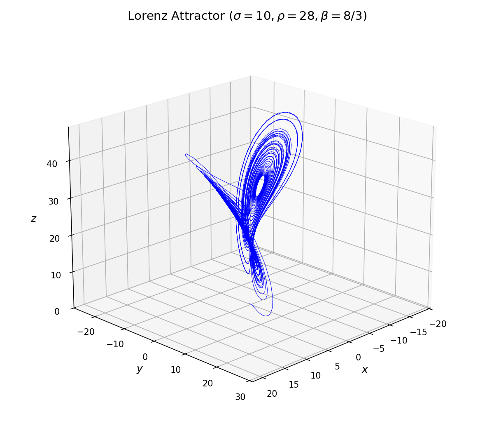
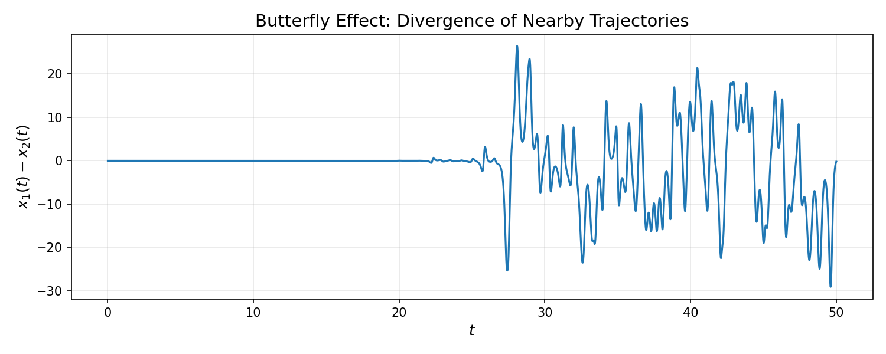
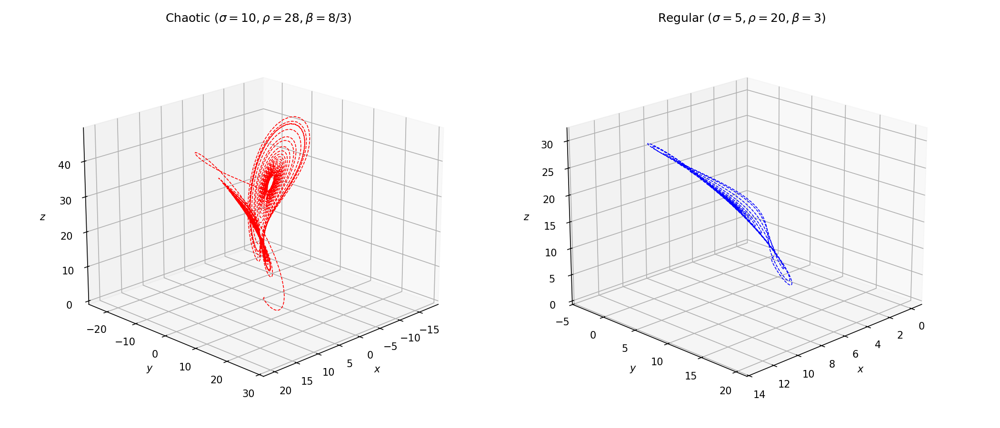

## 洛伦兹模型与混沌现象

### 内容提要

| 序号 | 问题 | 内容类型 |
|------|------|---------|
| 问1 | 洛伦兹模型的物理背景与起源 | 问题背景 |
| 问2 | 洛伦兹方程组的数学形式 | 理论知识 |
| 问3 | 三个参数的物理意义 | 理论知识 |
| 问4 | 平衡点（不动点）的求解与稳定性 | 数学建模 |
| 问5 | 用 odeint 数值求解洛伦兹方程 | 编程计算 |
| 问6 | 绘制三维相空间轨迹（洛伦兹吸引子） | 图表制作 |
| 问7 | 蝴蝶效应：初值敏感性的数值验证 | 编程计算+图表 |
| 问8 | 不同参数下的系统行为对比 | 编程计算+图表 |
| 问9 | 混沌的判断标准 | 理论知识 |
| 问10 | 拓展思考：混沌理论的实际应用 | 拓展思考 |

---

### 问1. 洛伦兹模型的物理背景与起源

<details>
<summary>问题：</summary>

洛伦兹模型起源于哪个研究领域？爱德华·洛伦兹（Edward Lorenz）是如何从大气对流方程推导出这个简单的三方程组的？

</details>

<details>
<summary>解答：</summary>

1963年，美国气象学家爱德华·洛伦兹在麻省理工学院研究大气对流运动时，将二维流体流动的偏微分方程组进行简化，只保留最低阶的傅里叶模态，最终得到了一个仅含三个未知函数的一阶自治常微分方程组。其中，X 正比于对流强度，Y 正比于上升气流与下降气流之间的温差，Z 正比于温度剖面的非线性偏差。

这个模型原本是为了模拟大气对流，但洛伦兹发现，即使方程是完全确定性的（不含任何随机项），系统的长期行为也可能呈现出类似随机的不规则运动——这就是"混沌"的由来。洛伦兹模型因此成为混沌理论的第一个经典吸引子模型。

</details>

---

### 问2. 洛伦兹方程组的数学形式

<details>
<summary>问题：</summary>

请写出洛伦兹方程组的完整数学表达式，并说明每个符号的含义。

</details>

<details>
<summary>解答：</summary>

洛伦兹方程组为如下三变量一阶自治常微分方程组：

$$
\begin{cases}
\dot{x} = \sigma(y - x), \\
\dot{y} = \rho x - y - xz, \\
\dot{z} = xy - \beta z,
\end{cases}
$$

其中 $x(t)$、$y(t)$、$z(t)$ 是三个状态变量，$\sigma$、$\rho$、$\beta$ 是三个正常数参数。方程组不显含时间变量 $t$，因此是"自治"系统。三个方程通过非线性项 $xz$ 和 $xy$ 耦合在一起，这种非线性耦合正是产生混沌行为的数学根源。

</details>

---

### 问3. 三个参数的物理意义

<details>
<summary>问题：</summary>

参数 $\sigma$、$\rho$、$\beta$ 分别对应什么物理量？它们的典型取值范围是多少？

</details>

<details>
<summary>解答：</summary>

- **$\sigma$（普朗特数）**：$\sigma = \nu/\kappa$，表示流体动量粘性系数与热扩散系数之比，反映流体的粘性特性。对于空气，$\sigma \approx 0.7$；在洛伦兹的原始简化中取 $\sigma = 10$。
- **$\rho$（瑞利数）**：$\rho = Ra/Ra_c$，表示实际瑞利数与临界瑞利数之比，反映加热强度。当 $\rho < 1$ 时系统趋于静止状态；当 $\rho > 1$ 时出现对流。
- **$\beta$（方向比/几何因子）**：$\beta = 4/(1+a^2)$，由对流单元的几何形状决定。洛伦兹取 $\beta = 8/3$。

经典混沌参数组合为 $\sigma = 10$、$\rho = 28$、$\beta = 8/3$。

</details>

---

### 问4. 平衡点（不动点）的求解

<details>
<summary>问题：</summary>

求洛伦兹方程组的所有平衡点（即 $\dot{x}=\dot{y}=\dot{z}=0$ 时的不动点），并讨论它们的稳定性条件。

</details>

<details>
<summary>解答：</summary>

令 $\dot{x}=0$、$\dot{y}=0$、$\dot{z}=0$，解方程组：

- 原点 $(0, 0, 0)$ 始终是一个不动点，对应于"无对流"状态。
- 当 $\rho > 1$ 时，出现两个非平凡不动点：
  $$
  C^{\pm} = \left( \pm\sqrt{\beta(\rho-1)},\ \pm\sqrt{\beta(\rho-1)},\ \rho-1 \right)
  $$
  这两个不动点对应于"稳态对流"。

稳定性方面：

- 原点当 $\rho < 1$ 时稳定，$\rho > 1$ 时失稳；
- $C^{\pm}$ 当 $\rho < \sigma(\sigma+\beta+3)/(\sigma-\beta-1)$ 时稳定，超过该临界值后发生霍普夫分岔，系统进入混沌状态。

- 对于经典参数 $\sigma=10$、$\beta=8/3$，临界值为 $\rho_c = 10(10+8/3+3)/(10-8/3-1) \approx 24.74$，而 $\rho=28 > \rho_c$，因此系统处于混沌态。

</details>

---

### 问5. 用 odeint 数值求解洛伦兹方程

<details>
<summary>问题：</summary>

请编写 Python 代码，使用 `scipy.integrate.odeint` 求解经典参数下（$\sigma=10$、$\rho=28$、$\beta=8/3$）的洛伦兹方程数值解。

</details>

<details>
<summary>解答：</summary>

```python
import numpy as np
from scipy.integrate import odeint

# 参数设置
sigma = 10
rho = 28
beta = 8 / 3

# 定义洛伦兹方程组的右端项
def lorenz(state, t):
    x, y, z = state
    dxdt = sigma * (y - x)
    dydt = rho * x - y - x * z
    dzdt = x * y - beta * z
    return [dxdt, dydt, dzdt]

# 初始条件和积分区间
s0 = [1.0, 1.0, 1.0]
t = np.linspace(0, 10, 100)

# 数值求解
solution = odeint(lorenz, s0, t)
x = solution[:, 0]
y = solution[:, 1]
z = solution[:, 2]

print(f"求解完成，共 {len(t)} 个时间点")
print(f"最终状态: x={x[-1]:.4f}, y={y[-1]:.4f}, z={z[-1]:.4f}")
```

输出结果：

```txt
求解完成，共 100 个时间点
最终状态: x=-4.9027, y=-3.7439, z=24.6908
```

`odeint` 使用自适应步长的 BDF 或 LSODA 方法，能自动处理 stiff 问题。`state` 是包含三个状态变量的列表，`t` 是自变量（时间）的离散值数组。返回值 `solution` 的每一行对应一个时间点的 $[x, y, z]$ 值。

</details>

---

### 问6. 绘制三维相空间轨迹（洛伦兹吸引子）

<details>
<summary>问题：</summary>

如何将数值解在三维相空间中可视化，画出经典的"蝴蝶翅膀"形状的洛伦兹吸引子？

</details>

<details>
<summary>解答：</summary>

```python
import numpy as np
from scipy.integrate import odeint
import matplotlib.pyplot as plt
from mpl_toolkits.mplot3d import Axes3D

# 参数与求解（同上）
sigma = 10; rho = 28; beta = 8 / 3
def lorenz(state, t):
    x, y, z = state
    return [sigma*(y-x), rho*x-y-x*z, x*y-beta*z]

s0 = [1.0, 1.0, 1.0]
t = np.linspace(0, 50, 3000)
sol = odeint(lorenz, s0, t)

# 三维绘图
fig = plt.figure(figsize=(8, 7))
ax = fig.add_subplot(111, projection='3d')
ax.plot(sol[:, 0], sol[:, 1], sol[:, 2], 'b-', lw=0.5)
ax.set_xlabel('$x$', fontsize=12)
ax.set_ylabel('$y$', fontsize=12)
ax.set_zlabel('$z$', fontsize=12)
ax.set_title('Lorenz Attractor ($\\sigma=10, \\rho=28, \\beta=8/3$)', fontsize=14)
ax.view_init(elev=20, azim=45)
plt.tight_layout()
plt.savefig('lorenz_attractor.png', dpi=150)
plt.show()
```



关键技巧：

- 使用 `mpl_toolkits.mplot3d` 的 `projection='3d'` 创建三维坐标轴；
- 使用 `ax.plot(x, y, z)` 自动将三维点连成曲线；
- 使用 `ax.view_init(elev, azim)` 可调整观察角度，找到最佳视角。
- 由于洛伦兹吸引子会反复绕两个"翅膀"旋转，线宽设小（0.5）可避免图形过于密集。

</details>

---

### 问7. 蝴蝶效应：初值敏感性的数值验证

<details>
<summary>问题：</summary>

洛伦兹系统对初始条件极端敏感（"蝴蝶效应"）。请编写代码，从两个相差仅 $10^{-6}$ 的初始值出发，绘制两条轨线以及它们的差值随时间的变化曲线。

</details>

<details>
<summary>解答：</summary>

```python
import numpy as np
from scipy.integrate import odeint
import matplotlib.pyplot as plt

sigma = 10; rho = 28; beta = 8 / 3
def lorenz(state, t):
    x, y, z = state
    return [sigma*(y-x), rho*x-y-x*z, x*y-beta*z]

np.random.seed(2)
t = np.linspace(0, 50, 5000)

# 两个接近的初始值
s01 = np.random.rand(3)
s02 = s01 + 1e-6

sol1 = odeint(lorenz, s01, t)
sol2 = odeint(lorenz, s02, t)

# 绘制 x 分量的差值
plt.figure(figsize=(10, 4))
plt.plot(t, sol1[:, 0] - sol2[:, 0], '-')
plt.xlabel('$t$', fontsize=12)
plt.ylabel('$x_1(t) - x_2(t)$', fontsize=12)
plt.title('Butterfly Effect: Divergence of Nearby Trajectories', fontsize=14)
plt.grid(True, alpha=0.3)
plt.tight_layout()
plt.savefig('butterfly_effect.png', dpi=150)
plt.show()
```



从图中可以清楚看到：

- 在初始阶段（约 $t < 10$），两条轨线的差值非常小，几乎重合；

- 但经过一段时间后，差值呈指数增长，最终完全分离。

这种"初始条件的微小差异被指数放大"的现象，正是混沌系统的核心特征——对初值的敏感依赖性。

</details>

---

### 问8. 不同参数下的系统行为对比

<details>
<summary>问题：</summary>

将经典混沌参数（$\sigma=10$、$\rho=28$、$\beta=8/3$）与另一组参数（$\sigma=5$、$\rho=20$、$\beta=3$）的洛伦兹吸引子画在同一张图中对比，观察系统行为的差异。

</details>

<details>
<summary>解答：</summary>

```python
import numpy as np
from scipy.integrate import odeint
import matplotlib.pyplot as plt
from mpl_toolkits.mplot3d import Axes3D

def lorenz(state, t, params):
    sigma, rho, beta = params
    x, y, z = state
    return [sigma*(y-x), rho*x-y-x*z, x*y-beta*z]

t = np.linspace(0, 30, 3000)
s0 = [0, 1, 0]

# 两组参数
params1 = (10, 28, 8/3)
params2 = (5, 20, 3)

sol1 = odeint(lorenz, s0, t, args=(params1,))
sol2 = odeint(lorenz, s0, t, args=(params2,))

fig = plt.figure(figsize=(14, 6))

# 混沌参数
ax1 = fig.add_subplot(121, projection='3d')
ax1.plot(sol1[:, 0], sol1[:, 1], sol1[:, 2], 'r--', lw=0.8)
ax1.set_xlabel('$x$'); ax1.set_ylabel('$y$'); ax1.set_zlabel('$z$')
ax1.set_title('Chaotic ($\\sigma=10, \\rho=28, \\beta=8/3$)', fontsize=12)
ax1.view_init(elev=20, azim=45)

# 非混沌参数
ax2 = fig.add_subplot(122, projection='3d')
ax2.plot(sol2[:, 0], sol2[:, 1], sol2[:, 2], 'b--', lw=0.8)
ax2.set_xlabel('$x$'); ax2.set_ylabel('$y$'); ax2.set_zlabel('$z$')
ax2.set_title('Regular ($\\sigma=5, \\rho=20, \\beta=3$)', fontsize=12)
ax2.view_init(elev=20, azim=45)

plt.tight_layout()
plt.savefig('lorenz_comparison.png', dpi=150)
plt.show()
```



对比结果：

- 左图（混沌参数）的轨线在三维空间中反复绕两个"翼"旋转，永不重复，形成复杂的蝴蝶形状；
- 右图（非混沌参数）的轨线则迅速收敛到一个稳定的不动点或极限环，轨迹简洁有序。

这说明**相同的方程结构，仅因参数不同，就可能产生截然不同的动力学行为**。

</details>

---

### 问9. 混沌的判断标准

<details>
<summary>问题：</summary>

如何从数学和数值两个角度判断洛伦兹系统是否处于混沌状态？混沌运动有哪些基本特征？

</details>

<details>
<summary>解答：</summary>

混沌运动的基本特征包括：

1. **对初值的敏感依赖性**：两条无限接近的轨线随时间呈指数分离（Lyapunov 指数为正）。问7的数值实验直接验证了这一点。
2. **有界非周期性**：轨线始终在一个有限区域内运动（洛伦兹吸引子是"有界"的），但永不重复（"非周期"）。
3. **奇异性（分形结构）**：洛伦兹吸引子具有分形维数（容量维数约 2.06），不是整数维的流形，因此称为"奇异吸引子"。
4. **确定性中的随机性**：方程完全确定（无随机项），但输出表现出类随机的不规则运动。

数值判断方法：
- 计算最大 Lyapunov 指数：若为正，则系统混沌。
- 观察功率谱：混沌系统的功率谱包含连续谱（而非离散谱）。
- 绘制庞加莱截面：混沌系统的庞加莱截面呈分形点集。

1963年洛伦兹首次发现这一现象，被誉为"混沌理论诞生的标志"。

</details>

---

### 问10. 拓展思考：混沌理论的实际应用

<details>
<summary>问题：</summary>

洛伦兹模型揭示的混沌理论有哪些实际应用？除了气象预报，混沌还在哪些领域发挥作用？

</details>

<details>
<summary>解答：</summary>

混沌理论的应用远超出气象学范畴，主要包括：

- **气象与气候预报**：洛伦兹的原始动机。混沌表明天气预报存在"可预报性上限"（约两周），超越此期限的精确预报在原理上不可能。
- **生态学**：Logistic 映射 $x_{n+1} = r x_n (1-x_n)$ 在 $r$ 较大时呈现混沌，解释了种群数量的不规则波动。
- **密码学**：利用混沌系统的初值敏感性和伪随机性，设计混沌加密算法。
- **电力系统**：分析电网的混沌振荡，防止大面积停电。
- **神经科学**：大脑神经元的放电模式中存在混沌动力学特征。
- **结构工程**：桥梁、建筑在风载或地震作用下的混沌振动分析。
- **天体力学**：太阳系长期稳定性、小行星轨道的混沌演化。

混沌理论的核心启示是：**简单确定性系统也能产生极其复杂的行为**。这改变了"还原论"的哲学观——世界的不规则性不一定来自外部随机扰动，也可能源于系统内部的非线性动力学本质。

</details>

---
