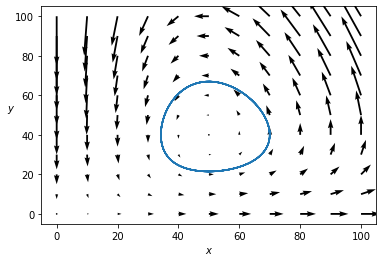
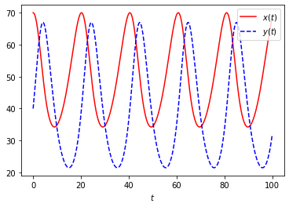

## 捕食者被捕食者模型 

内容提要：研究捕食者和被捕食者的总体数量随时间的变化规律。

### 问题描述A

设捕食者与被捕食者的种群数量可由常微分方程组
$$
\left\{\begin{array}{l}
\frac{dx}{dt} = ax - bxy, \\
\frac{dy}{dt} = -cy + dxy,\\
\end{array}\right.
\tag{1}
$$
描述，其中 $x(t)$ 表示第 $t$ 个月时被捕食者的数量，$y(t)$ 表示捕食者的数量。参数 $a,b,c,d$ 未知。
**种群数量观测值**

| $t$ | 0 | 1 | 2 | 3 | 4 | 5 | 6 | 8 | 10 | 12 | 14 | 16 | 18 |
|------|---|---|---|---|---|---|---|---|----|----|----|----|-----|
| $x(t)$ | 60 | 63 | 64 | 63 | 61 | 58 | 53 | 44 | 39 | 38 | 41 | 46 | 53 |
| $y(t)$ | 30 | 34 | 38 | 44 | 50 | 55 | 58 | 56 | 47 | 38 | 30 | 27 | 26 |

1.  利用表格中的观测数据，拟合未知参数。
2.  画出这个模型的相图。
3.  找一些更详细的数据，研究这个模型是否合适。


### 建立模型A

将微分方程写成差分方程，可得
$$
\left\{\begin{array}{l}
(x_{k+1}-x_k)/(t_{k+1}-t_k) = ax_k - bx_ky_k, \\ 
(y_{k+1}-y_k)/(t_{k+1}-t_k) = -cy_k + dx_ky_k, 
\end{array}\right. \,\, k=0,1,2,\cdots,11,
\tag{2}
$$
其中 $x_k$ 和 $y_k$ 是 $x(t)$ 和 $y(t)$ 在 $t=t_k$ 时的观测值。
%
因为系数 $a,b,c,d$ 是未知的，所以将(\ref{eq-2})写成矩阵形式，可得
$$
\begin{bmatrix} x_k & -x_ky_k & 0 & 0 \\ 0 & 0 & -y_k & x_ky_k \end{bmatrix} 
\begin{bmatrix} a \\ b \\ c \\ d  \end{bmatrix} 
=\begin{bmatrix} (x_{k+1}-x_k)/(t_{k+1}-t_k) \\ (y_{k+1}-y_k)/(t_{k+1}-t_k) \end{bmatrix}. 
\tag{3}
$$

将12组观测值放在一起，可得超定的线性方程组，然后使用最小二乘法求解，
$$
\begin{bmatrix} 
x_0 & -x_0y_0 & 0 & 0 \\ 
x_1 & -x_1y_1 & 0 & 0 \\ 
\vdots & \vdots & \vdots & \vdots \\ 
x_{11} & -x_{11}y_{11} & 0 & 0 \\ 
0 & 0 & -y_0 & x_0y_0 \\ 
0 & 0 & -y_1 & x_1y_1 \\ 
\vdots & \vdots & \vdots & \vdots \\ 
0 & 0 & -y_{11} & x_{11}y_{!1} \\ 
\end{bmatrix} 
\begin{bmatrix} a \\ b \\ c \\ d  \end{bmatrix} 
=\begin{bmatrix} 
(x_{1}-x_0)/(t_{1}-t_0) \\ 
(x_{2}-x_1)/(t_{2}-t_1) \\ 
\vdots  \\ 
(x_{12}-x_{11})/(t_{12}-t_{11}) \\ 
(y_{1}-y_0)/(t_{1}-t_0) \\ 
(y_{2}-y_1)/(t_{2}-t_1) \\ 
\vdots  \\ 
(y_{12}-y_{11})/(t_{12}-t_{11}) \\ 
\end{bmatrix}. 
\tag{4}
$$

### 编程计算A

创建时间点的取值、捕食者数量和被捕食者数量这三个向量。
```python
import numpy as np
t0=np.array([0,1,2,3,4,5,6,8,10,12,14,16,18])
x0=np.array([60,63,64,63,61,58,53,44,39,38,41,46,53])
y0=np.array([30,34,38,44,50,55,58,56,47,38,30,27,26])
```

进行一些适当的差分运算。
```python
dt=np.diff(t0); dx=np.diff(x0); dy=np.diff(y0)
temp=x0[:-1]*y0[:-1]
```

将一些列向量堆叠成矩阵。
```python
mat1=np.vstack([x0[:-1], -temp, np.zeros((2,12))]).T
mat2=np.vstack([np.zeros((2,12)), -y0[:-1], temp]).T
```

构造线性方程组的系数矩阵与常数项列。
```python
mat=np.vstack([mat1,mat2])
b=np.hstack([dx/dt,dy/dt])
```

用线性最小二乘法拟合参数。
```python
cs=np.linalg.pinv(mat)@b
print('The values of the parameters a,b,c,d are: ', np.round(cs,4))
```

### 回答问题A

参数a,b,c,d的值分别为
$$
a=0.1907,\,\,
b=0.0048,\,\,
c=0.4829,\,\, 
d=0.0095. 
$$


### 问题描述B

设捕食者与被捕食者的总体数量由常微分方程组
$$
\left\{\begin{array}{rcl}
\frac{dx}{dt} &=& 0.2x - 0.005xy, \\
\frac{dy}{dt} &=& -0.5y + 0.01xy,\\
\end{array}\right.
$$
描述，其中 $x(t)$ 表示第 $t$ 个月时被捕食者的数量，$y(t)$ 表示捕食者的数量。
设初始时刻的数量分别为 
$$
\left\{\begin{array}{rcl}
x(0) &=& 70, \\ 
y(0) &=& 40. 
\end{array}\right.
$$

1.  求被捕食者的总体数量 $x(t)$ 和捕食者的总体数量 $y(t)$ 的变化的周期。
2.  求被捕食者的总体数量 $x(t)$ 的最大值和最小值。
3.  求捕食者的总体数量 $y(t)$ 的最大值和最小值。


### 计算思路B

首先考虑这个常微分方程组的平衡点。设 $dx/dt=0$ 以及 $dy/dt=0$, 可得
$$
\left\{\begin{array}{rcl}
 0.2x - 0.005xy &=& 0, \\
 -0.5y + 0.01xy &=& 0. 
\end{array}\right.
$$

由此求得平衡点为 $(x,y)=(0,0)$ 与 $(x,y)=(50,40)$. 
我们的主要方法是使用 pylab 模块的 quiver 函数画出这个常微分方程组的方向场，
和使用 scipy.integrate 模块的 odeint 函数求出这个常微分方程组的数值解。


### 编程计算B

首先载入数值计算模块 numpy, 符号计算模块 sympy, 画图模块 pylab, 和 科学计算的积分模块 scipy.integrate. 
```python
import numpy as np
import sympy as sp
import pylab as plt
from scipy.integrate import odeint
```

这两行设置字体的代码可以不用。
```python
#plt.rc('text',usetex=True)
#plt.rc('font',size=15); 
```

定义两个符号变量 x,y, 求解方程组，使用符号模块的 solve 函数计算平衡点。
```python
x=sp.symbols('x')
y=sp.symbols('y')
eq=[0.2*x-0.005*x*y,-0.5*y+0.01*x*y]
s1=sp.solve(eq,[x,y])
print(s1)
```

在 x,y 平面的正方形区域 $[0,100]\times [0,100]$ 上画出格点，间隔距离为10, 共121个点。使用 quiver 函数画出方向场。结果见图1. 
```python
x=np.linspace(0,100,11)
x,y=np.meshgrid(x,x)
u=0.2*x-0.005*x*y; v=-0.5*y+0.01*x*y
plt.quiver(x,y,u,v)
plt.xlabel('$x$')
plt.ylabel('$y$',rotation=0)
```

将常微分方程的右端创建为一个函数，设自变量取值区间为 $[0,100]$, 自变量按间隔 $\Delta t =0.1$ 设置分点 $t_i, 0\le i\le 1000$. 使用 odeint 函数求解常微分方程，数值解 $x(t_i), y(t_i)$ 保存在变量 s 中。
```python
def func(f,t):
    x, y=f
    return [0.2*x-0.005*x*y,-0.5*y+0.01*x*y]
t=np.linspace(0,100,1000)
s=odeint(func, [70,40], t)
```

求出被捕食者的总体数量 $x(t)$ 的最大值和最小值，捕食者的总体数量 $y(t)$ 的最大值和最小值。
```python
x1=max(s[:,0])
x2=min(s[:,0])

print('The maximal value of x is ', x1)
print('The minimal value of x is ', x2)

y1=max(s[:,1])
y2=min(s[:,1])

print('The maximal value of y is ', y1)
print('The minimal value of y is ', y2)
```

在前面用 quiver 函数画的方向场中画出解函数的轨线 $(x(t),y(t))$. 结果见图1. 
```python
plt.plot(s[:,0], s[:,1])
```

另起一个图，以时间 $t$ 为横坐标，画出被捕食者的总体数量 $x(t)$ 的函数图像，与捕食者的总体数量 $y(t)$ 的函数图像。结果见图2. 
```python
plt.figure()
plt.plot(t, s[:,0], 'r-', label='$x(t)$')
plt.plot(t, s[:,1], 'b--', label='$y(t)$')
plt.legend()
plt.xlabel('$t$')
```


### 回答问题B

两个稳定点为 $(0, 0)$ 和 $(50, 40)$. 
x的最大值为70, 最小值为34. 
y的最大值为 67, y的最小值为21. 
两个种群的总体数量的变化周期约为20个月。

常微分方程组的方向场与相图



 
被捕食者（红线）与捕食者（蓝线）的数量与时间的函数图




### 参考文献 
1. 丁同仁、李承治，常微分方程教程，高等教育出版社，2022年3月第三版。
2. 司守奎,孙玺菁. Python数学建模算法与应用, 国防工业出版社. 2022年1月第1版. 
