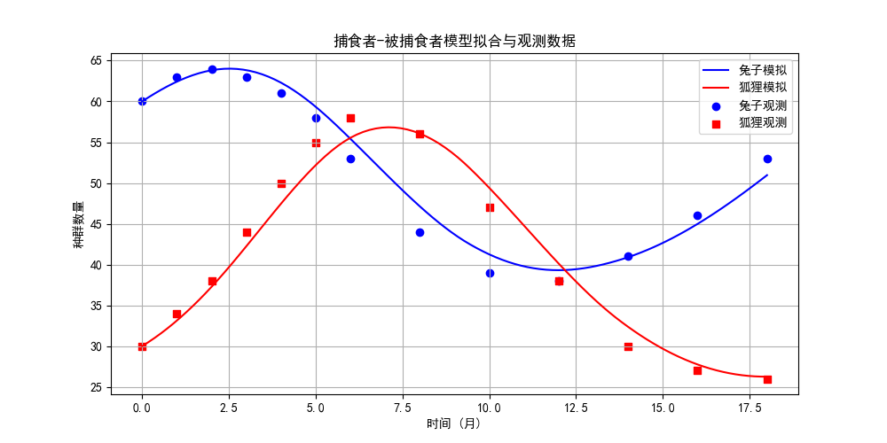
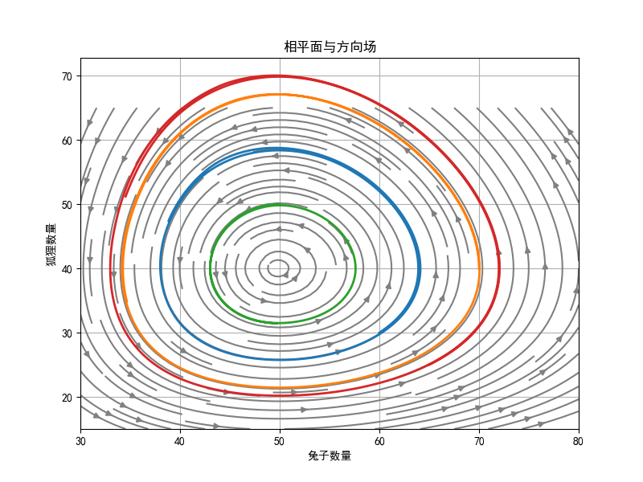

## 捕食者-被捕食者模型

### 问1. 捕食者-被捕食者模型的基本形式是什么？

<details>
<summary>问题：</summary>
请写出描述兔子（被捕食者）和狐狸（捕食者）种群数量随时间变化的经典微分方程组，并解释每个参数和变量的含义。
</details>

<details>
<summary>解答：</summary>
经典Lotka-Volterra捕食者-被捕食者模型为：
\[
\begin{cases}
\frac{dx}{dt} = a x - b x y, \\
\frac{dy}{dt} = -c y + d x y,
\end{cases}
\]
其中 \(x(t)\) 为被捕食者（兔子）数量，\(y(t)\) 为捕食者（狐狸）数量。  
参数 \(a>0\) 为兔子自然增长率，\(b>0\) 为捕食导致的兔子减少率；\(c>0\) 为狐狸自然死亡率，\(d>0\) 为捕食带来的狐狸增长率。  
该模型假设捕食者与猎物相遇概率与二者数量乘积成正比。
</details>

---

### 问2. 如何从连续微分方程得到离散差分方程？

<details>
<summary>问题：</summary>
已知观测数据为离散时间点上的种群数量，请说明如何将连续的微分方程离散化，以便用观测数据拟合参数。
</details>

<details>
<summary>解答：</summary>
利用前向欧拉近似，将导数替换为差分：
\[
\frac{dx}{dt}\bigg|_{t_k} \approx \frac{x_{k+1}-x_k}{t_{k+1}-t_k}, \quad 
\frac{dy}{dt}\bigg|_{t_k} \approx \frac{y_{k+1}-y_k}{t_{k+1}-t_k}.
\]
代入原微分方程，得到线性方程组：
\[
\begin{cases}
\frac{x_{k+1}-x_k}{\Delta t_k} = a x_k - b x_k y_k, \\
\frac{y_{k+1}-y_k}{\Delta t_k} = -c y_k + d x_k y_k,
\end{cases}
\]
其中 \(\Delta t_k = t_{k+1}-t_k\)。这样就可用最小二乘法估计参数 \(a,b,c,d\)。
</details>

---

### 问3. 如何将差分方程整理成矩阵形式用于参数拟合？

<details>
<summary>问题：</summary>
请解释如何把多个时间点的差分方程组合成一个线性方程组 \(A\mathbf{p} = \mathbf{b}\)，并指出矩阵 \(A\) 和向量 \(\mathbf{b}\) 的构造方法。
</details>

<details>
<summary>解答：</summary>
对于每个时间点 \(k\)，差分方程可改写为：
\[
\begin{bmatrix}
x_k & -x_k y_k & 0 & 0 \\
0 & 0 & -y_k & x_k y_k
\end{bmatrix}
\begin{bmatrix}
a \\ b \\ c \\ d
\end{bmatrix}
=
\begin{bmatrix}
\frac{x_{k+1}-x_k}{\Delta t_k} \\
\frac{y_{k+1}-y_k}{\Delta t_k}
\end{bmatrix}.
\]
将所有 \(k=0,1,\dots,n-1\) 的方程纵向堆叠，得到 \(2n \times 4\) 的系数矩阵 \(A\) 和 \(2n\) 维常数向量 \(\mathbf{b}\)。  
这种构造使得问题转化为标准的线性最小二乘问题，可通过求解正规方程或使用伪逆得到参数估计。
</details>

---

### 问4. 用Python实现参数拟合时，代码中的关键步骤有哪些？

<details>
<summary>问题：</summary>
阅读示例程序 `ex8_14.py`，解释其核心代码块的功能，并说明为何使用 `np.linalg.pinv` 而不是直接求解。

```python
#程序文件ex8_14.py
import numpy as np
t0=np.array([0,1,2,3,4,5,6,8,10,12,14,16,18])
x0=np.array([60,63,64,63,61,58,53,44,39,38,41,46,53])
y0=np.array([30,34,38,44,50,55,58,56,47,38,30,27,26])
dt=np.diff(t0); dx=np.diff(x0); dy=np.diff(y0)
temp=x0[:-1]*y0[:-1]
mat1=np.vstack([x0[:-1], -temp, np.zeros((2,12))]).T
mat2=np.vstack([np.zeros((2,12)), -y0[:-1], temp]).T
mat=np.vstack([mat1,mat2])  #构造线性方程组系数矩阵
b=np.hstack([dx/dt,dy/dt])  #构造线性方程组常数项列
cs=np.linalg.pinv(mat)@b    #线性最小二乘法拟合参数
print('参数a,b,c,d的值分别为:', np.round(cs,4))
```

输出结果：
```txt
参数a,b,c,d的值分别为: [0.1907 0.0048 0.4829 0.0095]
```
</details>

<details>
<summary>解答：</summary>

核心步骤如下：

1. 计算时间差 `dt`、兔子差分 `dx`、狐狸差分 `dy`；
2. 构造第一组（兔子方程）的系数块：`[x_k, -x_k y_k]`；
3. 构造第二组（狐狸方程）的系数块：`[-y_k, x_k y_k]`；
4. 纵向堆叠所有块形成 \(A\)，横向堆叠所有右端项形成 \(\mathbf{b}\)；
5. 使用 `np.linalg.pinv(A) @ b` 求最小二乘解。

使用伪逆 `pinv` 是因为当矩阵 \(A\) 不是方阵或列不满秩时，伪逆仍能给出最小二乘意义下的最优解，且数值稳定。
</details>

---

### 问5. 拟合出的参数有什么生态学意义？如何验证拟合效果？

<details>
<summary>问题：</summary>
根据例8.14拟合结果 \(a=0.1907, b=0.0048, c=0.4829, d=0.0095\)，请解释这些数值的生态含义，并说明如何通过数值模拟验证模型与数据吻合。
</details>

<details>
<summary>解答：</summary>

- \(a=0.1907\)：兔子在没有狐狸时的月增长率约19%；
- \(b=0.0048\)：每只狐狸每月对兔子的捕食影响系数；
- \(c=0.4829\)：狐狸在没有兔子时的月死亡率约48%；
- \(d=0.0095\)：兔子数量对狐狸增长率的贡献系数。

验证方法：用拟合参数作为初值 \(x(0)=60, y(0)=30\) 求解微分方程（如RK45），将数值解与观测数据画在同一图上，观察趋势是否一致，并计算均方根误差（RMSE）。
</details>

---

### 问6. 如何绘制种群数量随时间变化的曲线图？

<details>
<summary>问题：</summary>
请编写Python代码，利用拟合参数和初值，绘制兔子与狐狸数量在0~18个月内的数值解曲线，并与观测数据散点图叠加。
</details>

<details>
<summary>解答：</summary>

```python
import numpy as np
from scipy.integrate import solve_ivp
import matplotlib.pyplot as plt

plt.rcParams['font.sans-serif'] = ['SimHei']  
plt.rcParams['axes.unicode_minus'] = False    

# 数据与拟合参数
t_data = np.array([0,1,2,3,4,5,6,8,10,12,14,16,18])
x_data = np.array([60,63,64,63,61,58,53,44,39,38,41,46,53])
y_data = np.array([30,34,38,44,50,55,58,56,47,38,30,27,26])
a, b, c, d = 0.1907, 0.0048, 0.4829, 0.0095

# 定义微分方程
def lotka_volterra(t, z):
    x, y = z
    dx = a*x - b*x*y
    dy = -c*y + d*x*y
    return [dx, dy]

# 数值求解
sol = solve_ivp(lotka_volterra, [0, 18], [60, 30], t_eval=np.linspace(0,18,100))

# 绘图
plt.figure(figsize=(10,5))
plt.plot(sol.t, sol.y[0], 'b-', label='兔子模拟')
plt.plot(sol.t, sol.y[1], 'r-', label='狐狸模拟')
plt.scatter(t_data, x_data, color='blue', marker='o', label='兔子观测')
plt.scatter(t_data, y_data, color='red', marker='s', label='狐狸观测')
plt.xlabel('时间 (月)')
plt.ylabel('种群数量')
plt.legend()
plt.grid(True)
plt.title('捕食者-被捕食者模型拟合与观测数据')
plt.show()
```



</details>

---

### 问7. 什么是相平面图？如何绘制捕食者-被捕食者的相图？

<details>
<summary>问题：</summary>
说明相平面图的概念，并编写代码绘制以兔子数量为横轴、狐狸数量为纵轴的轨道曲线，同时添加方向场。
</details>

<details>
<summary>解答：</summary>
相平面图是以状态变量（\(x\)和\(y\)）为坐标的平面，每个点代表一个种群状态，曲线表示系统随时间演化的轨迹。  
绘制方法：对多个初值求解微分方程，将 \(x(t)\) 与 \(y(t)\) 画成参数曲线。方向场则用网格点的导数向量表示。

```python
import numpy as np
from scipy.integrate import solve_ivp
import matplotlib.pyplot as plt

plt.rcParams['font.sans-serif'] = ['SimHei']  
plt.rcParams['axes.unicode_minus'] = False    

a, b, c, d = 0.2, 0.005, 0.5, 0.01

# 定义微分方程
def lotka_volterra(t, z):
    x, y = z
    dx = a*x - b*x*y
    dy = -c*y + d*x*y
    return [dx, dy]

X, Y = np.meshgrid(np.linspace(30, 80, 20), np.linspace(15, 65, 20))
u = a*X - b*X*Y
v = -c*Y + d*X*Y
norm = np.sqrt(u**2 + v**2)
u /= norm; v /= norm

plt.figure(figsize=(8,6))
plt.streamplot(X, Y, u, v, density=1.5, color='gray')
# 对几个初值画轨道
for x0, y0 in [(60,30), (70,40), (50,50), (65,25)]:
    sol = solve_ivp(lotka_volterra, [0, 30], [x0, y0], t_eval=np.linspace(0,30,500))
    plt.plot(sol.y[0], sol.y[1], linewidth=2)
plt.xlabel('兔子数量')
plt.ylabel('狐狸数量')
plt.title('相平面与方向场')
plt.grid(True)
plt.show()
```



</details>

---

### 问8. 如何从数值解中计算种群数量的变化周期？

<details>
<summary>问题：</summary>
根据例8.15，说明如何从 \(x(t)\) 或 \(y(t)\) 的时间序列中确定振荡周期，并给出具体的计算方法。
</details>

<details>
<summary>解答：</summary>
周期可以通过相邻两个极小值（或极大值）之间的时间间隔来估计。  
具体实现：在足够长的模拟时间序列中，使用 `scipy.signal.find_peaks` 寻找局部极小值点，然后计算这些点对应时间的差值，取平均值即为周期。  
例8.15中，计算得兔子数量极小值间隔约20个月，故周期 \(T \approx 20\) 个月。
</details>

---

### 问9. 如何分析平衡点的稳定性？

<details>
<summary>问题：</summary>
对于方程组
\[
\begin{cases}
\frac{dx}{dt}=0.2x-0.005xy, \\
\frac{dy}{dt}=-0.5y+0.01xy,
\end{cases}
\]
求其平衡点，并判断平衡点类型。
</details>

<details>
<summary>解答：</summary>
令两式均为0，得：
\[
x(0.2-0.005y)=0, \quad y(-0.5+0.01x)=0.
\]
非零平衡点满足 \(y=40, x=50\)，即点 (50,40)。  
计算雅可比矩阵在平衡点处：
\[
J = \begin{bmatrix}
0.2-0.005y & -0.005x \\
0.01y & -0.5+0.01x
\end{bmatrix}_{(50,40)}
= \begin{bmatrix}
0 & -0.25 \\
0.4 & 0
\end{bmatrix}.
\]
其特征值为 \(\lambda = \pm 0.316i\)，纯虚数，故平衡点为稳定的中心，系统作周期振荡。
</details>

---

### 问10. 该模型有何局限性？如何拓展使其更符合实际？

<details>
<summary>问题：</summary>
Lotka-Volterra模型虽然经典，但存在一些理想化假设。请指出其至少两个主要局限性，并各提出一种改进方向。
</details>

<details>
<summary>解答：</summary>
局限性1：假定捕食者只以该猎物为食，且猎物无限增长（无密度制约）。  
改进：在兔子方程中加入逻辑斯蒂项 \(-r x^2\)，如 \(\frac{dx}{dt}=a x - b x y - r x^2\)。

局限性2：参数恒定，不随环境或种群密度变化。  
改进：引入季节性变化的参数，或使用功能反应函数（如Holling II型）替代简单的 \(bxy\)，即 \(\frac{dx}{dt}=a x - \frac{b x y}{1+h x}\)。
</details>

---

### 问11. 如何用实际数据检验模型预测能力？

<details>
<summary>问题：</summary>
在参数拟合完成后，你会采用什么方法来评估模型对未观测时间点的预测能力？
</details>

<details>
<summary>解答：</summary>
可采用交叉验证方法，例如留一法（leave-one-out）：每次保留一个时间点的数据不参与拟合，用剩余数据估计参数，然后预测被保留点的值，计算预测误差。  
也可将数据分为训练集（前70%）和测试集（后30%），训练集拟合参数，测试集计算预测值与真实值之间的RMSE或平均绝对百分比误差（MAPE）。  
此外，绘制残差图（预测值-观测值）可直观检查模型是否系统性地偏离数据。
</details>

---

### 问12. 该模型能否推广到多个物种的生态系统？

<details>
<summary>问题：</summary>
若生态系统中存在两种捕食者或两种猎物，模型应如何扩展？
</details>

<details>
<summary>解答：</summary>
可以扩展为高维Lotka-Volterra系统。例如，两种猎物 \(x_1, x_2\) 和一种捕食者 \(y\) 的模型为：
\[
\begin{cases}
\frac{dx_1}{dt} = a_1 x_1 - b_{11} x_1^2 - b_{12} x_1 x_2 - c_1 x_1 y, \\
\frac{dx_2}{dt} = a_2 x_2 - b_{21} x_2 x_1 - b_{22} x_2^2 - c_2 x_2 y, \\
\frac{dy}{dt} = -d y + e_1 x_1 y + e_2 x_2 y.
\end{cases}
\]
其中加入了种内竞争和种间竞争项。参数拟合和相图分析的方法类似，但矩阵维度增大，需要更多数据以避免过拟合。
</details>